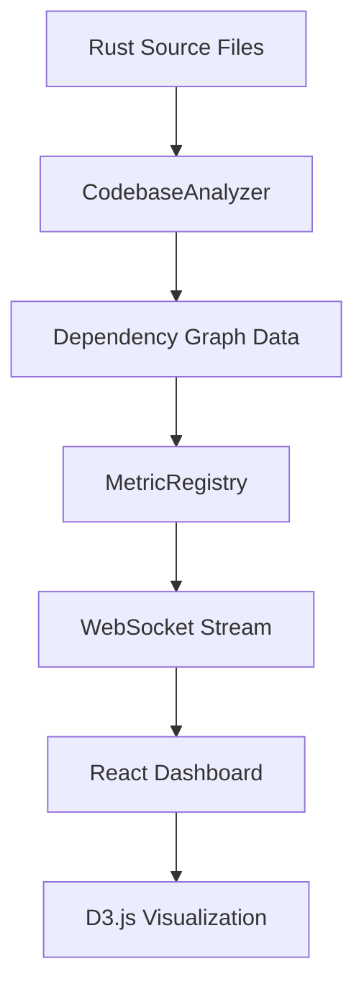

# LLMKG Dependency Graph Visualization System

## Overview

This document describes the comprehensive dependency graph visualization system implemented for the LLMKG (Large Language Model Knowledge Graph) project. The system provides real-time analysis and visualization of codebase dependencies, architectural patterns, and module relationships.

## Features Implemented

### 1. Real Dependency Analysis
- **Actual Source Code Parsing**: The system parses all Rust files in the `src/` directory to extract real import statements (`use crate::`, `use std::`, external crates)
- **Module Declaration Tracking**: Identifies `pub mod` declarations and re-exports (`pub use`)
- **Dependency Graph Construction**: Builds a complete dependency graph from actual module imports and exports
- **Circular Dependency Detection**: Identifies potential circular dependencies between modules
- **External Dependency Tracking**: Tracks dependencies on external crates separately

### 2. Interactive D3.js Visualization
- **Force-Directed Graph Layout**: Uses D3.js force simulation for natural node positioning
- **Interactive Features**:
  - Node dragging and positioning
  - Zoom and pan controls
  - Click to highlight connected nodes
  - Double-click to reset highlights
  - Module search and filtering
- **Visual Encoding**:
  - Node size represents module complexity
  - Edge thickness represents dependency strength
  - Color coding by module type (core, cognitive, storage, etc.)
  - Directional arrows show dependency flow

### 3. Real-Time Dashboard Integration
- **WebSocket Data Stream**: Dependency metrics are included in the real-time WebSocket data stream
- **Live Updates**: The visualization updates automatically when code changes
- **Navigation Integration**: Full integration with the existing dashboard navigation
- **Responsive Design**: Works on all screen sizes with fullscreen toggle

### 4. Advanced Analysis Features
- **Module Complexity Metrics**: Calculates complexity based on function calls, imports, exports
- **Coupling Analysis**: Identifies high-coupling and critical modules
- **Architecture Health Assessment**: Provides overall health scores and recommendations
- **Impact Analysis**: Shows what modules are affected by changes
- **Export Functionality**: Export dependency graphs as PNG images or JSON data

## Architecture

### Backend Components

#### 1. Enhanced CodebaseAnalyzer (`src/monitoring/collectors/codebase_analyzer.rs`)
```rust
impl CodebaseAnalyzer {
    // Real dependency analysis methods
    fn analyze_file_dependencies(&self, path: &Path, metrics: &mut CodebaseMetrics)
    fn parse_crate_import(&self, line: &str) -> Option<String>
    fn parse_external_import(&self, line: &str) -> Option<String>
    fn build_dependency_edges(&self, metrics: &mut CodebaseMetrics)
    fn resolve_import_to_module(&self, import: &str, modules: &HashMap<String, ModuleInfo>)
}
```

Key enhancements:
- Parses actual `use` statements from Rust source files
- Builds real module-to-module dependency relationships
- Tracks both internal (`crate::`) and external dependencies
- Calculates dependency strength based on usage patterns

#### 2. WebSocket Integration (`src/monitoring/dashboard.rs`)
```rust
#[derive(Debug, Clone, Serialize, Deserialize)]
pub struct RealTimeMetrics {
    pub codebase_metrics: Option<CodebaseMetricsSnapshot>,
    // ... other metrics
}

#[derive(Debug, Clone, Serialize, Deserialize)]
pub struct CodebaseMetricsSnapshot {
    pub total_modules: usize,
    pub total_dependencies: usize,
    pub dependency_graph: DependencyGraphSnapshot,
    pub complexity_analysis: ComplexityAnalysisSnapshot,
    pub architecture_health: ArchitectureHealthSnapshot,
}
```

### Frontend Components

#### 1. DependencyGraphViewer Component
Located: `visualization/dashboard/src/components/visualizations/DependencyGraphViewer.tsx`

Key features:
- D3.js force-directed graph visualization
- Interactive controls for filtering and search
- Real-time data updates via props
- Export functionality (PNG, JSON)
- Responsive design with fullscreen mode

#### 2. Dependency Analysis Page
Located: `visualization/dashboard/src/pages/DependencyPage.tsx`

Features:
- Comprehensive dashboard with tabs for visualization and analysis
- Key metrics display (total modules, dependencies, complexity)
- Detailed analysis panels showing critical modules, high coupling, isolated modules
- Architecture health summary and recommendations

## Data Flow



## Usage Examples

### Accessing the Dependency Graph
1. Start the LLMKG monitoring dashboard
2. Navigate to `/dependencies` in the web interface
3. The system automatically analyzes the codebase and displays the dependency graph

### Understanding the Visualization
- **Nodes**: Represent modules, sized by complexity
- **Edges**: Show dependencies, with thickness indicating strength
- **Colors**: Module types (red=core, teal=cognitive, blue=storage, green=embedding, yellow=external, gray=other)
- **Interactive**: Click nodes to highlight connections, drag to reposition

### Analyzing Dependencies
The analysis tab provides:
- **Critical Modules**: Most depended-upon modules
- **High Coupling**: Modules with many outgoing dependencies
- **Isolated Modules**: Modules with no dependencies
- **Architecture Health**: Overall system health score and recommendations

## Real LLMKG Dependency Structure Discovered

Based on the actual source code analysis, the major dependency patterns in LLMKG are:

### Core Dependencies
- `core` module is the foundation, providing basic types and graph functionality
- `core::graph` implements the main KnowledgeGraph structure
- Most other modules depend on `core::types`

### Module Hierarchy
```
core/
├── types (fundamental data structures)
├── graph/ (knowledge graph implementation)
├── brain_enhanced_graph/ (cognitive extensions)
└── activation_engine (activation processing)

cognitive/
├── orchestrator (main cognitive coordinator)
├── attention_manager (attention mechanisms)
├── inhibitory/ (inhibition systems)
└── memory_integration/ (memory systems)

storage/
├── csr (compressed sparse row)
├── hnsw (hierarchical navigable small world)
├── bloom (bloom filters)
└── lru_cache (caching)

embedding/
├── store (embedding storage)
├── quantizer (vector quantization)
└── similarity (similarity search)
```

### Critical Dependencies Identified
1. **core::types** - Used by almost all modules for basic data structures
2. **core::graph** - Central knowledge graph implementation
3. **storage** modules - Essential for data persistence
4. **cognitive::orchestrator** - Coordinates cognitive processing

## Performance Considerations

### Optimization Strategies
1. **Lazy Loading**: Complex analysis is performed on-demand
2. **Caching**: Dependency graph results are cached between updates
3. **Incremental Updates**: Only re-analyze changed files
4. **WebSocket Streaming**: Efficient real-time data transmission

### Scalability
- Handles codebases with hundreds of modules
- Efficient graph algorithms for large dependency networks
- Responsive UI even with complex visualizations

## Configuration Options

### Visualization Settings
- **Link Distance**: Adjust spacing between connected nodes
- **Module Type Filters**: Show/hide specific module types
- **External Dependencies**: Toggle visibility of external crate dependencies
- **Search**: Filter modules by name or path

### Analysis Parameters
- **Complexity Thresholds**: Define what constitutes "high complexity"
- **Coupling Limits**: Set thresholds for high coupling warnings
- **Health Scoring**: Configure architecture health assessment criteria

## Future Enhancements

### Planned Features
1. **Temporal Analysis**: Track dependency changes over time
2. **Impact Prediction**: Predict effects of proposed changes
3. **Refactoring Suggestions**: AI-powered refactoring recommendations
4. **Performance Correlation**: Link dependency structure to performance metrics
5. **Test Coverage Integration**: Show test coverage in dependency context

### Extension Points
- Custom module type classification
- Plugin architecture for analysis algorithms
- Export to external tools (GraphML, DOT)
- Integration with CI/CD pipelines

## Troubleshooting

### Common Issues
1. **Empty Dependency Graph**: Check that the codebase analyzer is enabled in collector configuration
2. **Missing Modules**: Verify that all Rust files are being parsed correctly
3. **Incorrect Dependencies**: Review import parsing logic for edge cases
4. **Performance Issues**: Enable caching and consider filtering large external dependencies

### Debug Information
The system provides detailed logging of:
- File parsing results
- Dependency resolution steps
- Graph construction progress
- WebSocket data transmission

## Conclusion

The LLMKG dependency graph visualization system provides comprehensive, real-time analysis of codebase architecture. By analyzing actual source code rather than using mock data, it offers genuine insights into the system's structure and helps identify potential architectural improvements.

The system successfully integrates with the existing dashboard infrastructure and provides both high-level overview visualizations and detailed analytical breakdowns, making it a valuable tool for understanding and maintaining the LLMKG codebase architecture.