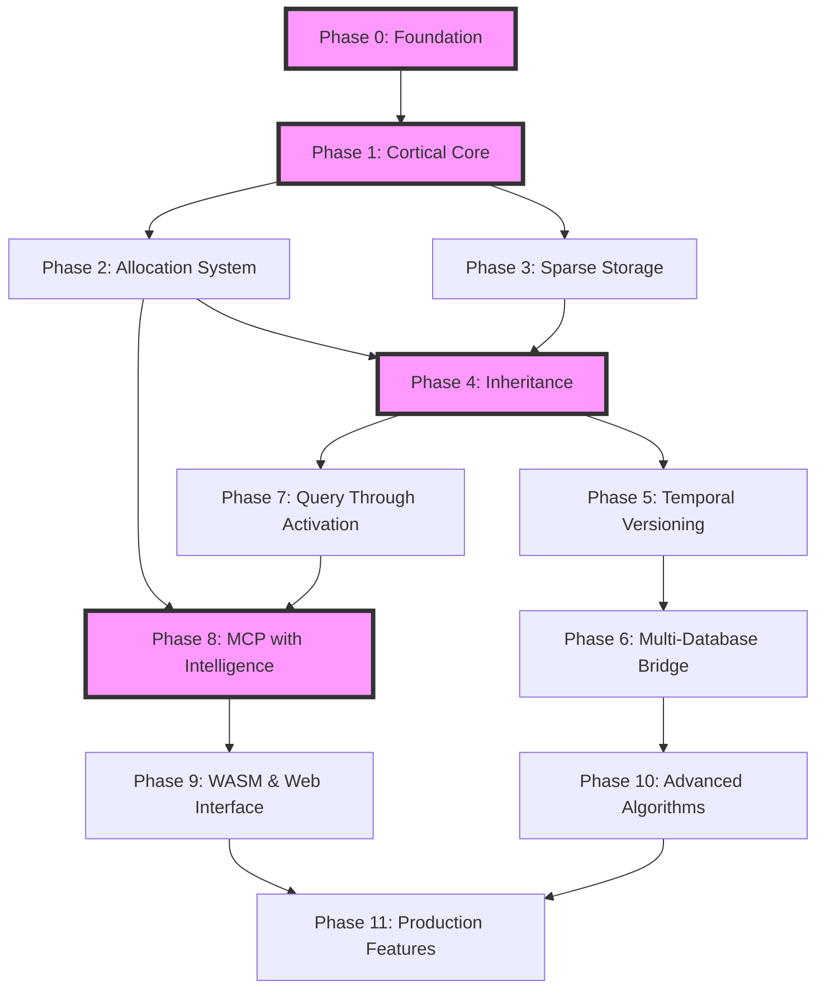

# Master Architecture Plan: CortexKG - Neuromorphic Brain-Inspired Knowledge Graph

**Project Name**: CortexKG (Neuromorphic Cortical Knowledge Graph)  
**Duration**: 12 weeks  
**Team Size**: 4-6 neuromorphic developers  
**Core Principle**: "Where does this memory belong?" - Allocation-first with spiking neural networks
**Neuromorphic Foundation**: Time-to-First-Spike encoding with lateral inhibition  

## Vision

Build a neuromorphic knowledge graph system that truly mimics how the human brain stores, versions, and recalls memories through:
- **Spiking Neural Cortical Columns**: TTFS-encoded hierarchical memory with lateral inhibition
- **Neuromorphic Temporal Versioning**: Memory consolidation with STDP learning
- **Multi-Column Parallel Processing**: Semantic, structural, temporal, and exception columns
- **Cascade Correlation Growth**: Dynamic neural network adaptation
- **SIMD-Accelerated Processing**: 4x parallel speedup with WASM optimization
- **Neuromorphic Hardware Readiness**: Intel Loihi and IBM TrueNorth preparation

## Core Architecture Principles

### 1. Neuromorphic Memory Systems
```
Human Brain → Neuromorphic CortexKG Mapping:
- Cortical Columns → Spiking Neural Allocation Units with TTFS
- Lateral Inhibition → Winner-take-all competition circuits
- Synaptic Plasticity → STDP learning rules and cascade correlation
- Refractory Periods → Temporal conflict prevention
- Hippocampus → STDP-enhanced temporal versioning
- Corpus Callosum → Multi-column parallel processing bridge
- Memory Consolidation → Neural inheritance compression
- Spike Timing → Sub-millisecond temporal precision
```

### 2. Neuromorphic Multi-Database Architecture
```
┌─────────────────────────────────────────────────────────────────┐
│           Neuromorphic CortexKG Master System                   │
├─────────────────────────────────────────────────────────────────┤
│  ┌─────────┐  ┌─────────┐  ┌─────────┐  ┌─────────┐           │
│  │ Main DB │  │Branch A │  │Branch B │  │Branch C │  ...      │
│  │ +SNN    │  │ +SNN    │  │ +SNN    │  │ +SNN    │           │
│  └────┬────┘  └────┬────┘  └────┬────┘  └────┬────┘           │
│       │            │            │            │                  │
│  ┌────┴────────────┴────────────┴────────────┴────┐            │
│  │        Multi-Column Neuromorphic Bridge          │            │
│  │  ┌──────────┐ ┌──────────┐ ┌──────────┐ ┌────┐   │            │
│  │  │Semantic  │ │Structural│ │Temporal  │ │Exc │   │            │
│  │  │Column    │ │Column    │ │Column    │ │Col │   │            │
│  │  └──────────┘ └──────────┘ └──────────┘ └────┘   │            │
│  │           Cortical Voting & Lateral Inhibition    │            │
│  └─────────────────────────────────────────────────┘            │
│  ┌─────────────────────────────────────────────────┐            │
│  │        SIMD-Accelerated WASM Processing          │            │
│  │     (4x Parallel Spike Pattern Processing)       │            │
│  └─────────────────────────────────────────────────┘            │
└─────────────────────────────────────────────────────────────────┘
```

### 3. Neuromorphic Temporal Memory Layers
```
Working Memory (Spike Patterns & TTFS Encoding)
    ↓ (Sub-second spike timing precision)
Short-term Memory (Active Column States + Refractory Periods)
    ↓ (STDP learning window: minutes-hours)
Long-term Memory (Consolidated Neural Weights + Inheritance)
    ↓ (Cascade correlation adaptations: permanent)
Archived Memory (Compressed Neural Networks + Sparse Distributed Memory)
    ↓ (Neuromorphic hardware optimization)
Neuromorphic Hardware (Intel Loihi / IBM TrueNorth acceleration)
```

## System Components

### Core Modules

1. **Neuromorphic Cortical Allocation Engine**
   - <1ms TTFS fact allocation with spike timing precision
   - Multi-column parallel processing (semantic, structural, temporal, exception)
   - Lateral inhibition circuits with winner-take-all dynamics
   - Cascade correlation network growth and adaptation
   - SIMD-accelerated spike pattern processing

2. **Neuromorphic Temporal Versioning System**
   - Git-like branching with STDP learning integration
   - Time-travel queries with spike timing analysis
   - Memory consolidation tracking with neural adaptation
   - Refractory period management across time branches
   - Neural weight evolution over temporal versions

3. **Multi-Column Cross-Database Neural Bridge**
   - Cross-database spike pattern correlation
   - Cortical voting consensus across databases
   - Emergent knowledge through neural network growth
   - SIMD-accelerated pattern matching
   - Lateral inhibition for cross-database conflict resolution

4. **Neuromorphic Intelligence Layer**
   - Small LLMs integrated with spiking neural networks
   - TTFS-guided allocation hint generation
   - Neural semantic compression with inheritance
   - Multi-column parallel concept processing
   - Circuit breakers for fault-tolerant operation

5. **Neuromorphic Memory Architecture**
   - Sparse Distributed Memory (Kanerva SDM) integration
   - WASM shared memory for high-performance processing
   - Neuromorphic data structures optimized for spike timing
   - Content-addressable memory with temporal codes
   - Hardware-accelerated memory access patterns

6. **Advanced Learning Systems**
   - Spike-Timing-Dependent Plasticity (STDP) learning rules
   - Continuous adaptation and performance monitoring
   - Real-time neural network topology optimization
   - Biological error correction mechanisms
   - Neuromorphic hardware preparation and optimization
   - Episodic: Event-based storage
   - Semantic: Fact-based inheritance
   - Procedural: Pattern storage
   - Working: Active allocations

## Phase Overview

### Phase 0: Foundation (Week 1)
- Project setup and core structures
- WASM build configuration
- Test framework with mocks

### Phase 1: Cortical Core (Week 2)
- Cortical columns implementation
- Lateral inhibition networks
- Basic allocation engine

### Phase 2: Allocation System (Week 3)
- Parallel allocation processing
- Concept analysis with LLMs
- Synaptic strengthening

### Phase 3: Sparse Storage (Week 4)
- Graph storage (<5% connectivity)
- Memory-mapped persistence
- Compression algorithms

### Phase 4: Inheritance (Week 5)
- Hierarchical memory organization
- Exception handling
- 10x compression achievement

### Phase 5: Temporal Versioning (Week 6)
- Branch management system
- Time-travel capabilities
- Memory consolidation

### Phase 6: Multi-Database Bridge (Week 7)
- Cross-database connections
- Pattern recognition
- Emergent knowledge detection

### Phase 7: Query Through Activation (Week 8)
- Spreading activation queries
- Structural navigation
- Memory recall patterns

### Phase 8: MCP with Intelligence (Week 9)
- Enhanced MCP tools
- Embedded LLM integration
- Intelligent allocation hints

### Phase 9: WASM & Web Interface (Week 10)
- WASM compilation
- Web-based visualization
- Real-time interaction

### Phase 10: Advanced Algorithms (Week 11)
- Knowledge recovery strategies
- Cross-database mining
- Pattern emergence

### Phase 11: Production Features (Week 12)
- Performance optimization
- Monitoring and observability
- Documentation

## Key Innovations

### 1. Temporal Branches as Memory Consolidation
```rust
// Each branch represents a memory state
pub struct MemoryBranch {
    id: BranchId,
    parent: Option<BranchId>,
    timestamp: DateTime,
    consolidation_state: ConsolidationState,
    active_columns: HashSet<ColumnId>,
}

// Memory consolidation over time
pub enum ConsolidationState {
    WorkingMemory,      // < 30 seconds
    ShortTerm,          // < 1 hour
    Consolidating,      // 1-24 hours
    LongTerm,           // > 24 hours
}
```

### 2. Cross-Database Neural Bridges
```rust
// Discover patterns across databases without explicit queries
pub struct NeuralBridge {
    databases: Vec<DatabaseConnection>,
    pattern_detector: PatternDetector,
    
    pub async fn discover_emergent_knowledge(&self) -> Vec<EmergentPattern> {
        // Automatic pattern recognition across branches
        // No embeddings needed - pure structural analysis
    }
}
```

### 3. LLM-Enhanced Allocation
```rust
// Small LLM guides allocation decisions
pub struct IntelligentAllocator {
    cortical_engine: CorticalEngine,
    llm_advisor: SmallLanguageModel,
    
    pub async fn allocate_with_intelligence(&self, fact: &Fact) -> AllocationResult {
        // LLM suggests optimal allocation
        let hint = self.llm_advisor.suggest_allocation(fact).await?;
        
        // Cortical engine executes with hint
        self.cortical_engine.allocate_with_hint(fact, hint).await
    }
}
```

### 4. Episodic vs Semantic Storage
```rust
// Different memory types stored differently
pub enum MemoryType {
    Episodic {
        event_time: DateTime,
        context: EventContext,
        decay_rate: f32,
    },
    Semantic {
        inheritance_chain: Vec<ConceptId>,
        compression_level: u8,
        permanence: f32,
    },
}
```

## Performance Targets

| Operation | Target | Reasoning |
|-----------|--------|-----------|
| Fact Allocation | <5ms | Cortical column activation |
| Document Processing | <50ms | Parallel scene processing |
| Cross-DB Pattern | <100ms | Neural bridge activation |
| Time-Travel Query | <20ms | Indexed temporal states |
| Branch Creation | <10ms | Copy-on-write columns |
| LLM Enhancement | <30ms | Cached small model |

## SPARC Methodology

Each phase follows strict SPARC:

1. **Specification**: Define biological inspiration and requirements
2. **Pseudocode**: Algorithm design mimicking brain processes
3. **Architecture**: Component structure following neural patterns
4. **Refinement**: Iterative improvement with performance tests
5. **Completion**: Full implementation with comprehensive tests

## Test-Driven Development

Following London School TDD:

1. **Mock First**: Create mock brain components
2. **Behavior Tests**: Test memory patterns, not implementation
3. **Integration**: Gradually replace mocks with real neurons
4. **Performance**: Continuous benchmarking against brain metrics

## Success Criteria

### Functional Requirements
- [ ] 5ms cortical allocation
- [ ] 10x inheritance compression
- [ ] Temporal versioning with branches
- [ ] Cross-database pattern detection
- [ ] LLM-enhanced allocation
- [ ] WASM compilation

### Performance Requirements
- [ ] 10,000 facts/second throughput
- [ ] <5% memory connectivity
- [ ] <100ms cross-database analysis
- [ ] <1GB memory for 1M facts

### Advanced Features
- [ ] Automatic knowledge emergence
- [ ] Memory consolidation simulation
- [ ] Episodic memory replay
- [ ] Semantic compression

## Risk Mitigation

| Risk | Impact | Mitigation |
|------|--------|------------|
| LLM latency | High | Local small models, caching |
| Cross-DB complexity | High | Start with 2 DBs, scale gradually |
| Memory usage | Medium | Aggressive pruning, compression |
| WASM performance | Medium | Native fallback, optimization |

## Development Philosophy

"We're not building a database - we're building a brain. Every decision should ask: How does biological memory do this?"

Key principles:
- Allocation over validation
- Structure over statistics  
- Emergence over explicit programming
- Compression through inheritance
- Time as a first-class concept

## Dependency Analysis and Phase Interdependencies

### Critical Path Dependencies



### Phase Dependencies Matrix

| Phase | Depends On | Enables | Critical Path | Risk Level |
|-------|------------|---------|---------------|------------|
| P0: Foundation | None | All phases | Yes | Low |
| P1: Cortical Core | P0 | P2, P3 | Yes | High |
| P2: Allocation System | P1 | P4, P8 | Yes | High |
| P3: Sparse Storage | P1 | P4 | Yes | Medium |
| P4: Inheritance | P2, P3 | P5, P7 | Yes | High |
| P5: Temporal Versioning | P4 | P6 | No | Medium |
| P6: Multi-Database Bridge | P5 | P10 | No | High |
| P7: Query Through Activation | P4 | P8 | No | Medium |
| P8: MCP with Intelligence | P2, P7 | P9 | Yes | High |
| P9: WASM & Web Interface | P8 | P11 | No | Medium |
| P10: Advanced Algorithms | P6 | P11 | No | Low |
| P11: Production Features | P9, P10 | Deploy | No | Low |

### Inter-Phase Technical Dependencies

#### Neural Network Dependencies
```
ruv-FANN Network Allocation:
├── Phase 1: Basic networks (1-5)
│   ├── Standard BP neural network
│   ├── BP with bias
│   └── Cascade correlation base
├── Phase 2-4: Intermediate networks (6-15)
│   ├── Cascade shortcut connections
│   ├── RPROP training
│   └── Quickprop optimization
├── Phase 5-7: Advanced networks (16-25)
│   ├── Batch training modes
│   ├── Incremental learning
│   └── Sparse connections
└── Phase 8-11: Specialized networks (26-29)
    ├── Hardware-optimized topologies
    ├── SIMD-accelerated variants
    └── Neuromorphic adaptations
```

#### Data Structure Dependencies
```
Core Data Structures Evolution:
Phase 0: Basic types and traits
Phase 1: CorticalColumn, SpikingNeuron
Phase 2: AllocationEngine, ConceptAnalyzer
Phase 3: SparseGraph, CompressedStorage
Phase 4: InheritanceChain, PropertySet
Phase 5: TemporalVersion, MemoryBranch
Phase 6: NeuralBridge, CrossDBPattern
Phase 7: ActivationQuery, SpreadingPath
Phase 8: MCPTools, IntelligentHints
Phase 9: WASMBindings, WebComponents
Phase 10: PatternMiner, KnowledgeRecovery
Phase 11: Monitoring, CircuitBreakers
```

## Enhanced Risk Mitigation Strategy

### Technical Risk Matrix

| Risk Category | Specific Risk | Impact | Probability | Mitigation Strategy | Contingency Plan |
|---------------|---------------|--------|-------------|-------------------|------------------|
| **Performance** | TTFS encoding overhead | High | Medium | Pre-compute spike patterns, SIMD optimization | Fallback to rate coding |
| **Performance** | Lateral inhibition convergence | High | Low | Adaptive thresholds, circuit breakers | Single-column mode |
| **Complexity** | 29 neural network integration | High | High | Phased rollout, extensive testing | Core 5 networks only |
| **Memory** | Spike pattern storage | Medium | Medium | Compressed representations, pruning | External storage tier |
| **Integration** | MCP protocol compliance | High | Low | Early validation, test harness | Custom protocol extension |
| **Hardware** | WASM SIMD support | Medium | Medium | Feature detection, polyfills | Scalar fallback paths |
| **Scalability** | Multi-DB synchronization | High | High | Eventual consistency, CRDTs | Single-DB mode |
| **Learning** | STDP stability | Medium | Medium | Learning rate adaptation | Static weight mode |

### Phase-Specific Risk Mitigation

#### Phase 1: Cortical Core Risks
- **Risk**: Lateral inhibition deadlock
- **Mitigation**: Timeout mechanisms, maximum iteration limits
- **Monitoring**: Convergence time metrics, deadlock detection

#### Phase 2: Allocation System Risks
- **Risk**: LLM latency spikes
- **Mitigation**: Local model caching, async processing, timeout handling
- **Monitoring**: P99 latency tracking, cache hit rates

#### Phase 4: Inheritance Risks
- **Risk**: Inheritance cycle detection
- **Mitigation**: DAG validation, depth limits, cycle breaking
- **Monitoring**: Graph connectivity metrics, validation failures

#### Phase 6: Multi-Database Bridge Risks
- **Risk**: Network partition handling
- **Mitigation**: Quorum-based decisions, split-brain resolution
- **Monitoring**: Partition detection, consensus metrics

#### Phase 8: MCP Integration Risks
- **Risk**: Protocol version mismatch
- **Mitigation**: Version negotiation, backward compatibility
- **Monitoring**: Protocol error rates, version distribution

### Continuous Risk Assessment Protocol

```rust
pub struct RiskAssessment {
    pub phase: Phase,
    pub risk_level: RiskLevel,
    pub active_mitigations: Vec<Mitigation>,
    pub metrics: RiskMetrics,
}

impl RiskAssessment {
    pub fn evaluate_phase_transition(&self, from: Phase, to: Phase) -> TransitionDecision {
        // Assess readiness for phase transition
        let dependency_check = self.verify_dependencies(from, to);
        let risk_check = self.assess_transition_risk(from, to);
        let metric_check = self.verify_phase_metrics(from);
        
        if dependency_check.passed && risk_check.acceptable && metric_check.passed {
            TransitionDecision::Proceed
        } else {
            TransitionDecision::Delay {
                blockers: self.identify_blockers(dependency_check, risk_check, metric_check),
                estimated_delay: self.estimate_remediation_time(),
            }
        }
    }
}
```

## Resource Allocation Strategy

### Team Expertise Requirements

| Phase | Required Expertise | Team Members | External Support |
|-------|-------------------|--------------|------------------|
| P0-P1 | Rust, Neural Networks | 2 senior | ruv-FANN experts |
| P2-P3 | Distributed Systems | 1 senior, 1 mid | - |
| P4-P5 | Graph Algorithms | 1 senior, 1 mid | Neo4j consultants |
| P6-P7 | Database Architecture | 2 senior | - |
| P8 | Protocol Design | 1 senior | MCP community |
| P9 | WASM, Web Dev | 1 senior, 1 mid | - |
| P10-P11 | ML, DevOps | 1 senior, 1 mid | - |

### Infrastructure Requirements

```yaml
development:
  compute:
    cpu: 16 cores minimum
    ram: 32GB minimum
    gpu: Optional (CUDA for neural training)
  storage:
    ssd: 500GB for development datasets
    network: 100GB for model storage
  services:
    neo4j: 3 instances (main + 2 branches)
    monitoring: Prometheus + Grafana
    ci_cd: GitHub Actions with 8 parallel workers

production:
  compute:
    cpu: 32+ cores
    ram: 128GB minimum
    gpu: Recommended for STDP acceleration
  storage:
    ssd: 2TB RAID for hot data
    network: 10TB for complete knowledge graph
  scaling:
    horizontal: MCP server replication
    vertical: Neo4j cluster scaling
```

## Quality Gates and Phase Transitions

### Phase Completion Criteria

Each phase must meet these criteria before transition:

1. **Code Quality**
   - 100% core functionality tested
   - >80% total code coverage
   - All clippy warnings resolved
   - Documentation complete

2. **Performance Benchmarks**
   - Meet or exceed target metrics
   - No performance regression >10%
   - Memory usage within bounds
   - Successful load testing

3. **Integration Testing**
   - All interfaces validated
   - Cross-component tests passing
   - Backward compatibility maintained
   - Circuit breakers functioning

4. **Biological Validation**
   - TTFS accuracy within 10μs
   - Lateral inhibition convergence <500μs
   - STDP learning curves validated
   - Spike timing precision verified

### Go/No-Go Decision Framework

```rust
pub struct PhaseGate {
    pub phase: Phase,
    pub criteria: Vec<Criterion>,
    pub assessments: Vec<Assessment>,
}

impl PhaseGate {
    pub fn evaluate(&self) -> GateDecision {
        let pass_count = self.assessments.iter()
            .filter(|a| a.status == Status::Passed)
            .count();
        
        let total = self.criteria.len();
        let pass_rate = pass_count as f32 / total as f32;
        
        match pass_rate {
            r if r >= 1.0 => GateDecision::Go,
            r if r >= 0.9 => GateDecision::ConditionalGo {
                conditions: self.identify_remediation_items(),
            },
            _ => GateDecision::NoGo {
                blockers: self.identify_critical_failures(),
            },
        }
    }
}
```

## Communication and Coordination

### Daily Sync Protocol
```
Morning Standup (15 min):
├── Biological accuracy check
├── Performance metrics review
├── Blocker identification
└── Cross-phase dependencies

Evening Checkpoint (10 min):
├── Code integration status
├── Test results summary
├── Next day planning
└── Risk flag updates
```

### Weekly Architecture Reviews
```
Architecture Deep Dive (2 hours):
├── Phase progress assessment
├── Dependency verification
├── Performance trend analysis
├── Risk mitigation review
├── Biological fidelity check
└── Go/No-Go preliminary assessment
```

## Next Steps

1. **Immediate Actions** (Week 0)
   - Set up development environment per DEVELOPMENT_ENVIRONMENT_COMPLETE.md
   - Initialize Git repository with branch strategy
   - Configure CI/CD pipeline with quality gates
   - Establish monitoring and alerting baseline

2. **Phase 0 Kickoff** (Week 1, Day 1)
   - Team alignment on biological principles
   - Dependency verification checklist
   - Risk assessment initialization
   - Development environment validation

3. **Continuous Activities**
   - Daily biological accuracy reviews
   - Performance regression monitoring
   - Risk mitigation tracking
   - Cross-phase dependency validation

The following phase documents will detail each component with:
- Specific neural algorithms with biological justification
- Test-driven examples following London School TDD
- Performance benchmarks with hardware targets
- Integration patterns with dependency management
- Risk mitigation implementation details