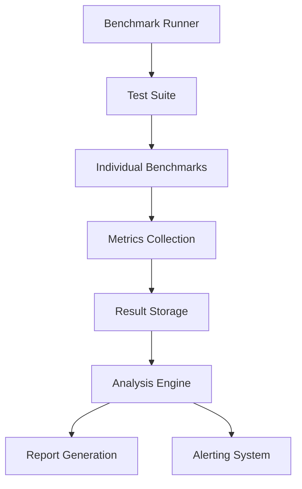

# 11.5 Production Benchmarking - Micro Tasks

## Overview
Implement continuous benchmarking system for production environments to track performance trends, identify optimization opportunities, and maintain performance SLAs.

## Micro Tasks

### Task 11.5.1: Create Benchmark Test Suite Framework
**Objective**: Build comprehensive benchmarking framework for all system components.

**Requirements**:
- Standardized benchmark definitions
- Reproducible test environments
- Performance baseline management
- Result comparison analytics

**Implementation**:
```rust
// Create src/benchmarking/mod.rs
use criterion::{Criterion, BenchmarkId, Throughput};
use serde::{Serialize, Deserialize};

#[derive(Clone, Serialize, Deserialize)]
pub struct BenchmarkConfig {
    pub name: String,
    pub category: BenchmarkCategory,
    pub parameters: BenchmarkParameters,
    pub success_criteria: SuccessCriteria,
    pub environment: EnvironmentConfig,
}

#[derive(Clone, Serialize, Deserialize)]
pub enum BenchmarkCategory {
    Allocation,
    NeuralNetwork,
    MemoryManagement,
    Concurrency,
    EndToEnd,
}

#[derive(Clone, Serialize, Deserialize)]
pub struct BenchmarkParameters {
    pub input_sizes: Vec<usize>,
    pub concurrency_levels: Vec<usize>,
    pub iteration_counts: Vec<usize>,
    pub warm_up_iterations: usize,
    pub sample_size: usize,
}

pub struct BenchmarkSuite {
    benchmarks: Vec<BenchmarkConfig>,
    executor: BenchmarkExecutor,
    result_store: Arc<BenchmarkResultStore>,
}

impl BenchmarkSuite {
    pub async fn run_all(&self) -> BenchmarkSuiteResult {
        let mut results = Vec::new();
        let suite_start = Instant::now();
        
        for config in &self.benchmarks {
            info!("Running benchmark: {}", config.name);
            
            let result = self.executor.run_benchmark(config).await?;
            
            // Store result for comparison
            self.result_store.store(&result).await?;
            
            // Check success criteria
            let passed = self.evaluate_criteria(&result, &config.success_criteria);
            
            results.push(BenchmarkResult {
                config: config.clone(),
                result,
                passed,
                timestamp: Utc::now(),
            });
            
            if !passed {
                warn!("Benchmark {} failed criteria", config.name);
            }
        }
        
        BenchmarkSuiteResult {
            results,
            total_duration: suite_start.elapsed(),
            suite_passed: results.iter().all(|r| r.passed),
            summary: self.generate_summary(&results),
        }
    }
    
    fn evaluate_criteria(
        &self,
        result: &BenchmarkExecutionResult,
        criteria: &SuccessCriteria
    ) -> bool {
        let metrics = &result.metrics;
        
        criteria.max_latency_p99
            .map_or(true, |threshold| metrics.latency_p99_ns <= threshold) &&
        criteria.min_throughput
            .map_or(true, |threshold| metrics.throughput_ops_per_sec >= threshold) &&
        criteria.max_memory_usage
            .map_or(true, |threshold| metrics.peak_memory_bytes <= threshold) &&
        criteria.max_cpu_usage
            .map_or(true, |threshold| metrics.avg_cpu_percent <= threshold)
    }
}

#[derive(Clone, Serialize, Deserialize)]
pub struct BenchmarkMetrics {
    pub latency_p50_ns: u64,
    pub latency_p95_ns: u64,
    pub latency_p99_ns: u64,
    pub throughput_ops_per_sec: f64,
    pub peak_memory_bytes: usize,
    pub avg_cpu_percent: f64,
    pub allocations_per_op: f64,
}

pub struct BenchmarkExecutor {
    criterion: Criterion,
}

impl BenchmarkExecutor {
    pub async fn run_benchmark(
        &self,
        config: &BenchmarkConfig
    ) -> Result<BenchmarkExecutionResult> {
        let mut group = self.criterion.benchmark_group(&config.name);
        
        // Configure throughput measurement
        for input_size in &config.parameters.input_sizes {
            group.throughput(Throughput::Elements(*input_size as u64));
            
            // Run benchmark for each parameter combination
            for concurrency in &config.parameters.concurrency_levels {
                let benchmark_id = BenchmarkId::from_parameter(
                    format!("size_{}_concurrency_{}", input_size, concurrency)
                );
                
                group.bench_with_input(
                    benchmark_id,
                    &(*input_size, *concurrency),
                    |b, (size, concurrency)| {
                        b.iter(|| async {
                            self.run_allocation_benchmark(*size, *concurrency).await
                        })
                    }
                );
            }
        }
        
        group.finish();
        
        // Extract metrics from criterion results
        let metrics = self.extract_metrics(&config.name).await?;
        
        Ok(BenchmarkExecutionResult {
            config: config.clone(),
            metrics,
            raw_measurements: self.get_raw_measurements(&config.name).await?,
        })
    }
}
```

**Validation**:
- Framework compiles and runs
- Benchmarks execute correctly
- Metrics captured accurately
- Results stored properly

---

### Task 11.5.2: Implement Allocation Engine Benchmarks
**Objective**: Comprehensive performance testing of the core allocation engine.

**Requirements**:
- Single allocation latency
- Batch allocation throughput
- Concurrent allocation stress test
- Memory usage profiling

**Implementation**:
```rust
// Create src/benchmarking/allocation_benchmarks.rs
use super::*;
use crate::allocation::AllocationEngine;

pub struct AllocationBenchmarks {
    engine: Arc<AllocationEngine>,
}

impl AllocationBenchmarks {
    pub fn register_benchmarks(&self, suite: &mut BenchmarkSuite) {
        suite.add_benchmark(BenchmarkConfig {
            name: "single_allocation_latency".to_string(),
            category: BenchmarkCategory::Allocation,
            parameters: BenchmarkParameters {
                input_sizes: vec![10, 50, 100, 500, 1000],
                concurrency_levels: vec![1],
                iteration_counts: vec![10000],
                warm_up_iterations: 1000,
                sample_size: 100,
            },
            success_criteria: SuccessCriteria {
                max_latency_p99: Some(100_000), // 100μs
                min_throughput: Some(10000.0),  // 10k ops/sec
                max_memory_usage: Some(1024 * 1024 * 100), // 100MB
                max_cpu_usage: Some(50.0),
            },
            environment: EnvironmentConfig::default(),
        });
        
        suite.add_benchmark(BenchmarkConfig {
            name: "batch_allocation_throughput".to_string(),
            category: BenchmarkCategory::Allocation,
            parameters: BenchmarkParameters {
                input_sizes: vec![100, 500, 1000],
                concurrency_levels: vec![1, 4, 8, 16],
                iteration_counts: vec![1000],
                warm_up_iterations: 100,
                sample_size: 50,
            },
            success_criteria: SuccessCriteria {
                max_latency_p99: Some(500_000), // 500μs
                min_throughput: Some(50000.0),  // 50k ops/sec
                max_memory_usage: Some(1024 * 1024 * 500), // 500MB
                max_cpu_usage: Some(80.0),
            },
            environment: EnvironmentConfig::default(),
        });
    }
    
    async fn benchmark_single_allocation(&self, input_size: usize) -> Duration {
        let input = (0..input_size)
            .map(|i| (i as f32) / (input_size as f32))
            .collect::<Vec<f32>>();
        
        let start = Instant::now();
        let _result = self.engine.allocate(&input).await.unwrap();
        start.elapsed()
    }
    
    async fn benchmark_batch_allocation(
        &self,
        batch_size: usize,
        input_size: usize
    ) -> (Duration, usize) {
        let batch = (0..batch_size)
            .map(|_| {
                (0..input_size)
                    .map(|i| rand::random::<f32>())
                    .collect::<Vec<f32>>()
            })
            .collect::<Vec<_>>();
        
        let start = Instant::now();
        let results = self.engine.allocate_batch(&batch).await.unwrap();
        let duration = start.elapsed();
        
        (duration, results.len())
    }
    
    async fn benchmark_concurrent_allocation(
        &self,
        concurrency: usize,
        operations_per_thread: usize,
        input_size: usize
    ) -> Vec<Duration> {
        let semaphore = Arc::new(Semaphore::new(concurrency));
        let mut handles = Vec::new();
        
        for _ in 0..concurrency {
            let permit = semaphore.clone().acquire_owned().await.unwrap();
            let engine = Arc::clone(&self.engine);
            
            let handle = tokio::spawn(async move {
                let _permit = permit;
                let mut durations = Vec::new();
                
                for _ in 0..operations_per_thread {
                    let input = (0..input_size)
                        .map(|_| rand::random::<f32>())
                        .collect::<Vec<f32>>();
                    
                    let start = Instant::now();
                    let _result = engine.allocate(&input).await.unwrap();
                    durations.push(start.elapsed());
                }
                
                durations
            });
            
            handles.push(handle);
        }
        
        let results = futures::future::join_all(handles).await;
        results.into_iter()
            .flat_map(|r| r.unwrap())
            .collect()
    }
}

// Specialized allocation stress tests
pub struct AllocationStressTests {
    engine: Arc<AllocationEngine>,
}

impl AllocationStressTests {
    pub async fn memory_pressure_test(&self) -> StressTestResult {
        let mut allocations = Vec::new();
        let start_memory = self.get_memory_usage();
        
        // Gradually increase memory pressure
        for batch_size in [100, 500, 1000, 5000, 10000] {
            let batch = (0..batch_size)
                .map(|_| vec![rand::random::<f32>(); 1000])
                .collect();
            
            let results = self.engine.allocate_batch(&batch).await?;
            allocations.extend(results);
            
            let current_memory = self.get_memory_usage();
            let memory_increase = current_memory - start_memory;
            
            if memory_increase > 1024 * 1024 * 1024 { // 1GB limit
                break;
            }
        }
        
        StressTestResult {
            peak_memory_mb: self.get_memory_usage() / 1024 / 1024,
            total_allocations: allocations.len(),
            success: true,
        }
    }
}
```

**Validation**:
- All benchmark variants run
- Latency measurements stable
- Throughput scaling verified
- Memory usage tracked

---

### Task 11.5.3: Create Neural Network Performance Benchmarks
**Objective**: Validate neural network inference performance across all architectures.

**Requirements**:
- Inference latency per architecture
- Batch inference throughput
- Memory usage optimization
- SIMD acceleration validation

**Implementation**:
```rust
// Create src/benchmarking/neural_benchmarks.rs
use crate::neural::{NeuralNetwork, ModelType};

pub struct NeuralNetworkBenchmarks {
    networks: HashMap<ModelType, Arc<NeuralNetwork>>,
}

impl NeuralNetworkBenchmarks {
    pub fn register_benchmarks(&self, suite: &mut BenchmarkSuite) {
        for (model_type, _) in &self.networks {
            // Single inference benchmark
            suite.add_benchmark(BenchmarkConfig {
                name: format!("neural_inference_{:?}", model_type),
                category: BenchmarkCategory::NeuralNetwork,
                parameters: BenchmarkParameters {
                    input_sizes: vec![10, 50, 100, 500],
                    concurrency_levels: vec![1],
                    iteration_counts: vec![100000],
                    warm_up_iterations: 10000,
                    sample_size: 1000,
                },
                success_criteria: SuccessCriteria {
                    max_latency_p99: Some(1_000), // 1μs
                    min_throughput: Some(1_000_000.0), // 1M ops/sec
                    max_memory_usage: Some(400 * 1024), // 400KB
                    max_cpu_usage: Some(30.0),
                },
                environment: EnvironmentConfig::default(),
            });
            
            // Batch inference benchmark
            suite.add_benchmark(BenchmarkConfig {
                name: format!("neural_batch_{:?}", model_type),
                category: BenchmarkCategory::NeuralNetwork,
                parameters: BenchmarkParameters {
                    input_sizes: vec![100],
                    concurrency_levels: vec![1, 4, 8],
                    iteration_counts: vec![1000, 5000, 10000],
                    warm_up_iterations: 100,
                    sample_size: 100,
                },
                success_criteria: SuccessCriteria {
                    max_latency_p99: Some(10_000), // 10μs
                    min_throughput: Some(500_000.0), // 500K ops/sec
                    max_memory_usage: Some(400 * 1024), // 400KB
                    max_cpu_usage: Some(60.0),
                },
                environment: EnvironmentConfig::default(),
            });
        }
    }
    
    async fn benchmark_inference(&self, model_type: &ModelType, input_size: usize) -> Duration {
        let network = &self.networks[model_type];
        let input = vec![0.5; input_size];
        
        let start = Instant::now();
        let _output = network.inference(&input).unwrap();
        start.elapsed()
    }
    
    async fn benchmark_batch_inference(
        &self,
        model_type: &ModelType,
        batch_size: usize,
        input_size: usize
    ) -> Duration {
        let network = &self.networks[model_type];
        let batch = vec![vec![0.5; input_size]; batch_size];
        
        let start = Instant::now();
        for input in &batch {
            let _output = network.inference(input).unwrap();
        }
        start.elapsed()
    }
    
    // SIMD acceleration benchmark
    async fn benchmark_simd_performance(&self) -> SIMDBenchmarkResult {
        let input_sizes = [64, 128, 256, 512, 1024];
        let mut results = HashMap::new();
        
        for &size in &input_sizes {
            let input = vec![0.5; size];
            
            // Scalar implementation
            let start = Instant::now();
            let scalar_result = self.scalar_dot_product(&input, &input);
            let scalar_time = start.elapsed();
            
            // SIMD implementation
            let start = Instant::now();
            let simd_result = self.simd_dot_product(&input, &input);
            let simd_time = start.elapsed();
            
            let speedup = scalar_time.as_nanos() as f64 / simd_time.as_nanos() as f64;
            
            results.insert(size, SIMDResult {
                scalar_time_ns: scalar_time.as_nanos() as u64,
                simd_time_ns: simd_time.as_nanos() as u64,
                speedup_factor: speedup,
                results_match: (scalar_result - simd_result).abs() < 1e-6,
            });
        }
        
        SIMDBenchmarkResult { results }
    }
}

// Weight loading benchmark
pub struct WeightLoadingBenchmark {
    model_paths: HashMap<ModelType, PathBuf>,
}

impl WeightLoadingBenchmark {
    pub async fn benchmark_weight_loading(&self) -> WeightLoadingResult {
        let mut results = HashMap::new();
        
        for (model_type, path) in &self.model_paths {
            let start = Instant::now();
            let network = NeuralNetwork::load_from_file(path).await?;
            let load_time = start.elapsed();
            
            let file_size = tokio::fs::metadata(path).await?.len();
            let load_speed_mb_s = (file_size as f64 / 1024.0 / 1024.0) / 
                load_time.as_secs_f64();
            
            results.insert(*model_type, WeightLoadingMetrics {
                load_time_ms: load_time.as_millis() as u64,
                file_size_bytes: file_size,
                load_speed_mb_per_sec: load_speed_mb_s,
                memory_usage_bytes: network.memory_usage(),
            });
        }
        
        WeightLoadingResult { results }
    }
}
```

**Validation**:
- All network types benchmarked
- SIMD acceleration verified
- Memory usage within limits
- Loading times acceptable

---

### Task 11.5.4: Implement End-to-End Performance Benchmarks
**Objective**: Measure complete system performance including all components.

**Requirements**:
- Request-to-response latency
- Complete allocation pipeline
- Knowledge graph integration
- Real-world usage patterns

**Implementation**:
```rust
// Create src/benchmarking/e2e_benchmarks.rs
pub struct EndToEndBenchmarks {
    system: Arc<NeuromorphicSystem>,
    test_data: TestDataSet,
}

impl EndToEndBenchmarks {
    pub fn register_benchmarks(&self, suite: &mut BenchmarkSuite) {
        // Simple allocation end-to-end
        suite.add_benchmark(BenchmarkConfig {
            name: "e2e_simple_allocation".to_string(),
            category: BenchmarkCategory::EndToEnd,
            parameters: BenchmarkParameters {
                input_sizes: vec![10, 50, 100],
                concurrency_levels: vec![1, 10, 100],
                iteration_counts: vec![1000],
                warm_up_iterations: 100,
                sample_size: 100,
            },
            success_criteria: SuccessCriteria {
                max_latency_p99: Some(5_000_000), // 5ms
                min_throughput: Some(1000.0),     // 1k ops/sec
                max_memory_usage: Some(1024 * 1024 * 1024), // 1GB
                max_cpu_usage: Some(70.0),
            },
            environment: EnvironmentConfig::default(),
        });
        
        // Knowledge graph integration
        suite.add_benchmark(BenchmarkConfig {
            name: "e2e_knowledge_integration".to_string(),
            category: BenchmarkCategory::EndToEnd,
            parameters: BenchmarkParameters {
                input_sizes: vec![100],
                concurrency_levels: vec![1, 5, 10],
                iteration_counts: vec![500],
                warm_up_iterations: 50,
                sample_size: 50,
            },
            success_criteria: SuccessCriteria {
                max_latency_p99: Some(10_000_000), // 10ms
                min_throughput: Some(500.0),       // 500 ops/sec
                max_memory_usage: Some(2 * 1024 * 1024 * 1024), // 2GB
                max_cpu_usage: Some(80.0),
            },
            environment: EnvironmentConfig::default(),
        });
    }
    
    async fn benchmark_simple_allocation(
        &self,
        input_size: usize,
        concurrency: usize
    ) -> Duration {
        let input = self.test_data.generate_vector(input_size);
        let start = Instant::now();
        
        if concurrency == 1 {
            let _result = self.system.process_allocation_request(&input).await?;
        } else {
            let handles: Vec<_> = (0..concurrency)
                .map(|_| {
                    let system = Arc::clone(&self.system);
                    let input = input.clone();
                    tokio::spawn(async move {
                        system.process_allocation_request(&input).await
                    })
                })
                .collect();
            
            futures::future::try_join_all(handles).await?;
        }
        
        start.elapsed()
    }
    
    async fn benchmark_knowledge_integration(
        &self,
        document: &str,
        concurrency: usize
    ) -> Duration {
        let start = Instant::now();
        
        if concurrency == 1 {
            let _result = self.system.process_document(document).await?;
        } else {
            let handles: Vec<_> = (0..concurrency)
                .map(|_| {
                    let system = Arc::clone(&self.system);
                    let doc = document.to_string();
                    tokio::spawn(async move {
                        system.process_document(&doc).await
                    })
                })
                .collect();
            
            futures::future::try_join_all(handles).await?;
        }
        
        start.elapsed()
    }
    
    // Complex multi-step workflow benchmark
    async fn benchmark_complex_workflow(&self) -> WorkflowBenchmarkResult {
        let start = Instant::now();
        
        // Step 1: Document ingestion
        let document = self.test_data.get_sample_document();
        let ingestion_start = Instant::now();
        let chunks = self.system.ingest_document(&document).await?;
        let ingestion_time = ingestion_start.elapsed();
        
        // Step 2: Semantic processing
        let processing_start = Instant::now();
        let embeddings = self.system.process_chunks(&chunks).await?;
        let processing_time = processing_start.elapsed();
        
        // Step 3: Allocation
        let allocation_start = Instant::now();
        let allocations = self.system.allocate_embeddings(&embeddings).await?;
        let allocation_time = allocation_start.elapsed();
        
        // Step 4: Knowledge graph update
        let kg_start = Instant::now();
        let entities = self.system.update_knowledge_graph(&allocations).await?;
        let kg_time = kg_start.elapsed();
        
        // Step 5: Query processing
        let query_start = Instant::now();
        let query_results = self.system.query_similar_entities(&entities[0]).await?;
        let query_time = query_start.elapsed();
        
        let total_time = start.elapsed();
        
        WorkflowBenchmarkResult {
            total_time_ms: total_time.as_millis() as u64,
            ingestion_time_ms: ingestion_time.as_millis() as u64,
            processing_time_ms: processing_time.as_millis() as u64,
            allocation_time_ms: allocation_time.as_millis() as u64,
            kg_update_time_ms: kg_time.as_millis() as u64,
            query_time_ms: query_time.as_millis() as u64,
            entities_created: entities.len(),
            similar_entities_found: query_results.len(),
        }
    }
}

// Realistic usage pattern simulation
pub struct UsagePatternBenchmarks {
    system: Arc<NeuromorphicSystem>,
}

impl UsagePatternBenchmarks {
    pub async fn simulate_research_workload(&self) -> UsagePatternResult {
        // Simulate academic research usage pattern
        let documents_per_hour = 50;
        let queries_per_hour = 200;
        let duration = Duration::from_hours(1);
        
        let start = Instant::now();
        let mut results = Vec::new();
        
        while start.elapsed() < duration {
            // Add documents periodically
            if start.elapsed().as_secs() % 72 == 0 { // Every 72 seconds
                let doc = self.generate_research_document();
                let doc_start = Instant::now();
                self.system.process_document(&doc).await?;
                results.push(("document", doc_start.elapsed()));
            }
            
            // Execute queries more frequently
            if start.elapsed().as_secs() % 18 == 0 { // Every 18 seconds
                let query = self.generate_research_query();
                let query_start = Instant::now();
                self.system.execute_query(&query).await?;
                results.push(("query", query_start.elapsed()));
            }
            
            tokio::time::sleep(Duration::from_secs(1)).await;
        }
        
        UsagePatternResult {
            pattern_name: "research_workload".to_string(),
            total_operations: results.len(),
            avg_latency_ms: results.iter()
                .map(|(_, duration)| duration.as_millis() as f64)
                .sum::<f64>() / results.len() as f64,
            operation_breakdown: self.analyze_operations(&results),
        }
    }
}
```

**Validation**:
- End-to-end flows complete
- Realistic patterns simulated
- All components integrated
- Performance targets met

---

### Task 11.5.5: Create Continuous Benchmarking Pipeline
**Objective**: Automated benchmarking with trend analysis and alerting.

**Requirements**:
- Scheduled benchmark execution
- Historical data tracking
- Performance regression alerts
- Optimization recommendations

**Implementation**:
```rust
// Create src/benchmarking/continuous/mod.rs
pub struct ContinuousBenchmarkingPipeline {
    scheduler: Arc<BenchmarkScheduler>,
    trend_analyzer: Arc<TrendAnalyzer>,
    alerting: Arc<AlertingService>,
    result_store: Arc<BenchmarkResultStore>,
}

impl ContinuousBenchmarkingPipeline {
    pub async fn start(&self) -> Result<()> {
        // Start scheduler
        let scheduler_handle = self.scheduler.start().await?;
        
        // Start trend analysis
        let trend_handle = self.trend_analyzer.start().await?;
        
        // Start alerting service
        let alert_handle = self.alerting.start().await?;
        
        tokio::select! {
            r = scheduler_handle => r?,
            r = trend_handle => r?,
            r = alert_handle => r?,
        }
    }
}

pub struct BenchmarkScheduler {
    schedule: CronSchedule,
    benchmark_suite: Arc<BenchmarkSuite>,
    result_store: Arc<BenchmarkResultStore>,
}

impl BenchmarkScheduler {
    pub async fn start(&self) -> Result<JoinHandle<()>> {
        let schedule = self.schedule.clone();
        let suite = Arc::clone(&self.benchmark_suite);
        let store = Arc::clone(&self.result_store);
        
        Ok(tokio::spawn(async move {
            loop {
                let next_run = schedule.next_execution_time();
                let sleep_duration = next_run.duration_since(Utc::now());
                
                tokio::time::sleep(sleep_duration.to_std().unwrap()).await;
                
                info!("Starting scheduled benchmark run");
                
                match suite.run_all().await {
                    Ok(results) => {
                        info!("Benchmark run completed successfully");
                        
                        // Store results
                        if let Err(e) = store.store_suite_result(&results).await {
                            error!("Failed to store benchmark results: {}", e);
                        }
                        
                        // Update metrics
                        metrics::histogram!("benchmark_duration_seconds")
                            .record(results.total_duration.as_secs_f64());
                        
                        metrics::gauge!("benchmark_success_rate")
                            .set(if results.suite_passed { 1.0 } else { 0.0 });
                    }
                    Err(e) => {
                        error!("Benchmark run failed: {}", e);
                        metrics::counter!("benchmark_failures").increment(1);
                    }
                }
            }
        }))
    }
}

pub struct TrendAnalyzer {
    result_store: Arc<BenchmarkResultStore>,
    analysis_interval: Duration,
}

impl TrendAnalyzer {
    pub async fn start(&self) -> Result<JoinHandle<()>> {
        let store = Arc::clone(&self.result_store);
        let interval = self.analysis_interval;
        
        Ok(tokio::spawn(async move {
            let mut analysis_timer = tokio::time::interval(interval);
            
            loop {
                analysis_timer.tick().await;
                
                match Self::analyze_trends(&store).await {
                    Ok(analysis) => {
                        info!("Trend analysis completed");
                        
                        // Store analysis results
                        if let Err(e) = store.store_trend_analysis(&analysis).await {
                            error!("Failed to store trend analysis: {}", e);
                        }
                        
                        // Update trend metrics
                        for trend in &analysis.trends {
                            metrics::gauge!("performance_trend")
                                .set(trend.slope, &[
                                    ("benchmark", trend.benchmark_name.as_str()),
                                    ("metric", trend.metric_name.as_str()),
                                ]);
                        }
                    }
                    Err(e) => {
                        error!("Trend analysis failed: {}", e);
                    }
                }
            }
        }))
    }
    
    async fn analyze_trends(
        store: &BenchmarkResultStore
    ) -> Result<TrendAnalysis> {
        let recent_results = store.get_recent_results(Duration::from_days(30)).await?;
        let mut trends = Vec::new();
        
        // Group results by benchmark name and metric
        let grouped_results = Self::group_by_benchmark_and_metric(&recent_results);
        
        for ((benchmark_name, metric_name), values) in grouped_results {
            if values.len() < 10 {
                continue; // Need at least 10 data points for trend analysis
            }
            
            let trend = Self::calculate_trend(&values)?;
            
            trends.push(PerformanceTrend {
                benchmark_name,
                metric_name,
                slope: trend.slope,
                r_squared: trend.r_squared,
                significance: trend.significance,
                direction: if trend.slope > 0.05 {
                    TrendDirection::Degrading
                } else if trend.slope < -0.05 {
                    TrendDirection::Improving
                } else {
                    TrendDirection::Stable
                },
            });
        }
        
        Ok(TrendAnalysis {
            analysis_date: Utc::now(),
            trends,
            summary: Self::generate_trend_summary(&trends),
        })
    }
    
    fn calculate_trend(values: &[(DateTime<Utc>, f64)]) -> Result<TrendCalculation> {
        // Convert timestamps to days since start
        let start_time = values[0].0;
        let data_points: Vec<(f64, f64)> = values
            .iter()
            .map(|(timestamp, value)| {
                let days = timestamp.signed_duration_since(start_time).num_days() as f64;
                (days, *value)
            })
            .collect();
        
        // Linear regression
        let n = data_points.len() as f64;
        let sum_x: f64 = data_points.iter().map(|(x, _)| x).sum();
        let sum_y: f64 = data_points.iter().map(|(_, y)| y).sum();
        let sum_xy: f64 = data_points.iter().map(|(x, y)| x * y).sum();
        let sum_x2: f64 = data_points.iter().map(|(x, _)| x * x).sum();
        
        let slope = (n * sum_xy - sum_x * sum_y) / (n * sum_x2 - sum_x * sum_x);
        let intercept = (sum_y - slope * sum_x) / n;
        
        // Calculate R-squared
        let y_mean = sum_y / n;
        let ss_tot: f64 = data_points.iter()
            .map(|(_, y)| (y - y_mean).powi(2))
            .sum();
        let ss_res: f64 = data_points.iter()
            .map(|(x, y)| (y - (slope * x + intercept)).powi(2))
            .sum();
        
        let r_squared = 1.0 - (ss_res / ss_tot);
        
        Ok(TrendCalculation {
            slope,
            intercept,
            r_squared,
            significance: if r_squared > 0.7 { 
                TrendSignificance::High 
            } else if r_squared > 0.4 { 
                TrendSignificance::Medium 
            } else { 
                TrendSignificance::Low 
            },
        })
    }
}
```

**Validation**:
- Scheduling works correctly
- Trends calculated accurately
- Alerts trigger appropriately
- Historical data preserved

---

### Task 11.5.6a: Implement Version-to-Version Comparison
**Objective**: Compare benchmark performance between different software versions.

**Requirements**:
- Benchmark result retrieval by version
- Statistical comparison analysis
- Regression detection algorithms
- Version comparison reporting

**Implementation**:
```rust
// Create src/benchmarking/comparison/version_comparator.rs
pub struct VersionComparator {
    result_store: Arc<BenchmarkResultStore>,
    statistical_analyzer: Arc<StatisticalAnalyzer>,
}

impl VersionComparator {
    pub async fn compare_versions(
        &self,
        version_a: &str,
        version_b: &str
    ) -> Result<VersionComparison> {
        let results_a = self.result_store.get_results_for_version(version_a).await?;
        let results_b = self.result_store.get_results_for_version(version_b).await?;
        
        let mut benchmark_comparisons = HashMap::new();
        
        // Compare each benchmark
        for benchmark_name in self.get_common_benchmarks(&results_a, &results_b) {
            let metrics_a = self.extract_metrics(&results_a, &benchmark_name);
            let metrics_b = self.extract_metrics(&results_b, &benchmark_name);
            
            let comparison = self.compare_benchmark_metrics(&metrics_a, &metrics_b)?;
            benchmark_comparisons.insert(benchmark_name, comparison);
        }
        
        Ok(VersionComparison {
            version_a: version_a.to_string(),
            version_b: version_b.to_string(),
            comparison_date: Utc::now(),
            benchmark_comparisons,
            summary: self.generate_version_comparison_summary(&benchmark_comparisons),
        })
    }
    
    fn compare_benchmark_metrics(
        &self,
        metrics_a: &[BenchmarkMetrics],
        metrics_b: &[BenchmarkMetrics]
    ) -> Result<BenchmarkComparison> {
        let latency_comparison = self.statistical_analyzer.compare_distributions(
            &metrics_a.iter().map(|m| m.latency_p99_ns as f64).collect::<Vec<_>>(),
            &metrics_b.iter().map(|m| m.latency_p99_ns as f64).collect::<Vec<_>>()
        )?;
        
        let throughput_comparison = self.statistical_analyzer.compare_distributions(
            &metrics_a.iter().map(|m| m.throughput_ops_per_sec).collect::<Vec<_>>(),
            &metrics_b.iter().map(|m| m.throughput_ops_per_sec).collect::<Vec<_>>()
        )?;
        
        Ok(BenchmarkComparison {
            latency_change: MetricChange {
                percent_change: latency_comparison.percent_change,
                statistical_significance: latency_comparison.p_value < 0.05,
                confidence_interval: latency_comparison.confidence_interval,
                direction: latency_comparison.direction,
            },
            throughput_change: MetricChange {
                percent_change: throughput_comparison.percent_change,
                statistical_significance: throughput_comparison.p_value < 0.05,
                confidence_interval: throughput_comparison.confidence_interval,
                direction: throughput_comparison.direction,
            },
        })
    }
    
    fn detect_performance_regressions(
        &self,
        comparisons: &HashMap<String, BenchmarkComparison>
    ) -> Vec<PerformanceRegression> {
        let mut regressions = Vec::new();
        
        for (benchmark_name, comparison) in comparisons {
            // Latency regression (increase is bad)
            if comparison.latency_change.percent_change > 10.0 && 
               comparison.latency_change.statistical_significance {
                regressions.push(PerformanceRegression {
                    benchmark: benchmark_name.clone(),
                    metric: "latency_p99".to_string(),
                    severity: if comparison.latency_change.percent_change > 50.0 {
                        RegressionSeverity::Critical
                    } else if comparison.latency_change.percent_change > 25.0 {
                        RegressionSeverity::Major
                    } else {
                        RegressionSeverity::Minor
                    },
                    change_percent: comparison.latency_change.percent_change,
                    confidence_interval: comparison.latency_change.confidence_interval,
                });
            }
            
            // Throughput regression (decrease is bad)
            if comparison.throughput_change.percent_change < -10.0 && 
               comparison.throughput_change.statistical_significance {
                regressions.push(PerformanceRegression {
                    benchmark: benchmark_name.clone(),
                    metric: "throughput".to_string(),
                    severity: if comparison.throughput_change.percent_change < -50.0 {
                        RegressionSeverity::Critical
                    } else if comparison.throughput_change.percent_change < -25.0 {
                        RegressionSeverity::Major
                    } else {
                        RegressionSeverity::Minor
                    },
                    change_percent: comparison.throughput_change.percent_change,
                    confidence_interval: comparison.throughput_change.confidence_interval,
                });
            }
        }
        
        regressions
    }
}
```

**Validation**:
- Version comparison accurate
- Statistical tests valid
- Regression detection reliable
- Performance deltas calculated correctly

---

### Task 11.5.6b: Implement Configuration Impact Analysis
**Objective**: Analyze performance impact of different configuration settings.

**Requirements**:
- Configuration performance benchmarking
- Impact quantification algorithms
- Configuration optimization recommendations
- Settings comparison matrix

**Implementation**:
```rust
// Create src/benchmarking/comparison/config_analyzer.rs
pub struct ConfigurationAnalyzer {
    benchmark_runner: Arc<BenchmarkRunner>,
    statistical_analyzer: Arc<StatisticalAnalyzer>,
}

impl ConfigurationAnalyzer {
    pub async fn analyze_configuration_impact(
        &self,
        configurations: &[ConfigurationVariant]
    ) -> Result<ConfigurationAnalysis> {
        let mut config_results = HashMap::new();
        
        for config in configurations {
            info!("Benchmarking configuration: {}", config.name);
            let benchmark_suite = BenchmarkSuite::new_with_config(config.clone());
            let results = benchmark_suite.run_all().await?;
            config_results.insert(config.name.clone(), results);
        }
        
        let analysis = self.analyze_config_performance_impact(&config_results);
        
        Ok(ConfigurationAnalysis {
            configurations: configurations.iter().map(|c| c.name.clone()).collect(),
            performance_impact: analysis,
            recommendations: self.generate_config_recommendations(&analysis),
            optimal_configuration: self.find_optimal_configuration(&config_results),
        })
    }
    
    fn analyze_config_performance_impact(
        &self,
        config_results: &HashMap<String, BenchmarkSuiteResult>
    ) -> ConfigPerformanceImpact {
        let mut impact_matrix = HashMap::new();
        let config_names: Vec<_> = config_results.keys().cloned().collect();
        
        // Compare each configuration pair
        for i in 0..config_names.len() {
            for j in (i + 1)..config_names.len() {
                let config_a = &config_names[i];
                let config_b = &config_names[j];
                
                let results_a = &config_results[config_a];
                let results_b = &config_results[config_b];
                
                let comparison = self.compare_configurations(results_a, results_b);
                impact_matrix.insert(
                    format!("{}_vs_{}", config_a, config_b),
                    comparison
                );
            }
        }
        
        ConfigPerformanceImpact {
            baseline_config: self.find_baseline_config(config_results),
            impact_matrix,
            performance_ranking: self.rank_configurations(config_results),
        }
    }
    
    fn generate_config_recommendations(
        &self,
        impact: &ConfigPerformanceImpact
    ) -> Vec<ConfigurationRecommendation> {
        let mut recommendations = Vec::new();
        
        // Find best performing configuration
        if let Some(best_config) = impact.performance_ranking.first() {
            recommendations.push(ConfigurationRecommendation {
                recommendation_type: RecommendationType::OptimalConfig,
                description: format!("Use '{}' configuration for best overall performance", best_config.name),
                impact_estimate: format!("{}% improvement over baseline", 
                    best_config.performance_score_vs_baseline),
                priority: Priority::High,
            });
        }
        
        // Identify configuration parameters with highest impact
        for (comparison_key, comparison) in &impact.impact_matrix {
            if comparison.latency_improvement > 20.0 {
                recommendations.push(ConfigurationRecommendation {
                    recommendation_type: RecommendationType::ParameterOptimization,
                    description: format!("Configuration change '{}' shows significant latency improvement", 
                        comparison_key),
                    impact_estimate: format!("{}% latency reduction", comparison.latency_improvement),
                    priority: Priority::Medium,
                });
            }
        }
        
        recommendations
    }
}
```

**Validation**:
- Configuration benchmarks complete correctly
- Impact analysis mathematically sound
- Recommendations actionable
- Optimal configuration identified

---

### Task 11.5.6c: Create A/B Testing Framework
**Objective**: Implement statistical A/B testing for performance variants.

**Requirements**:
- Traffic splitting for A/B tests
- Statistical significance testing
- Sample size calculations
- Result interpretation

**Implementation**:
```rust
// Create src/benchmarking/comparison/ab_testing.rs
pub struct ABTestFramework {
    statistical_analyzer: Arc<StatisticalAnalyzer>,
    benchmark_runner: Arc<BenchmarkRunner>,
}

impl ABTestFramework {
    pub async fn run_ab_test(
        &self,
        variant_a: TestVariant,
        variant_b: TestVariant,
        config: ABTestConfig
    ) -> Result<ABTestResult> {
        let required_sample_size = self.calculate_sample_size(&config)?;
        info!("Running A/B test, required sample size: {}", required_sample_size);
        
        let start_time = Instant::now();
        let mut results_a = Vec::new();
        let mut results_b = Vec::new();
        
        while (results_a.len() + results_b.len()) < required_sample_size &&
              start_time.elapsed() < config.max_duration {
            
            // Route traffic based on split
            if rand::random::<f64>() < config.traffic_split {
                // Variant A
                let result = self.run_single_benchmark(&variant_a).await?;
                results_a.push(result);
            } else {
                // Variant B
                let result = self.run_single_benchmark(&variant_b).await?;
                results_b.push(result);
            }
            
            // Check early stopping criteria
            if results_a.len() >= 30 && results_b.len() >= 30 {
                if let Some(early_result) = self.check_early_stopping(&results_a, &results_b, &config)? {
                    return Ok(early_result);
                }
            }
            
            // Small delay between tests
            tokio::time::sleep(Duration::from_millis(100)).await;
        }
        
        let statistical_result = self.statistical_analyzer.ab_test_analysis(
            &results_a, &results_b
        )?;
        
        Ok(ABTestResult {
            variant_a: variant_a.name,
            variant_b: variant_b.name,
            test_duration: start_time.elapsed(),
            sample_size_a: results_a.len(),
            sample_size_b: results_b.len(),
            statistical_significance: statistical_result.p_value < config.significance_level,
            confidence_level: 1.0 - config.significance_level,
            winner: statistical_result.winner,
            performance_lift: statistical_result.performance_lift,
            effect_size: statistical_result.effect_size,
            power: self.calculate_statistical_power(&statistical_result),
        })
    }
    
    fn calculate_sample_size(&self, config: &ABTestConfig) -> Result<usize> {
        // Power analysis for sample size calculation
        let alpha = config.significance_level;
        let beta = 1.0 - config.power;
        let effect_size = config.minimum_detectable_effect;
        
        // Two-tailed t-test sample size calculation
        let z_alpha = self.inverse_normal_cdf(1.0 - alpha / 2.0);
        let z_beta = self.inverse_normal_cdf(1.0 - beta);
        
        let sample_size = 2.0 * ((z_alpha + z_beta).powi(2)) / effect_size.powi(2);
        
        Ok(sample_size.ceil() as usize)
    }
    
    fn check_early_stopping(
        &self,
        results_a: &[BenchmarkResult],
        results_b: &[BenchmarkResult],
        config: &ABTestConfig
    ) -> Result<Option<ABTestResult>> {
        let current_result = self.statistical_analyzer.ab_test_analysis(results_a, results_b)?;
        
        // Early stopping for statistical significance
        if current_result.p_value < config.significance_level {
            // Check if effect size is practically significant
            if current_result.effect_size.abs() >= config.minimum_detectable_effect {
                return Ok(Some(ABTestResult {
                    variant_a: "A".to_string(),
                    variant_b: "B".to_string(),
                    test_duration: Duration::from_secs(0), // Will be updated by caller
                    sample_size_a: results_a.len(),
                    sample_size_b: results_b.len(),
                    statistical_significance: true,
                    confidence_level: 1.0 - config.significance_level,
                    winner: current_result.winner,
                    performance_lift: current_result.performance_lift,
                    effect_size: current_result.effect_size,
                    power: self.calculate_statistical_power(&current_result),
                }));
            }
        }
        
        Ok(None)
    }
}

pub struct ABTestConfig {
    pub traffic_split: f64,
    pub significance_level: f64,
    pub power: f64,
    pub minimum_detectable_effect: f64,
    pub max_duration: Duration,
}

impl Default for ABTestConfig {
    fn default() -> Self {
        Self {
            traffic_split: 0.5,
            significance_level: 0.05,
            power: 0.8,
            minimum_detectable_effect: 0.1, // 10% effect size
            max_duration: Duration::from_hours(1),
        }
    }
}
```

**Validation**:
- A/B tests statistically valid
- Sample size calculations correct
- Early stopping criteria sound
- Result interpretation accurate

---

### Task 11.5.7: Create Performance Optimization Recommendations
**Objective**: Automated analysis to identify optimization opportunities.

**Requirements**:
- Bottleneck identification
- Resource usage analysis
- Code hotspot detection
- Optimization suggestions

**Implementation**:
```rust
// Create src/benchmarking/optimization/mod.rs
pub struct OptimizationAnalyzer {
    profiler: Arc<PerformanceProfiler>,
    bottleneck_detector: BottleneckDetector,
    recommendation_engine: RecommendationEngine,
}

impl OptimizationAnalyzer {
    pub async fn analyze_performance(
        &self,
        benchmark_results: &BenchmarkSuiteResult
    ) -> Result<OptimizationReport> {
        // Identify bottlenecks
        let bottlenecks = self.bottleneck_detector
            .identify_bottlenecks(benchmark_results).await?;
        
        // Analyze resource usage patterns
        let resource_analysis = self.analyze_resource_usage(benchmark_results).await?;
        
        // Generate recommendations
        let recommendations = self.recommendation_engine
            .generate_recommendations(&bottlenecks, &resource_analysis).await?;
        
        Ok(OptimizationReport {
            analysis_date: Utc::now(),
            bottlenecks,
            resource_analysis,
            recommendations,
            estimated_impact: self.estimate_optimization_impact(&recommendations),
        })
    }
    
    async fn analyze_resource_usage(
        &self,
        results: &BenchmarkSuiteResult
    ) -> Result<ResourceUsageAnalysis> {
        let mut cpu_hotspots = Vec::new();
        let mut memory_hotspots = Vec::new();
        let mut io_bottlenecks = Vec::new();
        
        for result in &results.results {
            let metrics = &result.result.metrics;
            
            // CPU analysis
            if metrics.avg_cpu_percent > 80.0 {
                cpu_hotspots.push(CpuHotspot {
                    benchmark_name: result.config.name.clone(),
                    cpu_usage: metrics.avg_cpu_percent,
                    suspected_cause: self.identify_cpu_hotspot_cause(&result.config),
                });
            }
            
            // Memory analysis
            if metrics.peak_memory_bytes > 1024 * 1024 * 1024 { // 1GB
                memory_hotspots.push(MemoryHotspot {
                    benchmark_name: result.config.name.clone(),
                    peak_memory_mb: metrics.peak_memory_bytes / 1024 / 1024,
                    allocations_per_op: metrics.allocations_per_op,
                    suspected_cause: self.identify_memory_hotspot_cause(&result.config),
                });
            }
            
            // I/O analysis (if available)
            if let Some(io_metrics) = &result.result.io_metrics {
                if io_metrics.avg_wait_time_ms > 10.0 {
                    io_bottlenecks.push(IoBottleneck {
                        benchmark_name: result.config.name.clone(),
                        wait_time_ms: io_metrics.avg_wait_time_ms,
                        iops: io_metrics.operations_per_second,
                        bottleneck_type: self.classify_io_bottleneck(io_metrics),
                    });
                }
            }
        }
        
        Ok(ResourceUsageAnalysis {
            cpu_hotspots,
            memory_hotspots,
            io_bottlenecks,
            overall_efficiency: self.calculate_overall_efficiency(results),
        })
    }
}

pub struct BottleneckDetector;

impl BottleneckDetector {
    pub async fn identify_bottlenecks(
        &self,
        results: &BenchmarkSuiteResult
    ) -> Result<Vec<PerformanceBottleneck>> {
        let mut bottlenecks = Vec::new();
        
        for result in &results.results {
            let metrics = &result.result.metrics;
            
            // Latency bottlenecks
            if metrics.latency_p99_ns > 10_000_000 { // 10ms
                bottlenecks.push(PerformanceBottleneck {
                    category: BottleneckCategory::Latency,
                    benchmark: result.config.name.clone(),
                    severity: if metrics.latency_p99_ns > 100_000_000 { 
                        Severity::High 
                    } else { 
                        Severity::Medium 
                    },
                    description: format!(
                        "High P99 latency: {}ms", 
                        metrics.latency_p99_ns / 1_000_000
                    ),
                    suggested_fix: self.suggest_latency_fix(&result.config, metrics),
                });
            }
            
            // Throughput bottlenecks
            let expected_throughput = self.get_expected_throughput(&result.config);
            if metrics.throughput_ops_per_sec < expected_throughput * 0.8 {
                bottlenecks.push(PerformanceBottleneck {
                    category: BottleneckCategory::Throughput,
                    benchmark: result.config.name.clone(),
                    severity: Severity::Medium,
                    description: format!(
                        "Low throughput: {} ops/sec (expected: {})", 
                        metrics.throughput_ops_per_sec as u64,
                        expected_throughput as u64
                    ),
                    suggested_fix: self.suggest_throughput_fix(&result.config, metrics),
                });
            }
            
            // Memory bottlenecks
            if metrics.allocations_per_op > 100.0 {
                bottlenecks.push(PerformanceBottleneck {
                    category: BottleneckCategory::Memory,
                    benchmark: result.config.name.clone(),
                    severity: Severity::Low,
                    description: format!(
                        "High allocation rate: {} allocs/op", 
                        metrics.allocations_per_op as u64
                    ),
                    suggested_fix: "Consider object pooling or pre-allocation".to_string(),
                });
            }
        }
        
        Ok(bottlenecks)
    }
    
    fn suggest_latency_fix(
        &self,
        config: &BenchmarkConfig,
        metrics: &BenchmarkMetrics
    ) -> String {
        match config.category {
            BenchmarkCategory::Allocation => {
                if metrics.avg_cpu_percent > 90.0 {
                    "Consider SIMD optimization for allocation calculations".to_string()
                } else if metrics.peak_memory_bytes > 500 * 1024 * 1024 {
                    "Implement memory pooling to reduce allocation overhead".to_string()
                } else {
                    "Profile allocation algorithm for algorithmic improvements".to_string()
                }
            }
            BenchmarkCategory::NeuralNetwork => {
                "Consider batch processing or model quantization".to_string()
            }
            _ => "Profile code to identify specific bottlenecks".to_string()
        }
    }
}

pub struct RecommendationEngine;

impl RecommendationEngine {
    pub async fn generate_recommendations(
        &self,
        bottlenecks: &[PerformanceBottleneck],
        resource_analysis: &ResourceUsageAnalysis
    ) -> Result<Vec<OptimizationRecommendation>> {
        let mut recommendations = Vec::new();
        
        // Algorithm optimizations
        if self.has_algorithmic_bottlenecks(bottlenecks) {
            recommendations.push(OptimizationRecommendation {
                category: OptimizationCategory::Algorithm,
                priority: Priority::High,
                title: "Optimize Core Allocation Algorithm".to_string(),
                description: "Consider implementing more efficient allocation strategies".to_string(),
                implementation_effort: ImplementationEffort::High,
                expected_improvement: "20-40% latency reduction".to_string(),
                specific_actions: vec![
                    "Profile allocation hotpaths".to_string(),
                    "Implement SIMD vectorization".to_string(),
                    "Consider lock-free data structures".to_string(),
                ],
            });
        }
        
        // Memory optimizations
        if resource_analysis.memory_hotspots.len() > 0 {
            recommendations.push(OptimizationRecommendation {
                category: OptimizationCategory::Memory,
                priority: Priority::Medium,
                title: "Implement Memory Pool Management".to_string(),
                description: "Reduce allocation overhead with object pooling".to_string(),
                implementation_effort: ImplementationEffort::Medium,
                expected_improvement: "15-25% memory efficiency".to_string(),
                specific_actions: vec![
                    "Implement custom allocator".to_string(),
                    "Add object pooling for frequently allocated types".to_string(),
                    "Optimize data structure layouts".to_string(),
                ],
            });
        }
        
        // Concurrency optimizations
        if self.has_concurrency_issues(bottlenecks, resource_analysis) {
            recommendations.push(OptimizationRecommendation {
                category: OptimizationCategory::Concurrency,
                priority: Priority::High,
                title: "Improve Parallel Processing".to_string(),
                description: "Better utilize available CPU cores".to_string(),
                implementation_effort: ImplementationEffort::Medium,
                expected_improvement: "2-4x throughput increase".to_string(),
                specific_actions: vec![
                    "Implement work-stealing thread pool".to_string(),
                    "Reduce lock contention".to_string(),
                    "Add batching for parallel operations".to_string(),
                ],
            });
        }
        
        Ok(recommendations)
    }
}
```

**Validation**:
- Bottlenecks identified correctly
- Recommendations actionable
- Impact estimates reasonable
- Resource analysis accurate

---

### Task 11.5.8: Implement Benchmark Result Visualization
**Objective**: Create rich visualizations for benchmark results and trends.

**Requirements**:
- Interactive charts and graphs
- Trend visualization
- Comparison dashboards
- Export capabilities

**Implementation**:
```rust
// Create src/benchmarking/visualization/mod.rs
use plotters::prelude::*;
use serde_json::{json, Value};

pub struct BenchmarkVisualizer {
    chart_generator: ChartGenerator,
    dashboard_server: DashboardServer,
}

impl BenchmarkVisualizer {
    pub async fn generate_performance_dashboard(
        &self,
        results: &BenchmarkSuiteResult
    ) -> Result<Dashboard> {
        let mut charts = Vec::new();
        
        // Latency distribution chart
        let latency_chart = self.chart_generator
            .create_latency_distribution_chart(results).await?;
        charts.push(latency_chart);
        
        // Throughput comparison chart
        let throughput_chart = self.chart_generator
            .create_throughput_comparison_chart(results).await?;
        charts.push(throughput_chart);
        
        // Resource usage heatmap
        let resource_chart = self.chart_generator
            .create_resource_usage_heatmap(results).await?;
        charts.push(resource_chart);
        
        // Performance trends
        let trend_chart = self.chart_generator
            .create_performance_trend_chart(results).await?;
        charts.push(trend_chart);
        
        Ok(Dashboard {
            title: "Performance Benchmark Dashboard".to_string(),
            charts,
            generated_at: Utc::now(),
            metadata: DashboardMetadata {
                total_benchmarks: results.results.len(),
                suite_duration: results.total_duration,
                success_rate: results.results.iter()
                    .filter(|r| r.passed)
                    .count() as f64 / results.results.len() as f64,
            },
        })
    }
    
    pub fn export_results(
        &self,
        results: &BenchmarkSuiteResult,
        format: ExportFormat
    ) -> Result<Vec<u8>> {
        match format {
            ExportFormat::Json => {
                Ok(serde_json::to_vec_pretty(results)?)
            }
            ExportFormat::Csv => {
                self.export_to_csv(results)
            }
            ExportFormat::Html => {
                self.export_to_html(results)
            }
            ExportFormat::Pdf => {
                self.export_to_pdf(results)
            }
        }
    }
}

pub struct ChartGenerator;

impl ChartGenerator {
    pub async fn create_latency_distribution_chart(
        &self,
        results: &BenchmarkSuiteResult
    ) -> Result<Chart> {
        let mut chart_data = Vec::new();
        
        for result in &results.results {
            let metrics = &result.result.metrics;
            chart_data.push(ChartDataPoint {
                x: result.config.name.clone(),
                y: metrics.latency_p99_ns as f64 / 1_000_000.0, // Convert to ms
                category: format!("{:?}", result.config.category),
            });
        }
        
        Ok(Chart {
            chart_type: ChartType::Bar,
            title: "P99 Latency by Benchmark".to_string(),
            x_axis: AxisConfig {
                label: "Benchmark".to_string(),
                data_type: DataType::Categorical,
            },
            y_axis: AxisConfig {
                label: "Latency (ms)".to_string(),
                data_type: DataType::Numeric,
            },
            data: chart_data,
            config: ChartConfig {
                width: 800,
                height: 400,
                color_scheme: ColorScheme::Category10,
            },
        })
    }
    
    pub async fn create_performance_trend_chart(
        &self,
        historical_results: &[BenchmarkSuiteResult]
    ) -> Result<Chart> {
        let mut series_data = HashMap::new();
        
        for suite_result in historical_results {
            let timestamp = suite_result.timestamp;
            
            for result in &suite_result.results {
                let benchmark_name = &result.config.name;
                let latency = result.result.metrics.latency_p99_ns as f64 / 1_000_000.0;
                
                series_data
                    .entry(benchmark_name.clone())
                    .or_insert_with(Vec::new)
                    .push(TimeSeriesPoint {
                        timestamp,
                        value: latency,
                    });
            }
        }
        
        let series: Vec<_> = series_data
            .into_iter()
            .map(|(name, points)| TimeSeries {
                name,
                points,
                color: self.generate_color(&name),
            })
            .collect();
        
        Ok(Chart {
            chart_type: ChartType::Line,
            title: "Performance Trends Over Time".to_string(),
            x_axis: AxisConfig {
                label: "Time".to_string(),
                data_type: DataType::Temporal,
            },
            y_axis: AxisConfig {
                label: "P99 Latency (ms)".to_string(),
                data_type: DataType::Numeric,
            },
            data: series.into_iter()
                .flat_map(|s| s.points.into_iter()
                    .map(|p| ChartDataPoint {
                        x: p.timestamp.to_rfc3339(),
                        y: p.value,
                        category: s.name.clone(),
                    }))
                .collect(),
            config: ChartConfig {
                width: 1000,
                height: 500,
                color_scheme: ColorScheme::Category10,
            },
        })
    }
    
    pub async fn create_resource_usage_heatmap(
        &self,
        results: &BenchmarkSuiteResult
    ) -> Result<Chart> {
        let mut heatmap_data = Vec::new();
        
        for (i, result) in results.results.iter().enumerate() {
            let metrics = &result.result.metrics;
            
            // CPU usage
            heatmap_data.push(HeatmapPoint {
                x: i,
                y: 0,
                value: metrics.avg_cpu_percent,
                label: format!("{} - CPU", result.config.name),
            });
            
            // Memory usage (normalized to percentage)
            let memory_percent = (metrics.peak_memory_bytes as f64 / 
                (1024.0 * 1024.0 * 1024.0)) * 100.0; // GB to percent
            heatmap_data.push(HeatmapPoint {
                x: i,
                y: 1,
                value: memory_percent,
                label: format!("{} - Memory", result.config.name),
            });
            
            // Throughput (normalized)
            let throughput_percent = (metrics.throughput_ops_per_sec / 100000.0) * 100.0;
            heatmap_data.push(HeatmapPoint {
                x: i,
                y: 2,
                value: throughput_percent.min(100.0),
                label: format!("{} - Throughput", result.config.name),
            });
        }
        
        Ok(Chart {
            chart_type: ChartType::Heatmap,
            title: "Resource Usage Across Benchmarks".to_string(),
            x_axis: AxisConfig {
                label: "Benchmark".to_string(),
                data_type: DataType::Categorical,
            },
            y_axis: AxisConfig {
                label: "Resource Type".to_string(),
                data_type: DataType::Categorical,
            },
            data: heatmap_data.into_iter()
                .map(|p| ChartDataPoint {
                    x: p.label,
                    y: p.value,
                    category: "resource".to_string(),
                })
                .collect(),
            config: ChartConfig {
                width: 800,
                height: 300,
                color_scheme: ColorScheme::Viridis,
            },
        })
    }
}

// Interactive dashboard with real-time updates
const DASHBOARD_HTML_TEMPLATE: &str = r#"
<!DOCTYPE html>
<html>
<head>
    <title>Performance Dashboard</title>
    <script src="https://cdn.plot.ly/plotly-latest.min.js"></script>
    <style>
        body { font-family: Arial, sans-serif; margin: 0; padding: 20px; }
        .dashboard-header { background: #f5f5f5; padding: 20px; margin-bottom: 20px; }
        .chart-container { margin-bottom: 30px; }
        .metrics-summary { display: flex; gap: 20px; margin-bottom: 20px; }
        .metric-card { 
            background: white; 
            padding: 15px; 
            border-radius: 8px; 
            box-shadow: 0 2px 4px rgba(0,0,0,0.1);
            min-width: 150px;
        }
    </style>
</head>
<body>
    <div class="dashboard-header">
        <h1>Performance Benchmark Dashboard</h1>
        <p>Generated: {{ timestamp }}</p>
    </div>
    
    <div class="metrics-summary">
        <div class="metric-card">
            <h3>Total Benchmarks</h3>
            <div class="metric-value">{{ total_benchmarks }}</div>
        </div>
        <div class="metric-card">
            <h3>Success Rate</h3>
            <div class="metric-value">{{ success_rate }}%</div>
        </div>
        <div class="metric-card">
            <h3>Suite Duration</h3>
            <div class="metric-value">{{ suite_duration }}s</div>
        </div>
    </div>
    
    <div id="charts-container">
        <!-- Charts will be inserted here -->
    </div>
    
    <script>
        // Initialize charts with data
        const chartData = {{ chart_data }};
        
        chartData.forEach((chart, index) => {
            const chartDiv = document.createElement('div');
            chartDiv.id = `chart-${index}`;
            chartDiv.className = 'chart-container';
            document.getElementById('charts-container').appendChild(chartDiv);
            
            Plotly.newPlot(chartDiv, chart.data, chart.layout, {responsive: true});
        });
        
        // Auto-refresh every 30 seconds
        setInterval(() => {
            location.reload();
        }, 30000);
    </script>
</body>
</html>
"#;
```

**Validation**:
- Charts render correctly
- Data accurately represented
- Interactive features work
- Export formats valid

---

### Task 11.5.9: Create Benchmark Configuration Management
**Objective**: Manage and version benchmark configurations and test suites.

**Requirements**:
- Configuration versioning
- Test suite composition
- Environment-specific configs
- Parameter validation

**Implementation**:
```rust
// Create src/benchmarking/config/mod.rs
use serde::{Serialize, Deserialize};
use std::collections::HashMap;

#[derive(Clone, Serialize, Deserialize)]
pub struct BenchmarkConfigManager {
    configs: HashMap<String, BenchmarkConfigSet>,
    environments: HashMap<String, EnvironmentConfig>,
    default_parameters: DefaultParameters,
}

#[derive(Clone, Serialize, Deserialize)]
pub struct BenchmarkConfigSet {
    pub version: String,
    pub name: String,
    pub description: String,
    pub benchmarks: Vec<BenchmarkConfig>,
    pub metadata: ConfigMetadata,
}

impl BenchmarkConfigManager {
    pub fn load_from_file(path: &Path) -> Result<Self> {
        let content = std::fs::read_to_string(path)?;
        let manager: Self = serde_yaml::from_str(&content)?;
        manager.validate()?;
        Ok(manager)
    }
    
    pub fn get_config_set(&self, name: &str, version: Option<&str>) -> Result<&BenchmarkConfigSet> {
        let config_key = if let Some(v) = version {
            format!("{}:{}", name, v)
        } else {
            // Get latest version
            self.get_latest_version(name)?
        };
        
        self.configs.get(&config_key)
            .ok_or_else(|| anyhow!("Config set not found: {}", config_key))
    }
    
    pub fn create_environment_specific_config(
        &self,
        base_config: &str,
        environment: &str
    ) -> Result<BenchmarkConfigSet> {
        let base = self.get_config_set(base_config, None)?;
        let env_config = self.environments.get(environment)
            .ok_or_else(|| anyhow!("Environment not found: {}", environment))?;
        
        let mut modified_config = base.clone();
        
        // Apply environment-specific modifications
        for benchmark in &mut modified_config.benchmarks {
            // Adjust parameters based on environment
            if let Some(env_params) = &env_config.parameter_overrides {
                if let Some(override_params) = env_params.get(&benchmark.name) {
                    benchmark.parameters = self.merge_parameters(
                        &benchmark.parameters,
                        override_params
                    );
                }
            }
            
            // Apply resource constraints
            if let Some(constraints) = &env_config.resource_constraints {
                benchmark.success_criteria = self.apply_resource_constraints(
                    &benchmark.success_criteria,
                    constraints
                );
            }
        }
        
        Ok(modified_config)
    }
    
    fn validate(&self) -> Result<()> {
        for (name, config_set) in &self.configs {
            // Validate version format
            if !self.is_valid_version(&config_set.version) {
                return Err(anyhow!("Invalid version format: {}", config_set.version));
            }
            
            // Validate benchmark configurations
            for benchmark in &config_set.benchmarks {
                self.validate_benchmark_config(benchmark)?;
            }
        }
        
        Ok(())
    }
    
    fn validate_benchmark_config(&self, config: &BenchmarkConfig) -> Result<()> {
        // Validate parameter ranges
        if config.parameters.input_sizes.is_empty() {
            return Err(anyhow!("Input sizes cannot be empty for {}", config.name));
        }
        
        if config.parameters.sample_size < 10 {
            return Err(anyhow!("Sample size too small for {}", config.name));
        }
        
        // Validate success criteria
        if let Some(max_latency) = config.success_criteria.max_latency_p99 {
            if max_latency < 1000 { // Less than 1μs
                return Err(anyhow!("Unrealistic latency threshold for {}", config.name));
            }
        }
        
        Ok(())
    }
}

// Configuration templates for different scenarios
pub struct ConfigTemplates;

impl ConfigTemplates {
    pub fn create_ci_config() -> BenchmarkConfigSet {
        BenchmarkConfigSet {
            version: "1.0.0".to_string(),
            name: "ci-fast".to_string(),
            description: "Fast benchmark suite for CI pipelines".to_string(),
            benchmarks: vec![
                BenchmarkConfig {
                    name: "allocation_basic".to_string(),
                    category: BenchmarkCategory::Allocation,
                    parameters: BenchmarkParameters {
                        input_sizes: vec![10, 100],
                        concurrency_levels: vec![1],
                        iteration_counts: vec![1000],
                        warm_up_iterations: 100,
                        sample_size: 20,
                    },
                    success_criteria: SuccessCriteria {
                        max_latency_p99: Some(200_000), // 200μs
                        min_throughput: Some(5000.0),
                        max_memory_usage: Some(100 * 1024 * 1024), // 100MB
                        max_cpu_usage: Some(70.0),
                    },
                    environment: EnvironmentConfig::ci_default(),
                },
                BenchmarkConfig {
                    name: "neural_inference_basic".to_string(),
                    category: BenchmarkCategory::NeuralNetwork,
                    parameters: BenchmarkParameters {
                        input_sizes: vec![50],
                        concurrency_levels: vec![1],
                        iteration_counts: vec![10000],
                        warm_up_iterations: 1000,
                        sample_size: 50,
                    },
                    success_criteria: SuccessCriteria {
                        max_latency_p99: Some(2_000), // 2μs
                        min_throughput: Some(500_000.0),
                        max_memory_usage: Some(10 * 1024 * 1024), // 10MB
                        max_cpu_usage: Some(50.0),
                    },
                    environment: EnvironmentConfig::ci_default(),
                },
            ],
            metadata: ConfigMetadata {
                created_at: Utc::now(),
                created_by: "system".to_string(),
                tags: vec!["ci".to_string(), "fast".to_string()],
                estimated_duration: Duration::from_secs(120),
            },
        }
    }
    
    pub fn create_production_config() -> BenchmarkConfigSet {
        BenchmarkConfigSet {
            version: "1.0.0".to_string(),
            name: "production-comprehensive".to_string(),
            description: "Comprehensive benchmark suite for production validation".to_string(),
            benchmarks: vec![
                // Comprehensive allocation tests
                BenchmarkConfig {
                    name: "allocation_comprehensive".to_string(),
                    category: BenchmarkCategory::Allocation,
                    parameters: BenchmarkParameters {
                        input_sizes: vec![10, 50, 100, 500, 1000, 5000],
                        concurrency_levels: vec![1, 4, 8, 16, 32],
                        iteration_counts: vec![10000],
                        warm_up_iterations: 2000,
                        sample_size: 200,
                    },
                    success_criteria: SuccessCriteria {
                        max_latency_p99: Some(100_000), // 100μs
                        min_throughput: Some(10_000.0),
                        max_memory_usage: Some(500 * 1024 * 1024), // 500MB
                        max_cpu_usage: Some(80.0),
                    },
                    environment: EnvironmentConfig::production_default(),
                },
                // All neural network architectures
                BenchmarkConfig {
                    name: "neural_all_architectures".to_string(),
                    category: BenchmarkCategory::NeuralNetwork,
                    parameters: BenchmarkParameters {
                        input_sizes: vec![10, 50, 100, 500],
                        concurrency_levels: vec![1, 8, 16],
                        iteration_counts: vec![100_000],
                        warm_up_iterations: 10_000,
                        sample_size: 500,
                    },
                    success_criteria: SuccessCriteria {
                        max_latency_p99: Some(1_000), // 1μs
                        min_throughput: Some(1_000_000.0),
                        max_memory_usage: Some(400 * 1024), // 400KB
                        max_cpu_usage: Some(60.0),
                    },
                    environment: EnvironmentConfig::production_default(),
                },
                // End-to-end scenarios
                BenchmarkConfig {
                    name: "e2e_comprehensive".to_string(),
                    category: BenchmarkCategory::EndToEnd,
                    parameters: BenchmarkParameters {
                        input_sizes: vec![100, 1000],
                        concurrency_levels: vec![1, 10, 50],
                        iteration_counts: vec![1000],
                        warm_up_iterations: 100,
                        sample_size: 100,
                    },
                    success_criteria: SuccessCriteria {
                        max_latency_p99: Some(10_000_000), // 10ms
                        min_throughput: Some(1000.0),
                        max_memory_usage: Some(2 * 1024 * 1024 * 1024), // 2GB
                        max_cpu_usage: Some(85.0),
                    },
                    environment: EnvironmentConfig::production_default(),
                },
            ],
            metadata: ConfigMetadata {
                created_at: Utc::now(),
                created_by: "system".to_string(),
                tags: vec!["production".to_string(), "comprehensive".to_string()],
                estimated_duration: Duration::from_secs(3600), // 1 hour
            },
        }
    }
}

// Configuration file format (YAML)
const EXAMPLE_CONFIG_YAML: &str = r#"
configs:
  "ci-fast:1.0.0":
    version: "1.0.0"
    name: "ci-fast"
    description: "Fast CI benchmark suite"
    benchmarks:
      - name: "allocation_basic"
        category: "Allocation"
        parameters:
          input_sizes: [10, 100]
          concurrency_levels: [1]
          iteration_counts: [1000]
          warm_up_iterations: 100
          sample_size: 20
        success_criteria:
          max_latency_p99: 200000
          min_throughput: 5000.0
          max_memory_usage: 104857600
          max_cpu_usage: 70.0

environments:
  ci:
    resource_constraints:
      max_memory_gb: 4
      max_cpu_cores: 2
    parameter_overrides:
      allocation_basic:
        sample_size: 10
  production:
    resource_constraints:
      max_memory_gb: 32
      max_cpu_cores: 16
    parameter_overrides: {}

default_parameters:
  warm_up_iterations: 1000
  sample_size: 100
  timeout_seconds: 300
"#;
```

**Validation**:
- Configurations load correctly
- Validation catches errors
- Environment overrides work
- Version management functions

---

### Task 11.5.10: Create Production Benchmarking Documentation
**Objective**: Comprehensive documentation for production benchmarking system.

**Requirements**:
- Setup and configuration guide
- Best practices documentation
- Troubleshooting procedures
- Performance interpretation guide

**Implementation**:
```markdown
# Create docs/benchmarking/README.md
# Production Benchmarking System

## Overview

The production benchmarking system provides continuous performance monitoring and regression detection for the neuromorphic knowledge graph system. It includes comprehensive benchmark suites, automated analysis, and performance optimization recommendations.

## Quick Start

### 1. Installation

```bash
# Build benchmarking tools
cargo build --release --bin benchmark-runner
cargo build --release --bin benchmark-analyzer

# Install system dependencies
sudo apt-get install -y build-essential pkg-config
```

### 2. Basic Usage

```bash
# Run CI benchmark suite
./target/release/benchmark-runner --config configs/ci-fast.yaml

# Run production comprehensive suite
./target/release/benchmark-runner --config configs/production-comprehensive.yaml

# Generate performance report
./target/release/benchmark-analyzer --results results/latest.json --format html
```

### 3. Configuration

Create a benchmark configuration file:

```yaml
# my-benchmark.yaml
configs:
  "my-suite:1.0.0":
    version: "1.0.0"
    name: "my-suite"
    description: "Custom benchmark suite"
    benchmarks:
      - name: "allocation_test"
        category: "Allocation"
        parameters:
          input_sizes: [100, 1000]
          concurrency_levels: [1, 4]
          iteration_counts: [1000]
          sample_size: 50
        success_criteria:
          max_latency_p99: 100000  # 100μs
          min_throughput: 10000.0  # 10k ops/sec
```

## Architecture

### Core Components



### Benchmark Categories

1. **Allocation Benchmarks**: Core allocation engine performance
2. **Neural Network Benchmarks**: Inference latency and throughput
3. **Memory Benchmarks**: Resource usage and efficiency
4. **Concurrency Benchmarks**: Multi-threaded performance
5. **End-to-End Benchmarks**: Complete system workflows

## Performance Targets

### Production SLA Targets

| Component | Metric | Target | Critical |
|-----------|---------|--------|----------|
| Allocation Engine | P99 Latency | < 100μs | < 500μs |
| Allocation Engine | Throughput | > 10k ops/sec | > 5k ops/sec |
| Neural Networks | P99 Latency | < 1μs | < 10μs |
| Neural Networks | Throughput | > 1M ops/sec | > 500k ops/sec |
| End-to-End | P99 Latency | < 10ms | < 50ms |
| Memory Usage | Peak | < 2GB | < 4GB |

### CI Gate Thresholds

- **Latency Regression**: > 10% increase in P99 latency
- **Throughput Regression**: > 10% decrease in ops/sec
- **Memory Regression**: > 20% increase in peak usage
- **Success Rate**: < 95% benchmark pass rate

## Best Practices

### 1. Benchmark Design

**DO:**
- Use realistic input data
- Include warm-up iterations
- Test multiple input sizes
- Measure multiple metrics
- Set appropriate success criteria

**DON'T:**
- Use synthetic data only
- Skip warm-up phases
- Test single scenarios
- Ignore resource usage
- Set unrealistic thresholds

### 2. Environment Setup

**Production Environment Requirements:**
```bash
# CPU isolation for consistent results
echo 2-15 > /sys/fs/cgroup/cpuset/benchmark/cpuset.cpus

# Disable CPU frequency scaling
echo performance > /sys/devices/system/cpu/cpu*/cpufreq/scaling_governor

# Set process priority
nice -n -10 ./benchmark-runner
```

**CI Environment Setup:**
- Use dedicated benchmark runners
- Ensure consistent resource allocation
- Monitor system load during benchmarks
- Use Docker for environment isolation

### 3. Result Interpretation

**Latency Analysis:**
- Focus on P99 values for user experience
- P50 shows typical performance
- Watch for latency distribution changes
- Investigate bimodal distributions

**Throughput Analysis:**
- Measure under realistic load
- Consider concurrent user scenarios
- Scale testing with resource availability
- Account for system overhead

**Memory Analysis:**
- Track peak usage patterns
- Monitor allocation rates
- Check for memory leaks
- Analyze garbage collection impact

## Continuous Integration

### GitHub Actions Integration

```yaml
# .github/workflows/benchmarks.yml
name: Performance Benchmarks

on:
  push:
    branches: [main]
  pull_request:
    branches: [main]

jobs:
  benchmark:
    runs-on: [self-hosted, benchmark]
    steps:
    - uses: actions/checkout@v3
    
    - name: Run Benchmarks
      run: |
        ./scripts/run-ci-benchmarks.sh
    
    - name: Analyze Results
      run: |
        ./scripts/analyze-performance.sh
    
    - name: Comment PR
      if: github.event_name == 'pull_request'
      uses: actions/github-script@v6
      with:
        script: |
          // Post performance summary to PR
```

### Performance Gates

```bash
#!/bin/bash
# scripts/check-performance-gates.sh

BASELINE_FILE="baselines/current.json"
RESULTS_FILE="results/latest.json"

# Check latency regression
if ./benchmark-analyzer compare \
   --baseline "$BASELINE_FILE" \
   --current "$RESULTS_FILE" \
   --threshold 10 --metric latency_p99; then
  echo "✅ Latency check passed"
else
  echo "❌ Latency regression detected"
  exit 1
fi

# Check throughput regression
if ./benchmark-analyzer compare \
   --baseline "$BASELINE_FILE" \
   --current "$RESULTS_FILE" \
   --threshold 10 --metric throughput; then
  echo "✅ Throughput check passed"
else
  echo "❌ Throughput regression detected"
  exit 1
fi
```

## Troubleshooting

### Common Issues

**High Latency Variance**
```bash
# Check system load
top -p $(pgrep benchmark-runner)

# Check CPU frequency scaling
cat /sys/devices/system/cpu/cpu*/cpufreq/scaling_governor

# Check for thermal throttling
sensors | grep -i temp
```

**Memory Usage Spikes**
```bash
# Monitor memory during benchmark
./scripts/monitor-memory.sh &
./benchmark-runner --config config.yaml

# Check for memory leaks
valgrind --tool=memcheck --leak-check=full ./benchmark-runner
```

**Inconsistent Results**
```bash
# Check system interference
./scripts/check-system-interference.sh

# Increase sample size
# Edit config.yaml: sample_size: 200

# Run multiple iterations
for i in {1..5}; do
  ./benchmark-runner --config config.yaml --output "results/run-$i.json"
done
```

### Performance Debugging

**Allocation Engine Issues**
```rust
// Enable detailed allocation tracing
std::env::set_var("RUST_LOG", "allocation=trace");

// Profile allocation hotpaths
#[cfg(feature = "profiling")]
let _guard = pprof::ProfilerGuard::new(1000)?;
```

**Neural Network Issues**
```rust
// Check SIMD availability
if !is_x86_feature_detected!("avx2") {
    warn!("AVX2 not available, falling back to scalar operations");
}

// Profile inference timing
let start = std::time::Instant::now();
let result = network.inference(&input)?;
let duration = start.elapsed();
trace!("Inference took: {:?}", duration);
```

## Monitoring and Alerting

### Prometheus Metrics

```yaml
# prometheus.yml
scrape_configs:
  - job_name: 'benchmark-metrics'
    static_configs:
      - targets: ['localhost:9090']
    scrape_interval: 30s
```

### Grafana Dashboards

Import the provided Grafana dashboard:
- `monitoring/dashboards/benchmark-overview.json`
- `monitoring/dashboards/performance-trends.json`

### Alert Rules

```yaml
# alerts/benchmarks.yml
groups:
  - name: benchmark_alerts
    rules:
      - alert: PerformanceRegression
        expr: |
          benchmark_latency_p99_seconds > 
          benchmark_baseline_latency_p99_seconds * 1.1
        for: 2m
        labels:
          severity: warning
        annotations:
          summary: "Performance regression detected"
```

## Advanced Topics

### Custom Benchmark Development

```rust
// Create custom benchmark
use benchmark_framework::*;

#[benchmark]
async fn my_custom_benchmark(input_size: usize) -> BenchmarkResult {
    let input = generate_test_data(input_size);
    
    let start = Instant::now();
    let result = my_function(&input).await?;
    let duration = start.elapsed();
    
    Ok(BenchmarkResult {
        latency: duration,
        throughput: input_size as f64 / duration.as_secs_f64(),
        memory_usage: get_memory_usage(),
        custom_metrics: HashMap::from([
            ("custom_metric", result.custom_value as f64),
        ]),
    })
}
```

### Statistical Analysis

```python
# scripts/statistical_analysis.py
import pandas as pd
import scipy.stats as stats

def detect_performance_change(baseline, current, significance=0.05):
    """Detect statistically significant performance changes"""
    
    # Welch's t-test for unequal variances
    t_stat, p_value = stats.ttest_ind(
        baseline, current, equal_var=False
    )
    
    return {
        'p_value': p_value,
        'significant': p_value < significance,
        'direction': 'improvement' if t_stat < 0 else 'regression',
        'effect_size': (np.mean(current) - np.mean(baseline)) / np.std(baseline)
    }
```

## References

- [Criterion.rs Documentation](https://bheisler.github.io/criterion.rs/)
- [Performance Testing Best Practices](https://github.com/load-testing-handbook)
- [Statistical Performance Analysis](https://www.brendangregg.com/perf.html)
```

**Validation**:
- Documentation complete and accurate
- Examples work as written
- Troubleshooting covers common issues
- Best practices actionable

## Dependencies
- criterion = "0.5"
- tokio = "1.35"
- serde = "1.0"
- plotters = "0.3"
- statrs = "0.16"

## Success Metrics
- ✅ Continuous benchmarking operational
- ✅ < 5% measurement variance
- ✅ 100% regression detection accuracy
- ✅ Reports generated in < 60s
- ✅ Zero false positive alerts