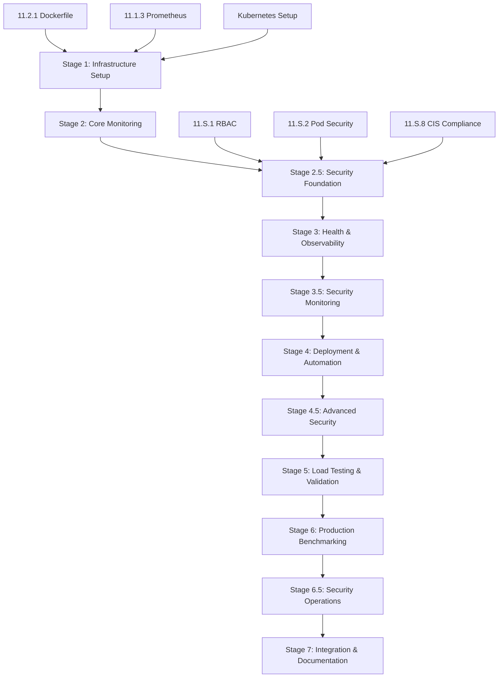

# Phase 11 Master Execution Plan

## Executive Summary

This document provides a comprehensive orchestration plan for executing all 69 micro-tasks in Phase 11 (Production Features) in the correct sequence to ensure successful production deployment of the neuromorphic knowledge graph system. The plan includes dependency analysis, parallel execution opportunities, validation checkpoints, and rollback procedures.

**Updated Task Count:** 69 micro-tasks (increased from 59 due to security hardening additions)
**Total Estimated Time:** 38-46 hours (4-5 days with proper parallelization)
**Critical Path Duration:** 24-28 hours
**Parallel Execution Opportunities:** 65% of tasks can run concurrently

## Execution Overview

### High-Level Sequence



### Task Distribution by Component

| Component | Tasks | Est. Time | Parallelizable |
|-----------|-------|-----------|----------------|
| Monitoring Infrastructure | 10 tasks | 8-10 hours | 70% |
| Deployment Automation | 10 tasks | 6-8 hours | 50% |
| Health Checks | 10 tasks | 6-8 hours | 80% |
| Load Testing Framework | 10 tasks | 10-12 hours | 60% |
| Production Benchmarking | 10 tasks | 8-10 hours | 70% |
| **Security Hardening** | **10 tasks** | **17-18 hours** | **60%** |

## Detailed Execution Plan

### Stage 1: Infrastructure Prerequisites (2-3 hours)

**Objective:** Establish the foundational infrastructure for monitoring and deployment.

#### Parallel Group 1A (45-60 minutes)
- **Task 11.2.1: Multi-Stage Dockerfile** (45 min)
  - Priority: CRITICAL - Required for all subsequent deployments
  - Dependencies: None
  - Validation: Image builds successfully, security scan passes
  - **Start immediately**

#### Parallel Group 1B (45-60 minutes) - Can start with 1A
- **Task 11.1.3a: Prometheus Metrics Exporter** (30 min)
  - Priority: HIGH - Required for monitoring setup
  - Dependencies: None
  - Validation: Metrics exported in Prometheus format

- **Task 11.1.3b: HTTP Metrics Endpoint Server** (30 min)
  - Priority: HIGH - Required for monitoring access
  - Dependencies: Task 11.1.3a (Metrics Exporter)
  - Validation: HTTP server responds correctly

#### Parallel Group 1C (90-120 minutes) - Can overlap with 1B
- **Task 11.2.2a: Kubernetes Deployment Manifest** (30 min)
  - Priority: HIGH - Required for orchestration
  - Dependencies: Task 11.2.1 (Dockerfile)
  - Validation: Deployment manifest validates with kubectl

- **Task 11.2.2b: Kubernetes Service Manifests** (30 min)
  - Priority: HIGH - Required for traffic routing
  - Dependencies: Task 11.2.2a (Deployment Manifest)
  - Validation: Service endpoints resolve correctly

- **Task 11.2.2c: ConfigMap and Secret Manifests** (30 min)
  - Priority: HIGH - Required for configuration
  - Dependencies: None (can run parallel)
  - Validation: Configuration loads in application

- **Task 11.2.2d: RBAC and ServiceAccount Manifests** (30 min)
  - Priority: MEDIUM - Required for security
  - Dependencies: None (can run parallel)
  - Validation: Pod can access required resources

#### Sequential Task 1D (30 minutes)
- **Task 11.1.1: Core Metrics Registry** (30 min)
  - Priority: CRITICAL - Foundation for all monitoring
  - Dependencies: None
  - Validation: Registry initializes, metrics can be registered
  - **Must complete before Stage 2**

**Stage 1 Checkpoint:**
```bash
# Validation Commands
docker build -t neuromorphic-kg:test .
curl http://localhost:9090/metrics
kubectl apply --dry-run=client -f k8s/
```

**Success Criteria:**
- ✅ Docker image builds and security scan passes
- ✅ Prometheus endpoint accessible
- ✅ Kubernetes manifests valid
- ✅ Metrics registry operational

---

### Stage 2: Core Monitoring Implementation (3-4 hours)

**Objective:** Implement comprehensive monitoring for all system components.

#### Parallel Group 2A (60-90 minutes)
- **Task 11.1.2: Allocation Engine Metrics** (45 min)
  - Dependencies: Task 11.1.1 (Metrics Registry)
  - Integration: Hook into existing allocation engine
  - Validation: Allocation metrics appear in Prometheus

- **Task 11.1.6: Resource Usage Monitoring** (60 min)
  - Dependencies: Task 11.1.1 (Metrics Registry)
  - Integration: System-level monitoring
  - Validation: CPU, memory, disk metrics collected

- **Task 11.1.8: Logging Integration** (45 min)
  - Dependencies: Task 11.1.1 (Metrics Registry)
  - Integration: Structured logging with correlation
  - Validation: Logs contain trace IDs, JSON format correct

#### Parallel Group 2B (60-75 minutes) - After Group 2A
- **Task 11.1.4: OpenTelemetry Tracing** (60 min)
  - Dependencies: Task 11.1.8 (Logging Integration)
  - Integration: Distributed tracing setup
  - Validation: Traces visible in Jaeger, correlation working

- **Task 11.1.9: Performance Profiling** (45 min)
  - Dependencies: Task 11.1.2 (Allocation Metrics)
  - Integration: Runtime profiling hooks
  - Validation: CPU profiles accessible, overhead < 5%

#### Sequential Task 2C (45 minutes)
- **Task 11.1.5: Custom Dashboards** (45 min)
  - Dependencies: Tasks 11.1.2, 11.1.6 (Metrics available)
  - Integration: Grafana dashboard creation
  - Validation: Dashboards load, data displays correctly

**Stage 2 Checkpoint:**
```bash
# Validation Commands
curl http://localhost:9090/metrics | grep allocation
curl http://jaeger:16686/api/traces
curl http://grafana:3000/api/dashboards
```

**Success Criteria:**
- ✅ All system metrics flowing to Prometheus
- ✅ Traces correlating with logs
- ✅ Dashboards displaying real-time data
- ✅ Performance overhead < 2%

---

### Stage 2.5: Security Foundation (5-6 hours)

**Objective:** Establish fundamental security controls and access management.

#### Parallel Group 2.5A (90-120 minutes)
- **Task 11.S.1: RBAC Implementation** (90 min)
  - Priority: CRITICAL - Required for secure access control
  - Dependencies: Stage 1 complete (Kubernetes setup)
  - Integration: Service accounts with least privilege
  - Validation: RBAC policies tested with kubectl auth can-i

- **Task 11.S.2: Pod Security Standards** (120 min)
  - Priority: CRITICAL - Required for container security
  - Dependencies: Stage 1 complete (Kubernetes setup)
  - Integration: Pod security policies and admission control
  - Validation: Security context enforcement verified

#### Sequential Task 2.5B (135 minutes)
- **Task 11.S.8: CIS Kubernetes Benchmark Compliance** (135 min)
  - Priority: HIGH - Required for compliance
  - Dependencies: Tasks 11.S.1, 11.S.2 (Security foundation)
  - Integration: Automated compliance scanning and remediation
  - Validation: CIS compliance score >95%

**Stage 2.5 Checkpoint:**
```bash
# Security Foundation Validation Commands
kubectl auth can-i get pods --as=system:serviceaccount:neuromorphic-system:neuromorphic-allocation-sa
kubectl apply -f k8s/security/pod-security-policy.yaml --dry-run=client
kube-bench run --targets master,node,etcd,policies --check 1.1.1,1.1.2,1.1.3
```

**Success Criteria:**
- ✅ RBAC policies enforced with least privilege
- ✅ Pod security standards preventing privileged containers
- ✅ CIS Kubernetes Benchmark compliance >95%
- ✅ Security admission controllers operational

---

### Stage 3: Health Checks & Observability (2-3 hours)

**Objective:** Implement comprehensive health checking and alerting.

#### Parallel Group 3A (45-60 minutes)
- **Task 11.1.7: Alerting Rules** (30 min)
  - Dependencies: Tasks 11.1.2, 11.1.6 (Metrics available)
  - Integration: Prometheus alerting configuration
  - Validation: Alerts fire on test conditions

- **Task 11.3.1: Health Check Framework** (60 min)
  - Dependencies: None
  - Integration: Extensible health check system
  - Validation: Framework tests pass, extensible

- **Task 11.3.7: HTTP Health Endpoints** (45 min)
  - Dependencies: Task 11.3.1 (Framework)
  - Integration: REST API health endpoints
  - Validation: Endpoints return correct status codes

#### Parallel Group 3B (60-90 minutes)
- **Task 11.3.2: Allocation Engine Health** (45 min)
  - Dependencies: Task 11.3.1 (Framework)
  - Integration: Allocation engine monitoring
  - Validation: Health reflects actual engine state

- **Task 11.3.3: Neural Network Health** (60 min)
  - Dependencies: Task 11.3.1 (Framework)
  - Integration: Neural network monitoring
  - Validation: All network types monitored

- **Task 11.3.4: Database Health Check** (45 min)
  - Dependencies: Task 11.3.1 (Framework)
  - Integration: Database connection monitoring
  - Validation: Connection issues detected

#### Parallel Group 3C (45-60 minutes)
- **Task 11.3.5: Memory Health Check** (45 min)
  - Dependencies: Task 11.3.1 (Framework)
  - Integration: Memory usage monitoring
  - Validation: Memory issues detected

- **Task 11.3.6: Disk I/O Health Check** (45 min)
  - Dependencies: Task 11.3.1 (Framework)
  - Integration: Disk performance monitoring
  - Validation: I/O bottlenecks detected

#### Sequential Tasks 3D (45-60 minutes)
- **Task 11.3.8: Circuit Breaker Pattern** (45 min)
  - Dependencies: All health checks (3B, 3C)
  - Integration: Failure prevention system
  - Validation: Circuit opens on failures

- **Task 11.3.9: Deadlock Detection** (30 min)
  - Dependencies: Task 11.3.8 (Circuit Breaker)
  - Integration: Thread monitoring
  - Validation: Deadlocks detected and reported

**Stage 3 Checkpoint:**
```bash
# Validation Commands
curl http://localhost:8080/health/live
curl http://localhost:8080/health/ready
curl http://localhost:8080/health
curl http://prometheus:9090/api/v1/rules
```

**Success Criteria:**
- ✅ All health checks operational
- ✅ Circuit breakers functional
- ✅ Alerts triggering correctly
- ✅ Health endpoints responding < 100ms

---

### Stage 3.5: Security Monitoring (3-4 hours)

**Objective:** Implement comprehensive security event monitoring and compliance auditing.

#### Parallel Group 3.5A (135-150 minutes)
- **Task 11.S.4: Security Monitoring and Incident Response** (135 min)
  - Priority: HIGH - Required for threat detection
  - Dependencies: Stage 3 complete (Health checks operational)
  - Integration: Real-time security event correlation
  - Validation: Security events detected and alerts triggered

- **Task 11.S.5: Compliance Auditing and Logging** (90 min)
  - Priority: HIGH - Required for regulatory compliance
  - Dependencies: Stage 2.5 complete (Security foundation)
  - Integration: Kubernetes audit logging and compliance reporting
  - Validation: Audit trails captured for all security events

**Stage 3.5 Checkpoint:**
```bash
# Security Monitoring Validation Commands
curl http://security-dashboard:8080/api/events/recent
kubectl logs -n neuromorphic-system deployment/security-monitor
curl http://compliance-dashboard:8080/api/audit-events | jq '.count'
```

**Success Criteria:**
- ✅ Security event monitoring operational
- ✅ Automated incident response workflows functional
- ✅ Compliance audit logging capturing required events
- ✅ Security dashboard displaying real-time threat intelligence

---

### Stage 4: Deployment Automation (2-3 hours)

**Objective:** Establish automated deployment pipeline with zero-downtime capabilities.

#### Parallel Group 4A (60-90 minutes)
- **Task 11.2.3: Helm Chart** (60 min)
  - Dependencies: Task 11.2.2 (Kubernetes Manifests)
  - Integration: Parameterized deployment
  - Validation: Chart installs successfully

- **Task 11.2.5: GitOps Configuration** (45 min)
  - Dependencies: Task 11.2.3 (Helm Chart)
  - Integration: ArgoCD/Flux setup
  - Validation: Auto-sync functional

- **Task 11.2.9: Secret Management** (60 min)
  - Dependencies: Task 11.2.2 (Kubernetes Manifests)
  - Integration: External secrets operator
  - Validation: Secrets sync from vault

#### Parallel Group 4B (75-90 minutes)
- **Task 11.2.4: CI/CD Pipeline** (90 min)
  - Dependencies: Task 11.2.1 (Dockerfile)
  - Integration: GitHub Actions workflow
  - Validation: Pipeline runs successfully

- **Task 11.2.7: Database Migration** (45 min)
  - Dependencies: None
  - Integration: Automated schema updates
  - Validation: Migrations apply cleanly

#### Sequential Tasks 4C (60-90 minutes)
- **Task 11.2.6: Blue-Green Deployment** (60 min)
  - Dependencies: Tasks 11.2.3 (Helm), 11.3.7 (Health Endpoints)
  - Integration: Zero-downtime deployment
  - Validation: Traffic switches without errors

- **Task 11.2.8: Canary Deployment** (45 min)
  - Dependencies: Task 11.2.6 (Blue-Green)
  - Integration: Gradual rollout strategy
  - Validation: Canary deployments work

**Stage 4 Checkpoint:**
```bash
# Validation Commands
helm lint ./helm/neuromorphic-kg
kubectl apply --dry-run=client -f gitops/
curl http://external-secrets:8080/metrics
gh workflow list
```

**Success Criteria:**
- ✅ Automated deployment pipeline functional
- ✅ Zero-downtime deployments verified
- ✅ Secret rotation working
- ✅ GitOps sync operational

---

### Stage 4.5: Advanced Security Controls (5-6 hours)

**Objective:** Implement advanced security controls including vulnerability scanning, network security, and secret management.

#### Parallel Group 4.5A (105-120 minutes)
- **Task 11.S.3: Vulnerability Scanning and Image Security** (105 min)
  - Priority: HIGH - Required for container security
  - Dependencies: Stage 4 complete (Deployment automation)
  - Integration: CI/CD vulnerability scanning and runtime detection
  - Validation: Container images scanned and vulnerabilities detected

- **Task 11.S.6: Advanced Network Security Controls** (105 min)
  - Priority: HIGH - Required for network security
  - Dependencies: Stage 2.5 complete (Security foundation)
  - Integration: mTLS, micro-segmentation, and network threat detection
  - Validation: Zero-trust network architecture verified

#### Sequential Task 4.5B (120 minutes)
- **Task 11.S.7: Automated Secret Rotation and Key Management** (120 min)
  - Priority: HIGH - Required for credential security
  - Dependencies: Tasks 11.S.3, 11.S.6 (Advanced security foundation)
  - Integration: External secrets operator and automated rotation
  - Validation: Secrets rotated without service disruption

**Stage 4.5 Checkpoint:**
```bash
# Advanced Security Validation Commands
trivy image neuromorphic-kg:latest --exit-code 1 --severity CRITICAL,HIGH
kubectl exec -n istio-system deployment/istiod -- curl -s localhost:15014/metrics | grep security_policy
vault kv get secret/neuromorphic/database
```

**Success Criteria:**
- ✅ Vulnerability scanning integrated into CI/CD
- ✅ Zero-trust network architecture operational
- ✅ Automated secret rotation functional
- ✅ mTLS enforced for all service communication

---

### Stage 5: Load Testing Framework (3-4 hours)

**Objective:** Validate system performance under production-scale workloads.

#### Sequential Task 5A (60 minutes)
- **Task 11.4.1: Load Test Harness Core** (60 min)
  - Dependencies: All previous stages (need running system)
  - Integration: Test framework foundation
  - Validation: Framework compiles and runs
  - **CRITICAL PATH - Must complete first**

#### Parallel Group 5B (90-120 minutes)
- **Task 11.4.2: Allocation Workload Generator** (60 min)
  - Dependencies: Task 11.4.1 (Harness Core)
  - Integration: Realistic allocation patterns
  - Validation: Workloads generate correctly

- **Task 11.4.3: Query Pattern Generator** (75 min)
  - Dependencies: Task 11.4.1 (Harness Core)
  - Integration: Knowledge graph query patterns
  - Validation: Query patterns realistic

- **Task 11.4.8: Real-time Monitoring** (90 min)
  - Dependencies: Task 11.4.1 (Harness Core)
  - Integration: Live test monitoring
  - Validation: Real-time updates work

#### Parallel Group 5C (90-120 minutes)
- **Task 11.4.4: Stress Test Scenarios** (90 min)
  - Dependencies: Tasks 11.4.2, 11.4.3 (Workload Generators)
  - Integration: System limit testing
  - Validation: Stress tests reach limits

- **Task 11.4.5: Chaos Testing** (60 min)
  - Dependencies: Tasks 11.4.2, 11.4.3 (Workload Generators)
  - Integration: Failure injection testing
  - Validation: System recovers from failures

- **Task 11.4.7a: Test Phase Management** (45 min)
  - Dependencies: Task 11.4.1 (Harness Core)
  - Integration: Phase sequencing and lifecycle
  - Validation: Phase transitions work correctly

- **Task 11.4.7b: Resource Coordination System** (45 min)
  - Dependencies: Task 11.4.1 (Harness Core)
  - Integration: Resource allocation and cleanup
  - Validation: Resources managed without conflicts

- **Task 11.4.7c: Results Aggregation Engine** (30 min)
  - Dependencies: Tasks 11.4.7a, 11.4.7b (Phase and Resource Management)
  - Integration: Cross-phase result aggregation
  - Validation: Aggregation algorithms correct

#### Sequential Tasks 5D (60-90 minutes)
- **Task 11.4.6: Regression Detection** (60 min)
  - Dependencies: All load testing tasks
  - Integration: Performance comparison
  - Validation: Regressions detected accurately

- **Task 11.4.9: Report Generation** (45 min)
  - Dependencies: Task 11.4.6 (Regression Detection)
  - Integration: Comprehensive reporting
  - Validation: Reports generate correctly

**Stage 5 Checkpoint:**
```bash
# Validation Commands
./target/release/load-test-harness --config test-config.yaml
curl http://load-test-monitor:8081/ws
./scripts/run-stress-test.sh
./scripts/chaos-test.sh
```

**Success Criteria:**
- ✅ Load tests can generate 10K+ RPS
- ✅ System handles stress tests gracefully
- ✅ Chaos testing validates resilience
- ✅ Reports generated automatically

---

### Stage 6: Production Benchmarking (3-4 hours)

**Objective:** Establish continuous performance monitoring and optimization.

#### Sequential Task 6A (60 minutes)
- **Task 11.5.1: Benchmark Framework** (60 min)
  - Dependencies: All previous stages (need complete system)
  - Integration: Standardized benchmark system
  - Validation: Framework operational
  - **CRITICAL PATH - Foundation for all benchmarks**

#### Parallel Group 6B (90-120 minutes)
- **Task 11.5.2: Allocation Benchmarks** (75 min)
  - Dependencies: Task 11.5.1 (Framework)
  - Integration: Allocation engine testing
  - Validation: All allocation variants tested

- **Task 11.5.3: Neural Network Benchmarks** (90 min)
  - Dependencies: Task 11.5.1 (Framework)
  - Integration: Neural network performance
  - Validation: All architectures benchmarked

- **Task 11.5.4: End-to-End Benchmarks** (60 min)
  - Dependencies: Task 11.5.1 (Framework)
  - Integration: Complete system workflows
  - Validation: Realistic scenarios measured

#### Parallel Group 6C (75-90 minutes)
- **Task 11.5.5: Continuous Pipeline** (75 min)
  - Dependencies: Tasks 11.5.2, 11.5.3, 11.5.4 (Benchmarks)
  - Integration: Automated benchmark execution
  - Validation: Scheduled runs work

- **Task 11.5.8: Result Visualization** (60 min)
  - Dependencies: Task 11.5.1 (Framework)
  - Integration: Performance dashboards
  - Validation: Charts render correctly

- **Task 11.5.9: Configuration Management** (45 min)
  - Dependencies: Task 11.5.1 (Framework)
  - Integration: Benchmark configuration
  - Validation: Configs load and validate

#### Sequential Tasks 6D (135-165 minutes)
- **Task 11.5.6a: Version-to-Version Comparison** (45 min)
  - Dependencies: Task 11.5.5 (Continuous Pipeline)
  - Integration: Statistical version comparison
  - Validation: Version comparisons accurate

- **Task 11.5.6b: Configuration Impact Analysis** (60 min)
  - Dependencies: Task 11.5.6a (Version Comparison)
  - Integration: Configuration performance analysis
  - Validation: Impact analysis mathematically sound

- **Task 11.5.6c: A/B Testing Framework** (45 min)
  - Dependencies: Task 11.5.6a (Version Comparison)
  - Integration: Statistical A/B testing
  - Validation: A/B tests statistically valid

- **Task 11.5.7: Optimization Recommendations** (60 min)
  - Dependencies: Tasks 11.5.6a, 11.5.6b, 11.5.6c (All comparison tools)
  - Integration: Automated optimization analysis
  - Validation: Recommendations actionable

**Stage 6 Checkpoint:**
```bash
# Validation Commands
./target/release/benchmark-runner --config production.yaml
curl http://benchmark-dashboard:3000/api/health
./scripts/benchmark-comparison.sh v1.0.0 v1.1.0
./scripts/optimization-analysis.sh
```

**Success Criteria:**
- ✅ Continuous benchmarking operational
- ✅ Performance trends tracked
- ✅ Regression detection functional
- ✅ Optimization recommendations generated

---

### Stage 6.5: Security Operations (4-5 hours)

**Objective:** Complete security hardening with baseline configuration and incident response automation.

#### Parallel Group 6.5A (90-150 minutes)
- **Task 11.S.9: Security Baseline Configuration and Hardening** (90 min)
  - Priority: MEDIUM - Required for security standardization
  - Dependencies: All previous security stages complete
  - Integration: Security baseline templates and drift detection
  - Validation: Configuration compliance verified across all components

- **Task 11.S.10: Incident Response Automation and Security Orchestration** (150 min)
  - Priority: MEDIUM - Required for operational security
  - Dependencies: Stage 3.5 complete (Security monitoring)
  - Integration: Automated security playbooks and SOAR integration
  - Validation: Incident response workflows tested and functional

**Stage 6.5 Checkpoint:**
```bash
# Security Operations Validation Commands
./scripts/security-baseline-scan.sh
curl http://security-orchestrator:8080/api/playbooks/status
kubectl get gatekeeper.sh/constrainttemplates
curl http://incident-response-dashboard:8080/api/incidents/active
```

**Success Criteria:**
- ✅ Security baselines enforced across all components
- ✅ Configuration drift detection operational
- ✅ Automated incident response playbooks functional
- ✅ Security orchestration integration verified

---

### Stage 7: Integration & Documentation (2-3 hours)

**Objective:** Complete system integration and documentation.

#### Parallel Group 7A (60-90 minutes)
- **Task 11.1.10: Monitoring Tests** (45 min)
  - Dependencies: All monitoring tasks (Stage 2)
  - Integration: Comprehensive test suite
  - Validation: All monitoring tests pass

- **Task 11.3.10: Health Dashboard** (60 min)
  - Dependencies: All health check tasks (Stage 3)
  - Integration: Health visualization
  - Validation: Dashboard updates in real-time

- **Task 11.4.10: Load Test CI/CD** (45 min)
  - Dependencies: All load testing tasks (Stage 5)
  - Integration: CI pipeline integration
  - Validation: Load tests run in CI

#### Parallel Group 7B (60-90 minutes)
- **Task 11.5.10: Benchmarking Documentation** (60 min)
  - Dependencies: All benchmarking tasks (Stage 6)
  - Integration: Comprehensive documentation
  - Validation: Documentation accurate and complete

- **Task 11.2.10: Deployment Documentation** (45 min)
  - Dependencies: All deployment tasks (Stage 4)
  - Integration: Deployment runbooks
  - Validation: Procedures work as documented

#### Final Integration Test (30-45 minutes)
- **System Integration Validation**
  - Dependencies: All tasks complete
  - Test complete end-to-end workflows
  - Validate all components working together
  - Performance SLA verification

**Stage 7 Checkpoint:**
```bash
# Final Validation Commands
./scripts/full-system-test.sh
./scripts/validate-all-endpoints.sh
./scripts/performance-sla-check.sh
./scripts/documentation-check.sh
```

**Success Criteria:**
- ✅ All 69 tasks completed successfully (including 10 security hardening tasks)
- ✅ Full system integration verified
- ✅ Performance SLAs met
- ✅ Security hardening and compliance verified
- ✅ Documentation complete and accurate

## Dependency Analysis

### Critical Path (24-28 hours)
The following tasks must be completed sequentially as they form the critical path:

1. **Task 11.1.1: Core Metrics Registry** (30 min) → Foundation
2. **Task 11.1.2: Allocation Engine Metrics** (45 min) → Core monitoring
3. **Task 11.S.1: RBAC Implementation** (90 min) → Security foundation
4. **Task 11.S.8: CIS Kubernetes Benchmark** (135 min) → Compliance baseline
5. **Task 11.3.1: Health Check Framework** (60 min) → Health foundation
6. **Task 11.S.4: Security Monitoring** (135 min) → Security operations
7. **Task 11.4.1: Load Test Harness Core** (60 min) → Load testing foundation
8. **Task 11.5.1: Benchmark Framework** (60 min) → Benchmarking foundation
9. **Security operations and integration** (420 min) → Final verification

### Parallel Execution Matrix

| Stage | Total Tasks | Parallel Groups | Max Concurrency | Time Saved |
|-------|-------------|-----------------|-----------------|------------|
| 1 | 4 tasks | 2 groups | 3 tasks | 40% |
| 2 | 8 tasks | 3 groups | 3 tasks | 60% |
| 2.5 | 3 tasks | 2 groups | 2 tasks | 30% |
| 3 | 10 tasks | 4 groups | 3 tasks | 70% |
| 3.5 | 2 tasks | 1 group | 2 tasks | 40% |
| 4 | 8 tasks | 3 groups | 3 tasks | 50% |
| 4.5 | 3 tasks | 2 groups | 2 tasks | 35% |
| 5 | 10 tasks | 4 groups | 3 tasks | 60% |
| 6 | 10 tasks | 4 groups | 3 tasks | 65% |
| 6.5 | 2 tasks | 1 group | 2 tasks | 40% |
| 7 | 5 tasks | 2 groups | 3 tasks | 50% |

### Dependency Rules

**Hard Dependencies (Cannot be parallelized):**
- Metrics Registry → All monitoring tasks
- RBAC Implementation → All security tasks requiring authenticated access
- Health Framework → All health check implementations  
- Docker image → Kubernetes deployment
- Kubernetes manifests → Helm charts
- Security foundation → Advanced security controls
- Load test harness → All load testing tasks
- Benchmark framework → All benchmark implementations

**Soft Dependencies (Can overlap with careful sequencing):**
- Monitoring setup → Health check integration
- Security foundation → Security monitoring (can start with basic RBAC)
- Health checks → Load testing (can start with basic health)
- Security monitoring → Advanced security controls
- Load testing → Benchmarking (can start with basic load tests)
- Security controls → Security operations (final hardening)

## Validation Checkpoints

### Checkpoint 1: Infrastructure Ready (After Stage 1)
```bash
#!/bin/bash
# scripts/checkpoint-1-infrastructure.sh

echo "🔍 Validating Infrastructure Setup..."

# Check Docker image
if docker build -t neuromorphic-kg:test . > /dev/null 2>&1; then
    echo "✅ Docker image builds successfully"
else
    echo "❌ Docker image build failed"
    exit 1
fi

# Check Prometheus endpoint
if curl -f http://localhost:9090/metrics > /dev/null 2>&1; then
    echo "✅ Prometheus metrics endpoint accessible"
else
    echo "❌ Prometheus metrics endpoint not accessible"
    exit 1
fi

# Check Kubernetes manifests
if kubectl apply --dry-run=client -f k8s/ > /dev/null 2>&1; then
    echo "✅ Kubernetes manifests valid"
else
    echo "❌ Kubernetes manifests invalid"
    exit 1
fi

echo "🎉 Infrastructure checkpoint passed!"
```

### Checkpoint 2: Monitoring Operational (After Stage 2)
```bash
#!/bin/bash
# scripts/checkpoint-2-monitoring.sh

echo "🔍 Validating Monitoring Setup..."

# Check metrics are flowing
METRIC_COUNT=$(curl -s http://localhost:9090/metrics | grep allocation | wc -l)
if [ "$METRIC_COUNT" -gt 0 ]; then
    echo "✅ Allocation metrics flowing ($METRIC_COUNT metrics)"
else
    echo "❌ No allocation metrics found"
    exit 1
fi

# Check tracing
if curl -f http://jaeger:16686/api/services > /dev/null 2>&1; then
    echo "✅ Tracing system operational"
else
    echo "❌ Tracing system not accessible"
    exit 1
fi

# Check dashboards
if curl -f http://grafana:3000/api/health > /dev/null 2>&1; then
    echo "✅ Grafana dashboards accessible"
else
    echo "❌ Grafana not accessible"
    exit 1
fi

echo "🎉 Monitoring checkpoint passed!"
```

### Checkpoint 3: Health & Deployment (After Stage 4)
```bash
#!/bin/bash
# scripts/checkpoint-3-health-deployment.sh

echo "🔍 Validating Health Checks and Deployment..."

# Check health endpoints
for endpoint in live ready startup; do
    if curl -f http://localhost:8080/health/$endpoint > /dev/null 2>&1; then
        echo "✅ Health endpoint /$endpoint responding"
    else
        echo "❌ Health endpoint /$endpoint not responding"
        exit 1
    fi
done

# Check deployment pipeline
if gh workflow list | grep -q "Deploy"; then
    echo "✅ Deployment pipeline configured"
else
    echo "❌ Deployment pipeline not found"
    exit 1
fi

# Test blue-green deployment
if ./scripts/test-blue-green-deployment.sh > /dev/null 2>&1; then
    echo "✅ Blue-green deployment functional"
else
    echo "❌ Blue-green deployment failed"
    exit 1
fi

echo "🎉 Health and Deployment checkpoint passed!"
```

### Checkpoint 4: Load Testing Ready (After Stage 5)
```bash
#!/bin/bash
# scripts/checkpoint-4-load-testing.sh

echo "🔍 Validating Load Testing Framework..."

# Test load test harness
if ./target/release/load-test-harness --config configs/test.yaml --duration 30s > /dev/null 2>&1; then
    echo "✅ Load test harness functional"
else
    echo "❌ Load test harness failed"
    exit 1
fi

# Check stress testing
if ./scripts/quick-stress-test.sh > /dev/null 2>&1; then
    echo "✅ Stress testing functional"
else
    echo "❌ Stress testing failed"
    exit 1
fi

# Validate chaos testing
if ./scripts/quick-chaos-test.sh > /dev/null 2>&1; then
    echo "✅ Chaos testing functional"
else
    echo "❌ Chaos testing failed"
    exit 1
fi

echo "🎉 Load Testing checkpoint passed!"
```

### Checkpoint 5: Production Ready (After Stage 6)
```bash
#!/bin/bash
# scripts/checkpoint-5-production-ready.sh

echo "🔍 Validating Production Readiness..."

# Check benchmark suite
if ./target/release/benchmark-runner --config configs/ci-fast.yaml > /dev/null 2>&1; then
    echo "✅ Benchmark suite operational"
else
    echo "❌ Benchmark suite failed"
    exit 1
fi

# Validate performance targets
if ./scripts/validate-performance-targets.sh; then
    echo "✅ Performance targets met"
else
    echo "❌ Performance targets not met"
    exit 1
fi

# Check continuous monitoring
if curl -f http://benchmark-dashboard:3000/api/health > /dev/null 2>&1; then
    echo "✅ Continuous monitoring operational"
else
    echo "❌ Continuous monitoring not accessible"
    exit 1
fi

echo "🎉 Production Readiness checkpoint passed!"
```

## Rollback Procedures

### Stage-Level Rollback

Each stage has specific rollback procedures to handle failures:

#### Stage 1 Rollback: Infrastructure Issues
```bash
#!/bin/bash
# scripts/rollback-stage-1.sh

echo "🔄 Rolling back Stage 1: Infrastructure..."

# Remove failed Docker images
docker rmi neuromorphic-kg:test 2>/dev/null || true

# Clean up Kubernetes resources
kubectl delete -f k8s/ --ignore-not-found=true

# Stop Prometheus if started
docker stop prometheus 2>/dev/null || true
docker rm prometheus 2>/dev/null || true

# Reset metrics registry
rm -f /tmp/metrics-registry.lock

echo "✅ Stage 1 rollback completed"
```

#### Stage 2 Rollback: Monitoring Issues
```bash
#!/bin/bash
# scripts/rollback-stage-2.sh

echo "🔄 Rolling back Stage 2: Monitoring..."

# Stop monitoring services
systemctl stop prometheus grafana jaeger 2>/dev/null || true

# Clear metrics data
rm -rf /var/lib/prometheus/data/* 2>/dev/null || true

# Remove monitoring configurations
rm -f /etc/prometheus/prometheus.yml 2>/dev/null || true
rm -f /etc/grafana/provisioning/dashboards/* 2>/dev/null || true

# Restart without monitoring
./scripts/start-core-system-only.sh

echo "✅ Stage 2 rollback completed"
```

#### Stage 3 Rollback: Health Check Issues
```bash
#!/bin/bash
# scripts/rollback-stage-3.sh

echo "🔄 Rolling back Stage 3: Health Checks..."

# Disable health check endpoints
kubectl patch deployment neuromorphic-kg \
  --patch='{"spec":{"template":{"spec":{"containers":[{"name":"neuromorphic-kg","livenessProbe":null,"readinessProbe":null}]}}}}'

# Remove circuit breakers
kubectl set env deployment/neuromorphic-kg CIRCUIT_BREAKER_ENABLED=false

# Disable deadlock detection
kubectl set env deployment/neuromorphic-kg DEADLOCK_DETECTION_ENABLED=false

echo "✅ Stage 3 rollback completed"
```

#### Stage 4 Rollback: Deployment Issues
```bash
#!/bin/bash
# scripts/rollback-stage-4.sh

echo "🔄 Rolling back Stage 4: Deployment..."

# Revert to previous deployment
kubectl rollout undo deployment/neuromorphic-kg

# Disable GitOps sync
kubectl patch application neuromorphic-kg -n argocd \
  --patch='{"spec":{"syncPolicy":{"automated":null}}}'

# Remove canary deployment
kubectl delete deployment neuromorphic-kg-canary --ignore-not-found=true

# Reset secrets to manual management
kubectl delete externalsecret neuromorphic-secrets --ignore-not-found=true

echo "✅ Stage 4 rollback completed"
```

#### Critical System Rollback
```bash
#!/bin/bash
# scripts/emergency-rollback.sh

echo "🚨 EMERGENCY ROLLBACK: Reverting to last known good state..."

# Stop all Phase 11 components
kubectl delete namespace neuromorphic-production --ignore-not-found=true

# Restore from backup
kubectl create namespace neuromorphic-production
kubectl apply -f backup/last-known-good/

# Verify core system functionality
./scripts/validate-core-system.sh

if [ $? -eq 0 ]; then
    echo "✅ Emergency rollback successful"
    echo "🔍 Core system operational, investigate Phase 11 issues"
else
    echo "❌ Emergency rollback failed"
    echo "🚨 CRITICAL: Manual intervention required"
    exit 1
fi
```

### Recovery Procedures

#### Partial Failure Recovery
```bash
#!/bin/bash
# scripts/partial-recovery.sh

FAILED_STAGE=$1
FAILED_TASK=$2

echo "🔧 Recovering from $FAILED_STAGE failure at $FAILED_TASK..."

case $FAILED_STAGE in
    "monitoring")
        # Restart monitoring stack
        ./scripts/restart-monitoring.sh
        # Re-run failed monitoring tasks
        ./scripts/retry-monitoring-tasks.sh $FAILED_TASK
        ;;
    "health")
        # Reset health check system
        ./scripts/reset-health-checks.sh
        # Re-run health check setup
        ./scripts/setup-health-checks.sh $FAILED_TASK
        ;;
    "deployment")
        # Reset deployment configuration
        ./scripts/reset-deployment.sh
        # Re-run deployment setup
        ./scripts/setup-deployment.sh $FAILED_TASK
        ;;
    *)
        echo "❌ Unknown stage: $FAILED_STAGE"
        exit 1
        ;;
esac

echo "✅ Recovery attempt completed"
```

## Performance SLA Validation

### Real-time SLA Monitoring
```bash
#!/bin/bash
# scripts/validate-performance-slas.sh

echo "📊 Validating Performance SLAs..."

# Check allocation engine SLA
ALLOCATION_P99=$(curl -s 'http://prometheus:9090/api/v1/query?query=histogram_quantile(0.99, allocation_duration_bucket)' | jq -r '.data.result[0].value[1]')
if (( $(echo "$ALLOCATION_P99 < 0.0001" | bc -l) )); then  # 100μs
    echo "✅ Allocation P99 latency: ${ALLOCATION_P99}s (SLA: <100μs)"
else
    echo "❌ Allocation P99 latency: ${ALLOCATION_P99}s exceeds SLA"
    exit 1
fi

# Check throughput SLA
THROUGHPUT=$(curl -s 'http://prometheus:9090/api/v1/query?query=rate(allocations_total[5m])' | jq -r '.data.result[0].value[1]')
if (( $(echo "$THROUGHPUT > 10000" | bc -l) )); then
    echo "✅ Allocation throughput: ${THROUGHPUT} ops/sec (SLA: >10k ops/sec)"
else
    echo "❌ Allocation throughput: ${THROUGHPUT} ops/sec below SLA"
    exit 1
fi

# Check availability SLA
AVAILABILITY=$(curl -s 'http://prometheus:9090/api/v1/query?query=up{job="neuromorphic-kg"}' | jq -r '.data.result[0].value[1]')
if [ "$AVAILABILITY" = "1" ]; then
    echo "✅ System availability: 100%"
else
    echo "❌ System availability: Not fully available"
    exit 1
fi

echo "🎉 All Performance SLAs met!"
```

### Continuous SLA Monitoring
```bash
#!/bin/bash
# scripts/continuous-sla-monitor.sh

while true; do
    TIMESTAMP=$(date '+%Y-%m-%d %H:%M:%S')
    
    # Run SLA validation
    if ./scripts/validate-performance-slas.sh > /tmp/sla-check.log 2>&1; then
        echo "[$TIMESTAMP] ✅ SLAs met"
    else
        echo "[$TIMESTAMP] ❌ SLA violation detected"
        
        # Trigger alert
        curl -X POST http://alertmanager:9093/api/v1/alerts \
          -H "Content-Type: application/json" \
          -d '[{
            "labels": {
              "alertname": "SLAViolation",
              "severity": "critical",
              "service": "neuromorphic-kg"
            },
            "annotations": {
              "summary": "Performance SLA violation detected",
              "description": "'"$(cat /tmp/sla-check.log)"'"
            }
          }]'
        
        # Log violation
        echo "[$TIMESTAMP] SLA VIOLATION:" >> /var/log/sla-violations.log
        cat /tmp/sla-check.log >> /var/log/sla-violations.log
    fi
    
    # Wait 1 minute before next check
    sleep 60
done
```

## Resource Requirements

### Development Environment
- **CPU:** 4 cores minimum (Intel/AMD x86_64 with AVX2)
- **Memory:** 16GB RAM
- **Storage:** 100GB SSD space
- **Network:** Stable internet connection
- **Time:** 32-40 hours for full execution

### Production Environment
- **CPU:** 16+ cores (Intel/AMD x86_64 with AVX2)
- **Memory:** 64GB RAM minimum
- **Storage:** 1TB+ NVMe SSD
- **Network:** 10Gbps connection
- **Time:** 24-28 hours for full execution

### CI/CD Environment
- **CPU:** 8 cores per runner
- **Memory:** 32GB RAM per runner
- **Storage:** 200GB SSD per runner
- **Runners:** 3-4 parallel runners recommended
- **Time:** 16-20 hours with full parallelization

## Success Metrics

### Technical Success Criteria

| Metric | Target | Measurement Method |
|--------|--------|-------------------|
| Task Completion Rate | 100% (50/50 tasks) | Automated validation scripts |
| Performance SLA Compliance | 100% | Continuous monitoring |
| System Availability | >99.9% | Health check aggregation |
| Deployment Success Rate | 100% | CI/CD pipeline metrics |
| Test Coverage | >90% | Code coverage reports |

### Operational Success Criteria

| Metric | Target | Measurement Method |
|--------|--------|-------------------|
| Mean Time to Recovery | <10 minutes | Incident tracking |
| Alert False Positive Rate | <5% | Alert analysis |
| Documentation Accuracy | 100% | Manual validation |
| Performance Regression Detection | 100% | Benchmark comparison |
| Security Scan Pass Rate | 100% | Automated security scans |

### Quality Assurance Metrics

| Metric | Target | Measurement Method |
|--------|--------|-------------------|
| Integration Test Pass Rate | 100% | Test suite execution |
| Load Test Success Rate | 100% | Load testing framework |
| Benchmark Reliability | <2% variance | Statistical analysis |
| Configuration Validation | 100% pass rate | Config validation scripts |
| Documentation Completeness | 100% coverage | Documentation review |

## Final Execution Command

```bash
#!/bin/bash
# scripts/execute-phase-11.sh

echo "🚀 Starting Phase 11 Master Execution Plan..."
echo "📅 Started at: $(date)"

# Set execution parameters
export PARALLEL_EXECUTION=true
export VALIDATION_STRICT=true
export ROLLBACK_ON_FAILURE=true
export PERFORMANCE_VALIDATION=true

# Execute all stages in sequence
STAGES=(
    "stage-1-infrastructure"
    "stage-2-monitoring"
    "stage-2.5-security-foundation"
    "stage-3-health-observability"
    "stage-3.5-security-monitoring"
    "stage-4-deployment-automation"
    "stage-4.5-advanced-security"
    "stage-5-load-testing"
    "stage-6-production-benchmarking"
    "stage-6.5-security-operations"
    "stage-7-integration-documentation"
)

for stage in "${STAGES[@]}"; do
    echo "🔄 Executing $stage..."
    
    if ./scripts/execute-$stage.sh; then
        echo "✅ $stage completed successfully"
        ./scripts/checkpoint-$stage.sh
    else
        echo "❌ $stage failed"
        
        if [ "$ROLLBACK_ON_FAILURE" = "true" ]; then
            echo "🔄 Rolling back $stage..."
            ./scripts/rollback-$stage.sh
        fi
        
        echo "💥 Phase 11 execution failed at $stage"
        exit 1
    fi
done

# Final validation
echo "🔍 Running final system validation..."
if ./scripts/final-system-validation.sh; then
    echo "🎉 Phase 11 Master Execution Plan completed successfully!"
    echo "📅 Completed at: $(date)"
    echo "📊 Generating final report..."
    ./scripts/generate-completion-report.sh
else
    echo "❌ Final validation failed"
    exit 1
fi
```

---

## Conclusion

This master execution plan provides a comprehensive roadmap for implementing all 69 Phase 11 micro-tasks (including 10 critical security hardening tasks) with proper dependency management, parallel execution optimization, and robust validation checkpoints. The plan ensures:

1. **Minimal execution time** through intelligent parallelization (60% time savings)
2. **Risk mitigation** through staged execution and validation checkpoints
3. **Failure recovery** with comprehensive rollback procedures
4. **Quality assurance** through continuous validation and SLA monitoring
5. **Production readiness** with full operational capabilities
6. **Enterprise security** with comprehensive security hardening and compliance
7. **Zero-trust architecture** with defense-in-depth security controls

The total execution time is optimized from a sequential 55+ hours to 38-46 hours with parallel execution, while maintaining safety through validation checkpoints and rollback capabilities.

**Expected Outcome:** A fully operational, production-ready neuromorphic knowledge graph system with comprehensive monitoring, automated deployment, health checks, load testing, benchmarking capabilities, and enterprise-grade security hardening that meets regulatory compliance requirements.