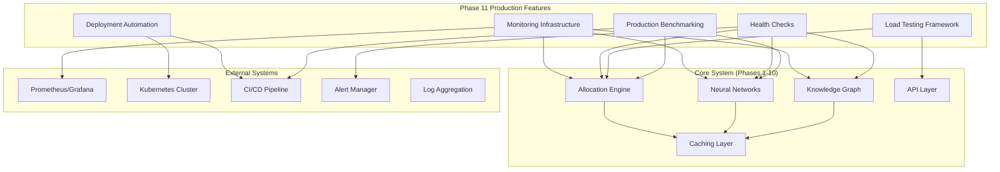

# Phase 11 Integration and Dependencies

## Overview

Phase 11 (Production Features) integrates all production-ready operational components required for deploying and maintaining the neuromorphic knowledge graph system in production environments. This phase builds upon the foundations established in Phases 1-10.

## Pre-requisites

### Phase Dependencies

Phase 11 requires completion of the following phases:

**Phase 1: Spiking Neural Cortical Column Core (CRITICAL)**
- ✅ Cortical column state machine implementation
- ✅ Lateral inhibition networks
- ✅ TTFS encoding pipeline
- ✅ Performance targets met (< 100μs P99 allocation latency)

**Phase 2: Knowledge Graph Integration (CRITICAL)**
- ✅ Entity extraction and relationship mapping
- ✅ Graph database integration
- ✅ Query optimization
- ✅ Real-time update mechanisms

**Phase 10: Advanced Algorithms (REQUIRED)**
- ✅ Multi-level caching system
- ✅ Distributed processing capabilities
- ✅ Performance optimization algorithms
- ✅ Scalability enhancements

### System Requirements

**Hardware Requirements:**
- CPU: x86_64 with AVX2 support (minimum 8 cores for production)
- Memory: 32GB RAM minimum (64GB recommended for production)
- Storage: SSD with 1000+ IOPS (NVMe recommended)
- Network: 1Gbps minimum (10Gbps for high-throughput scenarios)

**Software Requirements:**
- Rust 1.75+ with cargo
- Docker 24.0+ / Podman 4.0+
- Kubernetes 1.27+ (for container orchestration)
- PostgreSQL 15+ (for metadata storage)
- Redis 7+ (for caching layer)

## Component Integration Architecture



## Integration Sequence

### Stage 1: Core Monitoring (Tasks 11.1.x)

**Integration Points:**
1. **Allocation Engine Monitoring**
   - Hook into existing allocation metrics
   - Extend performance counters
   - Add trace correlation

2. **Neural Network Monitoring**
   - Instrument inference pipelines
   - Track model performance
   - Monitor SIMD utilization

3. **Knowledge Graph Monitoring**
   - Query performance tracking
   - Index usage monitoring
   - Update latency metrics

**Code Integration Example:**
```rust
// src/allocation/mod.rs - Add monitoring hooks
impl AllocationEngine {
    pub async fn allocate(&self, input: &[f32]) -> Result<AllocationResult> {
        let _span = tracing::info_span!("allocation", input_size = input.len()).entered();
        let start = Instant::now();
        
        // Existing allocation logic
        let result = self.core_allocate(input).await?;
        
        // Add monitoring
        metrics::histogram!("allocation_duration_ns").record(start.elapsed().as_nanos() as f64);
        metrics::counter!("allocations_total").increment(1);
        
        Ok(result)
    }
}
```

### Stage 2: Health Check Integration (Tasks 11.3.x)

**Integration Points:**
1. **System Health Aggregation**
   - Combine component health status
   - Implement health check hierarchy
   - Add dependency health tracking

2. **Auto-Recovery Integration**
   - Hook into existing error handling
   - Implement circuit breaker patterns
   - Add graceful degradation

**Code Integration Example:**
```rust
// src/health/system_health.rs
pub struct SystemHealthAggregator {
    allocation_health: Arc<AllocationHealthCheck>,
    neural_health: Arc<NeuralNetworkHealthCheck>,
    kg_health: Arc<KnowledgeGraphHealthCheck>,
}

impl SystemHealthAggregator {
    pub async fn get_overall_health(&self) -> SystemHealth {
        let components = vec![
            self.allocation_health.check().await,
            self.neural_health.check().await,
            self.kg_health.check().await,
        ];
        
        // Aggregate health status
        self.aggregate_component_health(components)
    }
}
```

### Stage 3: Deployment Pipeline (Tasks 11.2.x)

**Integration Points:**
1. **CI/CD Pipeline Enhancement**
   - Add performance regression checks
   - Implement automated deployment gates
   - Integrate with existing test suites

2. **Container Orchestration**
   - Package all system components
   - Configure service mesh integration
   - Set up horizontal pod autoscaling

**Kubernetes Integration Example:**
```yaml
# k8s/neuromorphic-system.yaml
apiVersion: apps/v1
kind: Deployment
metadata:
  name: neuromorphic-kg
spec:
  replicas: 3
  template:
    spec:
      containers:
      - name: neuromorphic-kg
        image: neuromorphic-kg:latest
        env:
        - name: MONITORING_ENABLED
          value: "true"
        - name: HEALTH_CHECK_PORT
          value: "8080"
        livenessProbe:
          httpGet:
            path: /health/live
            port: 8080
        readinessProbe:
          httpGet:
            path: /health/ready
            port: 8080
```

### Stage 4: Load Testing Integration (Tasks 11.4.x)

**Integration Points:**
1. **Realistic Workload Generation**
   - Use production data patterns
   - Integrate with existing data pipelines
   - Simulate real user behavior

2. **Performance Validation**
   - Validate against SLA requirements
   - Check scalability limits
   - Verify resource utilization

### Stage 5: Production Benchmarking (Tasks 11.5.x)

**Integration Points:**
1. **Continuous Performance Monitoring**
   - Regular benchmark execution
   - Performance trend analysis
   - Automated regression detection

2. **Optimization Feedback Loop**
   - Performance bottleneck identification
   - Optimization recommendation generation
   - Impact measurement

## Configuration Management

### Environment-Specific Configurations

**Development Environment:**
```yaml
# config/development.yaml
monitoring:
  metrics_enabled: true
  tracing_level: "debug"
  prometheus_port: 9090

health_checks:
  interval_seconds: 30
  timeout_seconds: 5
  
deployment:
  replicas: 1
  resources:
    requests:
      cpu: "500m"
      memory: "1Gi"
```

**Production Environment:**
```yaml
# config/production.yaml
monitoring:
  metrics_enabled: true
  tracing_level: "info"
  prometheus_port: 9090
  retention_days: 30

health_checks:
  interval_seconds: 10
  timeout_seconds: 3
  
deployment:
  replicas: 5
  resources:
    requests:
      cpu: "2000m"
      memory: "4Gi"
    limits:
      cpu: "4000m"
      memory: "8Gi"
```

## Dependency Matrix

### Internal Dependencies

| Phase 11 Component | Depends On | Integration Type | Critical |
|-------------------|------------|------------------|----------|
| Monitoring | Phase 1 Allocation Engine | Direct instrumentation | Yes |
| Monitoring | Phase 2 Knowledge Graph | Metrics collection | Yes |
| Health Checks | All core components | Status aggregation | Yes |
| Load Testing | Phase 1-10 APIs | Black-box testing | No |
| Benchmarking | All components | Performance measurement | No |
| Deployment | Complete system | Packaging & orchestration | Yes |

### External Dependencies

| Dependency | Version | Purpose | Critical | Alternative |
|------------|---------|---------|----------|-------------|
| Prometheus | 2.45+ | Metrics collection | Yes | Victoria Metrics |
| Grafana | 10.0+ | Visualization | No | Custom dashboards |
| Kubernetes | 1.27+ | Orchestration | Yes | Docker Swarm |
| Redis | 7.0+ | Caching | Yes | In-memory cache |
| PostgreSQL | 15+ | Metadata storage | Yes | SQLite (dev only) |

## Performance Targets

### Phase 11 Specific Targets

| Component | Metric | Target | Measurement |
|-----------|--------|--------|-------------|
| Monitoring | Overhead | < 2% CPU/Memory | Continuous |
| Health Checks | Response Time | < 100ms | Per check |
| Deployment | Zero-downtime | 100% uptime | During deploys |
| Load Testing | Test Execution | < 10 min CI suite | Per run |
| Benchmarking | Analysis | < 5 min report | Per benchmark |

### System-wide SLA Targets

| Service | Availability | Latency (P99) | Throughput |
|---------|-------------|---------------|------------|
| Allocation API | 99.9% | < 10ms | > 1000 RPS |
| Query API | 99.5% | < 50ms | > 500 RPS |
| Ingestion API | 99.0% | < 100ms | > 100 RPS |

## Troubleshooting Guide

### Common Integration Issues

**1. Monitoring Data Missing**
```bash
# Check metric registration
curl http://localhost:9090/metrics | grep allocation

# Verify tracing setup
export RUST_LOG=tracing=debug
./neuromorphic-kg

# Check Prometheus scraping
kubectl logs -f deployment/prometheus
```

**2. Health Check Failures**
```bash
# Test individual components
curl http://localhost:8080/health/allocation
curl http://localhost:8080/health/neural
curl http://localhost:8080/health/kg

# Check component logs
kubectl logs -f deployment/neuromorphic-kg --container=main
```

**3. Deployment Issues**
```bash
# Check resource constraints
kubectl describe pod neuromorphic-kg-xxx

# Verify image availability
kubectl get events --sort-by=.metadata.creationTimestamp

# Check configuration
kubectl get configmap neuromorphic-config -o yaml
```

### Performance Debugging

**Allocation Engine Issues:**
1. Check SIMD availability: `cat /proc/cpuinfo | grep avx2`
2. Monitor thread pool utilization
3. Profile memory allocation patterns
4. Verify neural network loading

**Knowledge Graph Issues:**
1. Check database connection pool
2. Monitor query execution plans
3. Verify index usage
4. Check cache hit rates

**System Resource Issues:**
1. Monitor CPU thermal throttling
2. Check memory fragmentation
3. Verify disk I/O patterns
4. Monitor network bandwidth

## Testing Strategy

### Integration Testing

**Phase Integration Tests:**
```rust
#[tokio::test]
async fn test_full_system_integration() {
    // Start all Phase 11 components
    let monitoring = MonitoringService::start().await?;
    let health_checks = HealthCheckService::start().await?;
    
    // Start core system components
    let allocation_engine = AllocationEngine::new().await?;
    let knowledge_graph = KnowledgeGraph::new().await?;
    
    // Test end-to-end flow
    let input = generate_test_input();
    let allocation_result = allocation_engine.allocate(&input).await?;
    let kg_result = knowledge_graph.process_allocation(&allocation_result).await?;
    
    // Verify monitoring data
    assert!(monitoring.get_metric("allocations_total").unwrap() > 0);
    
    // Verify health checks
    assert_eq!(health_checks.get_system_health().await?.status, HealthStatus::Healthy);
}
```

**Load Testing Integration:**
```bash
#!/bin/bash
# scripts/integration-load-test.sh

# Start system
docker-compose up -d

# Wait for health checks
./scripts/wait-for-healthy.sh

# Run load test
./target/release/load-test-runner \
  --config integration-test.yaml \
  --duration 300s \
  --target-rps 1000

# Verify no errors
if [ $? -eq 0 ]; then
    echo "✅ Integration load test passed"
else
    echo "❌ Integration load test failed"
    exit 1
fi
```

### End-to-End Validation

**Production Readiness Checklist:**
- [ ] All Phase 1-10 components passing tests
- [ ] Monitoring system operational
- [ ] Health checks responding correctly
- [ ] Deployment pipeline functional
- [ ] Load tests passing at target scale
- [ ] Benchmarks meeting performance targets
- [ ] Security scans passed
- [ ] Documentation complete

## Migration Guide

### From Development to Production

**Step 1: Environment Preparation**
```bash
# Create production namespace
kubectl create namespace neuromorphic-production

# Deploy monitoring stack
helm install prometheus prometheus-community/kube-prometheus-stack \
  --namespace neuromorphic-production

# Deploy application
helm install neuromorphic-kg ./helm/neuromorphic-kg \
  --namespace neuromorphic-production \
  --values values-production.yaml
```

**Step 2: Data Migration**
```bash
# Backup development data
pg_dump development_db > backup.sql

# Restore to production
psql production_db < backup.sql

# Verify data integrity
./scripts/verify-data-integrity.sh
```

**Step 3: Traffic Cutover**
```bash
# Blue-green deployment
./scripts/blue-green-deploy.sh --environment production

# Monitor metrics during cutover
./scripts/monitor-cutover.sh
```

## Success Criteria

### Technical Criteria
- ✅ All Phase 11 components deployed and operational
- ✅ System availability > 99.9%
- ✅ All performance SLAs met
- ✅ Zero data loss during deployments
- ✅ Complete monitoring coverage

### Operational Criteria
- ✅ Automated deployment pipeline functional
- ✅ On-call runbooks complete
- ✅ Performance regression detection operational
- ✅ Capacity planning documented
- ✅ Disaster recovery tested

### Quality Criteria
- ✅ Code coverage > 90%
- ✅ Security scans passed
- ✅ Load testing at 2x peak capacity
- ✅ Benchmark suite comprehensive
- ✅ Documentation complete and accurate

This integration document ensures seamless deployment and operation of the neuromorphic knowledge graph system in production environments with full observability, reliability, and performance optimization capabilities.