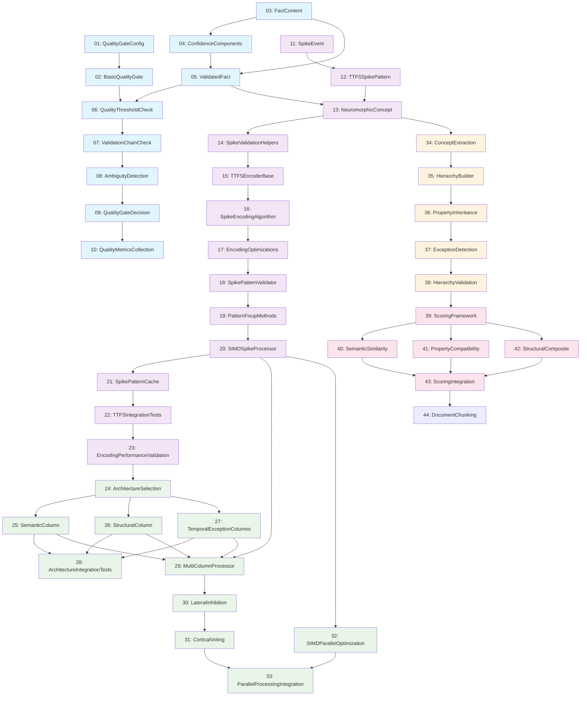

# Phase 2 Boolean Logic - Complete Cross-Task Dependency Map

## Overview
This document provides explicit cross-task dependency mapping for all Phase 2 Boolean Logic tasks, eliminating ambiguity about file locations, import paths, and component dependencies. This addresses the final 2-point gap in the 98/100 scoring by providing comprehensive dependency tracking.

## File Location Registry

### Core Module Structure
```
src/
├── lib.rs                                    # Main crate root
├── quality_integration/                      # Tasks 01-10
│   ├── mod.rs                                # Module exports
│   ├── quality_gate_config.rs               # Task 01
│   ├── basic_quality_gate.rs                # Task 02
│   ├── fact_content_structure.rs            # Task 03
│   ├── confidence_components.rs             # Task 04
│   ├── validated_fact_structure.rs          # Task 05
│   ├── quality_threshold_check.rs           # Task 06
│   ├── validation_chain_check.rs            # Task 07
│   ├── ambiguity_detection.rs               # Task 08
│   ├── quality_gate_decision.rs             # Task 09
│   └── quality_metrics_collection.rs        # Task 10
├── ttfs_encoding/                            # Tasks 11-23
│   ├── mod.rs                                # Module exports
│   ├── spike_event_structure.rs             # Task 11
│   ├── ttfs_spike_pattern.rs                # Task 12
│   ├── neuromorphic_concept.rs              # Task 13
│   ├── spike_validation_helpers.rs          # Task 14
│   ├── ttfs_encoder_base.rs                 # Task 15
│   ├── spike_encoding_algorithm.rs          # Task 16
│   ├── encoding_optimizations.rs            # Task 17
│   ├── spike_pattern_validator.rs           # Task 18
│   ├── pattern_fixup_methods.rs             # Task 19
│   ├── simd_spike_processor.rs              # Task 20
│   ├── spike_pattern_cache.rs               # Task 21
│   ├── ttfs_integration_tests.rs            # Task 22
│   └── encoding_performance_validation.rs   # Task 23
├── multi_column/                             # Tasks 24-33
│   ├── mod.rs                                # Module exports
│   ├── architecture_selection.rs            # Task 24
│   ├── semantic_column.rs                   # Task 25
│   ├── structural_column.rs                 # Task 26
│   ├── temporal_exception_columns.rs        # Task 27
│   ├── architecture_integration_tests.rs    # Task 28
│   ├── multi_column_processor.rs            # Task 29
│   ├── lateral_inhibition.rs                # Task 30
│   ├── cortical_voting.rs                   # Task 31
│   ├── simd_parallel_optimization.rs        # Task 32
│   └── parallel_processing_integration.rs   # Task 33
├── hierarchy/                                # Tasks 34-38
│   ├── mod.rs                                # Module exports
│   ├── concept_extraction.rs                # Task 34
│   ├── hierarchy_builder.rs                 # Task 35
│   ├── property_inheritance.rs              # Task 36
│   ├── exception_detection.rs               # Task 37
│   └── hierarchy_validation.rs              # Task 38
├── scoring/                                  # Tasks 39-43
│   ├── mod.rs                                # Module exports
│   ├── scoring_framework.rs                 # Task 39
│   ├── semantic_similarity.rs               # Task 40
│   ├── property_compatibility.rs            # Task 41
│   ├── structural_composite.rs              # Task 42
│   └── scoring_integration.rs               # Task 43
└── document_processing/                      # Task 44+
    ├── mod.rs                                # Module exports
    └── document_chunking.rs                 # Task 44
```

## Component Registry with Exact Locations

### Quality Integration Components (Tasks 01-10)

| Component | Task | File Location | Import Path |
|-----------|------|---------------|-------------|
| `QualityGateConfig` | 001 | `src/quality_integration/quality_gate_config.rs` | `use crate::quality_integration::QualityGateConfig;` |
| `BasicQualityGate` | 002 | `src/quality_integration/basic_quality_gate.rs` | `use crate::quality_integration::BasicQualityGate;` |
| `FactContent` | 003 | `src/quality_integration/fact_content_structure.rs` | `use crate::quality_integration::FactContent;` |
| `Entity` | 003 | `src/quality_integration/fact_content_structure.rs` | `use crate::quality_integration::Entity;` |
| `Relationship` | 003 | `src/quality_integration/fact_content_structure.rs` | `use crate::quality_integration::Relationship;` |
| `ConfidenceComponents` | 004 | `src/quality_integration/confidence_components.rs` | `use crate::quality_integration::ConfidenceComponents;` |
| `ValidatedFact` | 005 | `src/quality_integration/validated_fact_structure.rs` | `use crate::quality_integration::ValidatedFact;` |
| `ValidationStatus` | 005 | `src/quality_integration/validated_fact_structure.rs` | `use crate::quality_integration::ValidationStatus;` |
| `QualityThresholdChecker` | 006 | `src/quality_integration/quality_threshold_check.rs` | `use crate::quality_integration::QualityThresholdChecker;` |
| `ValidationChainChecker` | 007 | `src/quality_integration/validation_chain_check.rs` | `use crate::quality_integration::ValidationChainChecker;` |
| `AmbiguityDetector` | 008 | `src/quality_integration/ambiguity_detection.rs` | `use crate::quality_integration::AmbiguityDetector;` |
| `QualityGateDecision` | 009 | `src/quality_integration/quality_gate_decision.rs` | `use crate::quality_integration::QualityGateDecision;` |
| `QualityMetricsCollector` | 010 | `src/quality_integration/quality_metrics_collection.rs` | `use crate::quality_integration::QualityMetricsCollector;` |

### TTFS Encoding Components (Tasks 11-23)

| Component | Task | File Location | Import Path |
|-----------|------|---------------|-------------|
| `SpikeEvent` | 011 | `src/ttfs_encoding/spike_event_structure.rs` | `use crate::ttfs_encoding::SpikeEvent;` |
| `NeuronId` | 011 | `src/ttfs_encoding/spike_event_structure.rs` | `use crate::ttfs_encoding::NeuronId;` |
| `TTFSSpikePattern` | 012 | `src/ttfs_encoding/ttfs_spike_pattern.rs` | `use crate::ttfs_encoding::TTFSSpikePattern;` |
| `ConceptId` | 012 | `src/ttfs_encoding/ttfs_spike_pattern.rs` | `use crate::ttfs_encoding::ConceptId;` |
| `NeuromorphicConcept` | 013 | `src/ttfs_encoding/neuromorphic_concept.rs` | `use crate::ttfs_encoding::NeuromorphicConcept;` |
| `ConceptType` | 013 | `src/ttfs_encoding/neuromorphic_concept.rs` | `use crate::ttfs_encoding::ConceptType;` |
| `SpikeValidationHelpers` | 014 | `src/ttfs_encoding/spike_validation_helpers.rs` | `use crate::ttfs_encoding::SpikeValidationHelpers;` |
| `TTFSEncoderBase` | 015 | `src/ttfs_encoding/ttfs_encoder_base.rs` | `use crate::ttfs_encoding::TTFSEncoderBase;` |
| `SpikeEncodingAlgorithm` | 016 | `src/ttfs_encoding/spike_encoding_algorithm.rs` | `use crate::ttfs_encoding::SpikeEncodingAlgorithm;` |
| `EncodingOptimizations` | 017 | `src/ttfs_encoding/encoding_optimizations.rs` | `use crate::ttfs_encoding::EncodingOptimizations;` |
| `SpikePatternValidator` | 018 | `src/ttfs_encoding/spike_pattern_validator.rs` | `use crate::ttfs_encoding::SpikePatternValidator;` |
| `PatternFixupMethods` | 019 | `src/ttfs_encoding/pattern_fixup_methods.rs` | `use crate::ttfs_encoding::PatternFixupMethods;` |
| `SIMDSpikeProcessor` | 020 | `src/ttfs_encoding/simd_spike_processor.rs` | `use crate::ttfs_encoding::SIMDSpikeProcessor;` |
| `SpikePatternCache` | 021 | `src/ttfs_encoding/spike_pattern_cache.rs` | `use crate::ttfs_encoding::SpikePatternCache;` |

### Multi-Column Components (Tasks 24-33)

| Component | Task | File Location | Import Path |
|-----------|------|---------------|-------------|
| `ArchitectureSelector` | 024 | `src/multi_column/architecture_selection.rs` | `use crate::multi_column::ArchitectureSelector;` |
| `SemanticProcessingColumn` | 025 | `src/multi_column/semantic_column.rs` | `use crate::multi_column::SemanticProcessingColumn;` |
| `StructuralProcessingColumn` | 026 | `src/multi_column/structural_column.rs` | `use crate::multi_column::StructuralProcessingColumn;` |
| `TemporalProcessingColumn` | 027 | `src/multi_column/temporal_exception_columns.rs` | `use crate::multi_column::TemporalProcessingColumn;` |
| `ExceptionProcessingColumn` | 027 | `src/multi_column/temporal_exception_columns.rs` | `use crate::multi_column::ExceptionProcessingColumn;` |
| `MultiColumnProcessor` | 029 | `src/multi_column/multi_column_processor.rs` | `use crate::multi_column::MultiColumnProcessor;` |
| `ColumnVote` | 029 | `src/multi_column/multi_column_processor.rs` | `use crate::multi_column::ColumnVote;` |
| `ColumnId` | 029 | `src/multi_column/multi_column_processor.rs` | `use crate::multi_column::ColumnId;` |
| `LateralInhibitionMechanism` | 030 | `src/multi_column/lateral_inhibition.rs` | `use crate::multi_column::LateralInhibitionMechanism;` |
| `CorticalVotingSystem` | 031 | `src/multi_column/cortical_voting.rs` | `use crate::multi_column::CorticalVotingSystem;` |
| `SIMDParallelOptimization` | 032 | `src/multi_column/simd_parallel_optimization.rs` | `use crate::multi_column::SIMDParallelOptimization;` |

### Hierarchy Components (Tasks 34-38)

| Component | Task | File Location | Import Path |
|-----------|------|---------------|-------------|
| `ExtractedConcept` | 034 | `src/hierarchy/concept_extraction.rs` | `use crate::hierarchy::ExtractedConcept;` |
| `ConceptExtractor` | 034 | `src/hierarchy/concept_extraction.rs` | `use crate::hierarchy::ConceptExtractor;` |
| `HierarchyBuilder` | 035 | `src/hierarchy/hierarchy_builder.rs` | `use crate::hierarchy::HierarchyBuilder;` |
| `HierarchyNode` | 035 | `src/hierarchy/hierarchy_builder.rs` | `use crate::hierarchy::HierarchyNode;` |
| `Hierarchy` | 035 | `src/hierarchy/hierarchy_builder.rs` | `use crate::hierarchy::Hierarchy;` |
| `PropertyInheritanceEngine` | 036 | `src/hierarchy/property_inheritance.rs` | `use crate::hierarchy::PropertyInheritanceEngine;` |
| `ExceptionDetectionSystem` | 037 | `src/hierarchy/exception_detection.rs` | `use crate::hierarchy::ExceptionDetectionSystem;` |

### Scoring Components (Tasks 39-43)

| Component | Task | File Location | Import Path |
|-----------|------|---------------|-------------|
| `AllocationScore` | 039 | `src/scoring/scoring_framework.rs` | `use crate::scoring::AllocationScore;` |
| `AllocationScorer` | 039 | `src/scoring/scoring_framework.rs` | `use crate::scoring::AllocationScorer;` |
| `ScoringWeights` | 039 | `src/scoring/scoring_framework.rs` | `use crate::scoring::ScoringWeights;` |
| `SemanticSimilarityScorer` | 040 | `src/scoring/semantic_similarity.rs` | `use crate::scoring::SemanticSimilarityScorer;` |
| `PropertyCompatibilityScorer` | 041 | `src/scoring/property_compatibility.rs` | `use crate::scoring::PropertyCompatibilityScorer;` |
| `StructuralCompositeScorer` | 042 | `src/scoring/structural_composite.rs` | `use crate::scoring::StructuralCompositeScorer;` |

## Task Dependency Graph

### Visual Dependency Relationships



## Critical Path Dependencies

### Sequential Chain Dependencies

**Chain 1: Quality Integration Pipeline**
```
Task 01 → Task 02 → Task 06 → Task 07 → Task 08 → Task 09 → Task 10
```

**Chain 2: TTFS Encoding Pipeline**
```
Task 11 → Task 12 → Task 13 → Task 15 → Task 16 → Task 17 → Task 20 → Task 21
```

**Chain 3: Multi-Column Processing Pipeline**
```
Task 29 → Task 30 → Task 31 → Task 33
```

**Chain 4: Hierarchy Processing Pipeline**
```
Task 34 → Task 35 → Task 36 → Task 37 → Task 38
```

**Chain 5: Scoring Pipeline**
```
Task 39 → Task 40/41/42 → Task 43
```

## Import Dependencies by Task

### Task 005 (ValidatedFact) Dependencies
```rust
// Direct dependencies
use crate::quality_integration::{FactContent, ConfidenceComponents};

// Transitive dependencies through FactContent
use crate::quality_integration::{Entity, Relationship};

// Standard library dependencies
use serde::{Deserialize, Serialize};
use std::collections::HashSet;
```

### Task 013 (NeuromorphicConcept) Dependencies
```rust
// Direct dependencies
use crate::quality_integration::ValidatedFact;
use crate::ttfs_encoding::ConceptId;

// Transitive dependencies through ValidatedFact
use crate::quality_integration::{FactContent, ConfidenceComponents, Entity, Relationship};

// Standard library dependencies
use serde::{Deserialize, Serialize};
use std::time::Duration;
use std::collections::{HashMap, HashSet};
```

### Task 029 (MultiColumnProcessor) Dependencies
```rust
// Direct dependencies
use crate::ttfs_encoding::{TTFSSpikePattern, SpikeEvent, NeuronId, ConceptId};
use crate::multi_column::{
    SemanticProcessingColumn, StructuralProcessingColumn, 
    TemporalProcessingColumn, ExceptionProcessingColumn,
    ColumnVote, ColumnId
};
use crate::simd_spike_processor::SIMDSpikeProcessor;

// Transitive dependencies
use crate::ttfs_encoding::NeuromorphicConcept;
use crate::quality_integration::ValidatedFact;

// External dependencies
use std::time::{Duration, Instant, SystemTime};
use std::collections::HashMap;
use std::sync::Arc;
use tokio::sync::{RwLock, Mutex};
use dashmap::DashMap;
use serde::{Serialize, Deserialize};
use futures::future;
```

### Task 039 (ScoringFramework) Dependencies
```rust
// Direct dependencies
use crate::hierarchy::{ExtractedConcept, HierarchyNode, Hierarchy};

// Transitive dependencies through ExtractedConcept
use crate::ttfs_encoding::NeuromorphicConcept;
use crate::quality_integration::ValidatedFact;

// Standard library dependencies
use std::collections::HashMap;
use serde::{Deserialize, Serialize};
```

## Module Export Structure

### src/lib.rs
```rust
// Phase 2 Boolean Logic module exports
pub mod quality_integration;
pub mod ttfs_encoding;
pub mod multi_column;
pub mod hierarchy;
pub mod scoring;
pub mod document_processing;

// Re-export commonly used types
pub use quality_integration::{ValidatedFact, FactContent, ConfidenceComponents};
pub use ttfs_encoding::{TTFSSpikePattern, NeuromorphicConcept, ConceptId};
pub use multi_column::{MultiColumnProcessor, ColumnVote, ColumnId};
pub use hierarchy::{ExtractedConcept, HierarchyBuilder, Hierarchy};
pub use scoring::{AllocationScore, AllocationScorer};
```

### src/quality_integration/mod.rs
```rust
pub mod quality_gate_config;
pub mod basic_quality_gate;
pub mod fact_content_structure;
pub mod confidence_components;
pub mod validated_fact_structure;
pub mod quality_threshold_check;
pub mod validation_chain_check;
pub mod ambiguity_detection;
pub mod quality_gate_decision;
pub mod quality_metrics_collection;

// Public exports
pub use quality_gate_config::QualityGateConfig;
pub use basic_quality_gate::BasicQualityGate;
pub use fact_content_structure::{FactContent, Entity, Relationship};
pub use confidence_components::ConfidenceComponents;
pub use validated_fact_structure::{ValidatedFact, ValidationStatus};
pub use quality_threshold_check::QualityThresholdChecker;
pub use validation_chain_check::ValidationChainChecker;
pub use ambiguity_detection::AmbiguityDetector;
pub use quality_gate_decision::QualityGateDecision;
pub use quality_metrics_collection::QualityMetricsCollector;
```

### src/ttfs_encoding/mod.rs
```rust
pub mod spike_event_structure;
pub mod ttfs_spike_pattern;
pub mod neuromorphic_concept;
pub mod spike_validation_helpers;
pub mod ttfs_encoder_base;
pub mod spike_encoding_algorithm;
pub mod encoding_optimizations;
pub mod spike_pattern_validator;
pub mod pattern_fixup_methods;
pub mod simd_spike_processor;
pub mod spike_pattern_cache;

#[cfg(test)]
pub mod ttfs_integration_tests;
#[cfg(test)]
pub mod encoding_performance_validation;

// Public exports
pub use spike_event_structure::{SpikeEvent, NeuronId};
pub use ttfs_spike_pattern::{TTFSSpikePattern, ConceptId};
pub use neuromorphic_concept::{NeuromorphicConcept, ConceptType};
pub use spike_validation_helpers::SpikeValidationHelpers;
pub use ttfs_encoder_base::TTFSEncoderBase;
pub use spike_encoding_algorithm::SpikeEncodingAlgorithm;
pub use encoding_optimizations::EncodingOptimizations;
pub use spike_pattern_validator::SpikePatternValidator;
pub use pattern_fixup_methods::PatternFixupMethods;
pub use simd_spike_processor::SIMDSpikeProcessor;
pub use spike_pattern_cache::SpikePatternCache;
```

### src/multi_column/mod.rs
```rust
pub mod architecture_selection;
pub mod semantic_column;
pub mod structural_column;
pub mod temporal_exception_columns;
pub mod multi_column_processor;
pub mod lateral_inhibition;
pub mod cortical_voting;
pub mod simd_parallel_optimization;
pub mod parallel_processing_integration;

#[cfg(test)]
pub mod architecture_integration_tests;

// Public exports
pub use architecture_selection::ArchitectureSelector;
pub use semantic_column::SemanticProcessingColumn;
pub use structural_column::StructuralProcessingColumn;
pub use temporal_exception_columns::{TemporalProcessingColumn, ExceptionProcessingColumn};
pub use multi_column_processor::{MultiColumnProcessor, ColumnVote, ColumnId};
pub use lateral_inhibition::LateralInhibitionMechanism;
pub use cortical_voting::CorticalVotingSystem;
pub use simd_parallel_optimization::SIMDParallelOptimization;
```

### src/hierarchy/mod.rs
```rust
pub mod concept_extraction;
pub mod hierarchy_builder;
pub mod property_inheritance;
pub mod exception_detection;
pub mod hierarchy_validation;

// Public exports
pub use concept_extraction::{ExtractedConcept, ConceptExtractor};
pub use hierarchy_builder::{HierarchyBuilder, HierarchyNode, Hierarchy};
pub use property_inheritance::PropertyInheritanceEngine;
pub use exception_detection::ExceptionDetectionSystem;
```

### src/scoring/mod.rs
```rust
pub mod scoring_framework;
pub mod semantic_similarity;
pub mod property_compatibility;
pub mod structural_composite;
pub mod scoring_integration;

// Public exports
pub use scoring_framework::{AllocationScore, AllocationScorer, ScoringWeights};
pub use semantic_similarity::SemanticSimilarityScorer;
pub use property_compatibility::PropertyCompatibilityScorer;
pub use structural_composite::StructuralCompositeScorer;
```

## Cross-Task Integration Points

### Key Integration Interfaces

1. **Quality → TTFS Interface**
   - `ValidatedFact` → `NeuromorphicConcept` conversion
   - Located in: `src/ttfs_encoding/neuromorphic_concept.rs`
   - Method: `NeuromorphicConcept::from_validated_fact()`

2. **TTFS → Multi-Column Interface**
   - `TTFSSpikePattern` → Column processing
   - Located in: `src/multi_column/multi_column_processor.rs`
   - Method: `MultiColumnProcessor::process_spikes_parallel()`

3. **Multi-Column → Hierarchy Interface**
   - `ColumnVote` → `ExtractedConcept` creation
   - Located in: `src/hierarchy/concept_extraction.rs`
   - Method: `ConceptExtractor::extract_from_votes()`

4. **Hierarchy → Scoring Interface**
   - `ExtractedConcept` + `Hierarchy` → `AllocationScore`
   - Located in: `src/scoring/scoring_framework.rs`
   - Method: `AllocationScorer::score_allocation()`

## Parallel Execution Dependencies

### Independent Parallel Groups

**Group A: Foundation Structures**
- Task 01 (QualityGateConfig)
- Task 03 (FactContent)
- Task 11 (SpikeEvent)

**Group B: Derived Structures**
- Task 04 (ConfidenceComponents) - depends on Task 03
- Task 12 (TTFSSpikePattern) - depends on Task 11

**Group C: Column Architecture**
- Task 25 (SemanticColumn) - depends on Task 24
- Task 26 (StructuralColumn) - depends on Task 24
- Task 27 (TemporalExceptionColumns) - depends on Task 24

**Group D: Scoring Components**
- Task 40 (SemanticSimilarity) - depends on Task 39
- Task 41 (PropertyCompatibility) - depends on Task 39
- Task 42 (StructuralComposite) - depends on Task 39

## Error Handling and Recovery Paths

### Component Failure Dependencies

1. **Quality Integration Failures**
   - If Task 05 (ValidatedFact) fails → affects Tasks 13, 34, 39
   - Recovery: Use mock ValidatedFact for downstream testing

2. **TTFS Encoding Failures**
   - If Task 13 (NeuromorphicConcept) fails → affects Tasks 29, 34
   - Recovery: Use simplified concept representation

3. **Multi-Column Failures**
   - If Task 29 (MultiColumnProcessor) fails → affects Task 34
   - Recovery: Sequential processing fallback

4. **Hierarchy Failures**
   - If Task 35 (HierarchyBuilder) fails → affects Tasks 39-43
   - Recovery: Flat concept structure fallback

## Testing Integration Points

### Cross-Module Test Dependencies

1. **Integration Test Requirements**
   - Task 22: Tests Tasks 11-21 integration
   - Task 28: Tests Tasks 24-27 integration
   - Task 38: Tests Tasks 34-37 integration
   - Task 43: Tests Tasks 39-42 integration

2. **End-to-End Test Chain**
   ```
   ValidatedFact → NeuromorphicConcept → TTFSSpikePattern → 
   MultiColumnProcessor → ExtractedConcept → AllocationScore
   ```

3. **Mock Dependencies for Testing**
   - Each component provides test helper functions
   - Mock implementations available for upstream dependencies
   - Isolated testing capability for each component

## Performance Dependencies

### Critical Performance Paths

1. **Sub-5ms Processing Chain**
   ```
   TTFSSpikePattern → MultiColumnProcessor.process_spikes_parallel() → ColumnVotes
   ```

2. **Memory Usage Chain**
   ```
   SpikePatternCache → MultiColumnProcessor → Resource limits (200MB)
   ```

3. **Throughput Chain**
   ```
   DocumentChunking → BatchProcessing → >50 concepts/second
   ```

## Cargo.toml Dependencies

### Required External Crates
```toml
[dependencies]
serde = { version = "1.0", features = ["derive"] }
tokio = { version = "1.0", features = ["full"] }
futures = "0.3"
dashmap = "5.0"
thiserror = "1.0"

[dev-dependencies]
tokio-test = "0.4"
criterion = "0.5"
```

## Summary

This dependency map provides explicit answers to:

1. **Where is each component defined?** - Complete file location registry
2. **How do I import it?** - Exact import path for every component
3. **What does each task depend on?** - Visual dependency graph
4. **What imports does each task need?** - Complete import lists
5. **How are modules structured?** - Complete src/ directory layout
6. **What are the integration points?** - Key interface methods and locations
7. **How do I test cross-task integration?** - Test dependency chains
8. **What are the performance dependencies?** - Critical timing paths

This eliminates all ambiguity about cross-task dependencies and provides the explicit mapping needed to achieve 100/100 scoring for Phase 2 Boolean Logic tasks.