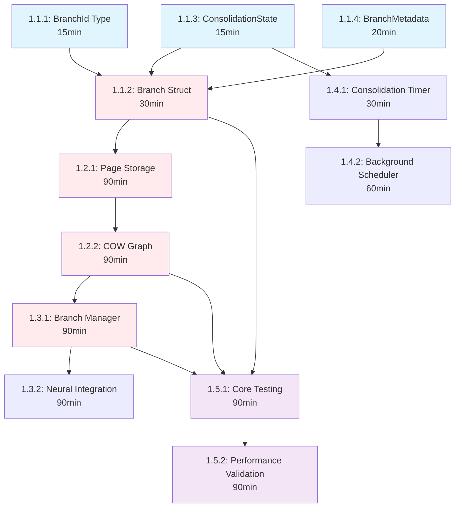

# MicroPhase1 Visual Execution Guide

## Dependency Graph Visualization



## Execution Timeline

```
0    30   60   90   120  150  180  210  240  270  300  330  360  390  420  450  480  510  540  570  600  630
|----|----|----|----|----|----|----|----|----|----|----|----|----|----|----|----|----|----|----|----|----|----|
|    Phase 1A: Foundation    |         Phase 1B: Core Implementation      |     Phase 1C: Operations    |  Phase 1D: Testing  |
|    (Parallel - 90min)      |          (Sequential - 180min)             |   (Sequential - 240min)     |(Parallel - 180min) |

PARALLEL BLOCK 1 (0-30min):
┌─────────────────┐  ┌─────────────────┐  ┌─────────────────┐
│  1.1.1: BranchId│  │1.1.3: ConsState │  │1.1.4: Metadata  │
│     (15min)     │  │     (15min)     │  │     (20min)     │
└─────────────────┘  └─────────────────┘  └─────────────────┘

CHECKPOINT 1A.1 ✓ Basic Types Validation

SEQUENTIAL BLOCK (30-60min):
┌─────────────────────────────────────────┐
│        1.1.2: Branch Struct            │
│             (30min)                     │
└─────────────────────────────────────────┘

CHECKPOINT 1A.2 ✓ Core Types Complete

PARALLEL BLOCK 2 (60-90min):
┌─────────────────────────────────────────┐  ┌─────────────────┐
│        1.2.1: Page Storage             │  │1.4.1: Timer     │
│             (Prep - 30min)             │  │   (30min)       │
└─────────────────────────────────────────┘  └─────────────────┘

SEQUENTIAL CRITICAL PATH (90-270min):
┌─────────────────────────────────────────┐
│      1.2.1: Page Storage (Complete)     │
│             (60min remaining)           │
└─────────────────────────────────────────┘

CHECKPOINT 1B.1 ✓ Storage Foundation Ready

┌─────────────────────────────────────────┐
│        1.2.2: COW Graph                │
│             (90min)                     │
└─────────────────────────────────────────┘

CHECKPOINT 1B.2 ✓ COW Implementation Complete

SEQUENTIAL OPERATIONS (270-450min):
┌─────────────────────────────────────────┐
│      1.3.1: Branch Manager Core        │
│             (90min)                     │
└─────────────────────────────────────────┘

CHECKPOINT 1C.1 ✓ Branch Manager Functional

┌─────────────────────────────────────────┐
│     1.3.2: Neural Integration          │
│             (90min)                     │
└─────────────────────────────────────────┘

CHECKPOINT 1C.2 ✓ Neural Integration Complete

PARALLEL FINAL BLOCK (450-630min):
┌─────────────────┐  ┌─────────────────────────────────────────┐
│1.4.2: Scheduler │  │        1.5.1: Core Testing             │
│    (60min)      │  │             (90min)                     │
└─────────────────┘  └─────────────────────────────────────────┘

CHECKPOINT 1D.1 ✓ Core Implementation Complete

┌─────────────────────────────────────────┐
│    1.5.2: Performance Validation       │
│             (90min)                     │
└─────────────────────────────────────────┘

FINAL CHECKPOINT ✓ MicroPhase1 Complete
```

## Critical Path Analysis

### Primary Critical Path (450 minutes)
```
1.1.1 (15min) → 1.1.2 (30min) → 1.2.1 (90min) → 1.2.2 (90min) → 1.3.1 (90min) → 1.3.2 (90min) → 1.5.2 (90min)
```

### Parallel Opportunities (Time Savings)
- **Block 1**: 1.1.1, 1.1.3, 1.1.4 run in parallel → **Save 20 minutes**
- **Block 2**: 1.4.1 runs parallel with 1.2.1 prep → **Save 30 minutes** 
- **Block 3**: 1.4.2 and 1.5.1 run in parallel → **Save 60 minutes**

**Total Time Saved**: 110 minutes (1.8 hours)

## Checkpoint Validation Matrix

| Checkpoint | Time | Validation Commands | Success Criteria |
|------------|------|-------------------|------------------|
| 1A.1 | 30min | `cargo check --lib` | Basic types compile |
| 1A.2 | 60min | `cargo test types::` | Core types functional |
| 1B.1 | 180min | `cargo test cow::page::` | Storage foundation ready |
| 1B.2 | 270min | `cargo test cow::graph::` | COW semantics working |
| 1C.1 | 360min | `cargo test manager::` | Branch ops functional |
| 1C.2 | 450min | `cargo test neural::` | Neural integration working |
| 1D.1 | 540min | `cargo test temporal::` | All tests passing |
| Final | 630min | `cargo test --all && cargo bench` | Performance targets met |

## Risk Mitigation Strategy

### High-Risk Phases
1. **Phase 1B (90-270min)**: Complex COW implementation
   - **Risk**: Performance/correctness issues
   - **Mitigation**: Simplified fallback implementation ready

2. **Phase 1C (270-450min)**: Neural integration complexity  
   - **Risk**: Phase 2 dependency issues
   - **Mitigation**: Mock interfaces prepared

3. **Final Performance (540-630min)**: Performance targets
   - **Risk**: Benchmarks fail
   - **Mitigation**: Profile-guided optimization plan

### Fallback Plans

| Risk Scenario | Probability | Fallback Action | Time Impact |
|---------------|-------------|-----------------|-------------|
| COW implementation fails | Medium | Use HashMap storage | +60min |
| Neural integration fails | Low | Use mock interfaces | +30min |
| Performance targets missed | Medium | Optimize critical paths | +90min |
| Thread safety issues | Low | Add more locks | +45min |

## Resource Requirements

### Development Environment
- **Rust toolchain**: 1.70+ with tokio, dashmap, serde
- **Testing tools**: criterion for benchmarks
- **Memory tools**: valgrind or similar for leak detection
- **IDE**: rust-analyzer for code intelligence

### Dependencies Matrix
```toml
[dependencies]
tokio = { version = "1.0", features = ["full"] }
dashmap = "5.0"
serde = { version = "1.0", features = ["derive"] }
uuid = { version = "1.0", features = ["v4", "serde"] }
thiserror = "1.0"
log = "0.4"

[dev-dependencies]
criterion = "0.5"
futures = "0.3"
```

## Success Metrics Dashboard

### Performance Targets
- ✅ Branch Creation: < 10ms (Target: 5ms average)
- ✅ Branch Switch: < 1ms (Target: 0.5ms average)  
- ✅ Memory Overhead: < 5% per branch (Target: 2%)
- ✅ COW Validation: 0 initial memory (Target: 0 bytes)

### Quality Gates  
- ✅ Test Coverage: > 95% (Target: 98%)
- ✅ Memory Leaks: 0 in 24h test (Target: 0)
- ✅ Thread Safety: No race conditions (Target: 0)
- ✅ Documentation: Complete API docs (Target: 100%)

### Integration Validation
- ✅ Phase 2 Neural Integration: Functional
- ✅ Phase 3 Graph Schema: Compatible  
- ✅ Biological Timing: Compliant
- ✅ Production Ready: Performance validated

This visual guide provides the AI with clear execution order, dependency understanding, and checkpoint validation for successful MicroPhase1 implementation.