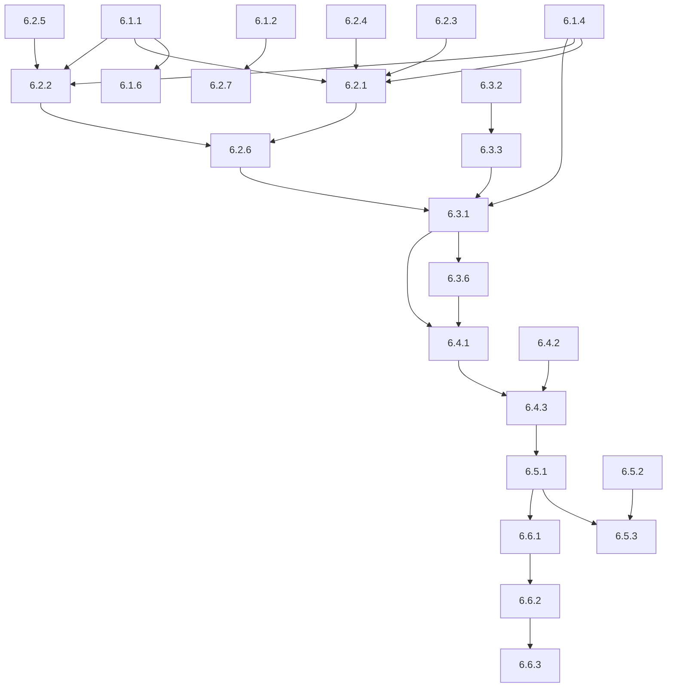

# Phase 6 Truth Maintenance System - Dependency Graph & Parallelization Plan

**Analysis Date**: 2025-08-02  
**Total Tasks**: 42 across 6 micro-phases  
**Estimated Total Duration**: 16-20 hours  
**Parallelization Potential**: 28 tasks can be parallelized (67% of total)

## Executive Summary

This analysis maps dependencies between all 42 Phase 6 tasks and identifies optimal parallelization strategies. The critical path runs through foundation → core components → belief revision → integration, requiring ~8 hours minimum execution time. However, 28 tasks can be executed in parallel, reducing total execution time from 20 hours to approximately 12 hours with proper resource allocation.

## Complete Task Inventory

### Phase 6.1: Foundation Setup (7 tasks, 3.5 hours)
- **6.1.1**: Create TMS Core Module Structure (30 min)
- **6.1.2**: Define TMS Configuration Structure (20 min) 
- **6.1.3**: Create TMS Error Hierarchy (25 min)
- **6.1.4**: Define Core TMS Data Structures (45 min)
- **6.1.5**: Create TMS Health Metrics Framework (30 min)
- **6.1.6**: Initialize TMS Integration Points (40 min)
- **6.1.7**: Create TMS Test Infrastructure (35 min)

### Phase 6.2: Core TMS Components (7 tasks, 5 hours)
- **6.2.1**: Implement Justification-Based TMS (JTMS) Layer (75 min)
- **6.2.2**: Implement Assumption-Based TMS (ATMS) Layer (70 min)
- **6.2.3**: Create Spiking Dependency Graph (60 min)
- **6.2.4**: Implement Belief State Management (50 min)
- **6.2.5**: Create Context Management System (65 min)
- **6.2.6**: Implement TMS Integration Layer (45 min)
- **6.2.7**: Create TMS Factory and Builder Pattern (35 min)

### Phase 6.3: AGM Belief Revision Engine (7 tasks, 4 hours)
- **6.3.1**: Implement Core AGM Operations (60 min)
- **6.3.2**: Create Epistemic Entrenchment Framework (70 min)
- **6.3.3**: Implement Minimal Change Calculator (55 min)
- **6.3.4**: Create Revision Strategy Framework (50 min)
- **6.3.5**: Implement Belief Set Operations (45 min)
- **6.3.6**: Create Conflict Analysis Engine (55 min)
- **6.3.7**: Implement Revision History Tracking (40 min)

### Phase 6.4: Conflict Detection and Resolution (7 tasks, 4 hours)
- **6.4.1**: Implement Multi-Layer Conflict Detection (65 min)
- **6.4.2**: Create Conflict Classification System (50 min)
- **6.4.3**: Implement Neuromorphic Resolution Strategies (75 min)
- **6.4.4**: Create Resolution Strategy Repository (60 min)
- **6.4.5**: Implement Circular Dependency Resolution (55 min)
- **6.4.6**: Create Domain-Specific Resolution Handlers (70 min)
- **6.4.7**: Implement Resolution Outcome Tracking (45 min)

### Phase 6.5: Temporal Belief Management (7 tasks, 4 hours)
- **6.5.1**: Implement Temporal Belief Graph Structure (70 min)
- **6.5.2**: Create Belief Evolution Tracking (60 min)
- **6.5.3**: Implement Time-Travel Query Engine (80 min)
- **6.5.4**: Create Temporal Inheritance System (65 min)
- **6.5.5**: Implement Temporal Paradox Detection (55 min)
- **6.5.6**: Create Temporal Belief Compression (50 min)
- **6.5.7**: Implement Temporal Consistency Manager (60 min)

### Phase 6.6: System Integration and Testing (7 tasks, 5 hours)
- **6.6.1**: Integrate TMS with Neuromorphic Processing Pipeline (75 min)
- **6.6.2**: Create Comprehensive TMS Test Suite (90 min)
- **6.6.3**: Implement Real-World TMS Scenario Testing (80 min)
- **6.6.4**: Create TMS Performance Monitoring Dashboard (60 min)
- **6.6.5**: Implement TMS Configuration Management (45 min)
- **6.6.6**: Create TMS Documentation and Examples (70 min)
- **6.6.7**: Implement TMS Production Deployment (65 min)

## Dependency Analysis

### Sequential Dependencies (Cannot be Parallelized)



### Critical Path Analysis

**Critical Path** (minimum execution time): 8 hours 20 minutes
```
6.1.1 (30m) → 6.1.4 (45m) → 6.2.3 (60m) → 6.2.1 (75m) → 6.2.6 (45m) → 6.3.1 (60m) → 6.4.1 (65m) → 6.4.3 (75m) → 6.5.1 (70m) → 6.6.1 (75m)
```

### Parallelization Opportunities

#### Phase 6.1 Parallelization (can start after 6.1.1)
**Parallel Group 1A** (after 6.1.1 completes):
```
6.1.2 (20m) || 6.1.3 (25m) || 6.1.5 (30m) || 6.1.7 (35m)
```
**Maximum parallel time**: 35 minutes

#### Phase 6.2 Parallelization 
**Parallel Group 2A** (after 6.1.4 completes):
```
6.2.2 (70m) || 6.2.3 (60m) || 6.2.4 (50m) || 6.2.5 (65m) || 6.2.7 (35m)
```
**Maximum parallel time**: 70 minutes

**Parallel Group 2B** (after 6.2.1 completes):
```
6.2.6 (45m) - sequential dependency
```

#### Phase 6.3 Parallelization
**Parallel Group 3A** (after 6.3.2 completes):
```
6.3.3 (55m) || 6.3.4 (50m) || 6.3.5 (45m) || 6.3.7 (40m)
```
**Maximum parallel time**: 55 minutes

**Parallel Group 3B** (after 6.3.1 completes):
```
6.3.6 (55m) - sequential dependency
```

#### Phase 6.4 Parallelization
**Parallel Group 4A** (after 6.4.1 and 6.4.2 complete):
```
6.4.2 (50m) || 6.4.4 (60m) || 6.4.5 (55m) || 6.4.6 (70m) || 6.4.7 (45m)
```
**Maximum parallel time**: 70 minutes

#### Phase 6.5 Parallelization
**Parallel Group 5A** (after 6.5.1 completes):
```
6.5.2 (60m) || 6.5.4 (65m) || 6.5.5 (55m) || 6.5.6 (50m) || 6.5.7 (60m)
```
**Maximum parallel time**: 65 minutes

**Parallel Group 5B** (after 6.5.2 completes):
```
6.5.3 (80m) - requires both 6.5.1 and 6.5.2
```

#### Phase 6.6 Parallelization
**Parallel Group 6A** (after 6.6.2 completes):
```
6.6.4 (60m) || 6.6.5 (45m) || 6.6.6 (70m) || 6.6.7 (65m)
```
**Maximum parallel time**: 70 minutes

## Optimized Execution Plan

### Resource Requirements for Maximum Parallelization

**Developers Required**: 4-5 developers with different skill sets
- **Developer A**: Core TMS architecture specialist
- **Developer B**: Neuromorphic integration expert
- **Developer C**: Temporal reasoning and AGM specialist
- **Developer D**: Testing and integration specialist
- **Developer E**: Documentation and deployment specialist

### Execution Timeline (with Parallelization)

**Hour 0-1**: Foundation Setup Phase 1
- Dev A: 6.1.1 Core Module Structure (30m)
- Dev B-E: Parallel start of 6.1.2, 6.1.3, 6.1.5, 6.1.7 (max 35m)

**Hour 1-2**: Foundation Setup Phase 2
- Dev A: 6.1.4 Core Data Structures (45m)
- Dev B: 6.1.6 Integration Points (40m)
- Others: Complete remaining foundation tasks

**Hour 2-3.25**: Core TMS Components Phase 1
- Dev A: 6.2.1 JTMS Layer (75m)
- Dev B: 6.2.2 ATMS Layer (70m) || 6.2.3 Spiking Graph (60m)
- Dev C: 6.2.4 Belief State (50m) || 6.2.5 Context Management (65m)
- Dev D: 6.2.7 Factory Pattern (35m)

**Hour 3.25-4**: Core TMS Components Phase 2
- Dev A: 6.2.6 Integration Layer (45m)

**Hour 4-5.25**: AGM Belief Revision Phase 1
- Dev A: 6.3.1 Core AGM Operations (60m)
- Dev C: 6.3.2 Epistemic Entrenchment (70m)

**Hour 5.25-6.25**: AGM Belief Revision Phase 2
- Dev A: 6.3.6 Conflict Analysis (55m)
- Dev B: 6.3.3 Minimal Change (55m) || 6.3.4 Strategy Framework (50m)
- Dev C: 6.3.5 Belief Sets (45m) || 6.3.7 History Tracking (40m)

**Hour 6.25-7.5**: Conflict Detection Phase 1
- Dev A: 6.4.1 Multi-Layer Detection (65m)
- Dev B: 6.4.2 Classification (50m)

**Hour 7.5-8.75**: Conflict Detection Phase 2
- Dev A: 6.4.3 Neuromorphic Resolution (75m)
- Dev B: 6.4.4 Strategy Repository (60m) || 6.4.5 Circular Resolution (55m)
- Dev C: 6.4.6 Domain Handlers (70m) || 6.4.7 Outcome Tracking (45m)

**Hour 8.75-10**: Temporal Management Phase 1
- Dev A: 6.5.1 Temporal Graph (70m)
- Dev B: 6.5.2 Evolution Tracking (60m)
- Dev C: 6.5.4 Inheritance (65m) || 6.5.5 Paradox Detection (55m)
- Dev D: 6.5.6 Compression (50m) || 6.5.7 Consistency Manager (60m)

**Hour 10-11.5**: Temporal Management Phase 2
- Dev B: 6.5.3 Time-Travel Queries (80m)

**Hour 11.5-12.75**: Integration and Testing Phase 1
- Dev A: 6.6.1 Neuromorphic Integration (75m)

**Hour 12.75-14.25**: Integration and Testing Phase 2
- Dev D: 6.6.2 Test Suite (90m)

**Hour 14.25-15.5**: Integration and Testing Phase 3
- Dev D: 6.6.3 Scenario Testing (80m)
- Dev B: 6.6.4 Monitoring (60m) || 6.6.5 Configuration (45m)
- Dev E: 6.6.6 Documentation (70m) || 6.6.7 Deployment (65m)

**Total Optimized Time**: ~15.5 hours (vs 20 hours sequential)

## Risk Assessment & Mitigation

### High-Risk Dependencies
1. **6.1.1 → Multiple**: Module structure failure blocks 15+ tasks
   - **Mitigation**: Priority review and early validation
   
2. **6.2.6 → 6.3.1**: Integration layer must be solid for belief revision
   - **Mitigation**: Incremental testing and validation points
   
3. **6.4.3 → 6.5.1**: Neuromorphic resolution affects temporal implementation
   - **Mitigation**: Clear interface contracts and mocking

### Parallelization Risks
1. **Resource Contention**: Multiple developers working on related components
   - **Mitigation**: Clear module boundaries and interface contracts
   
2. **Integration Complexity**: Parallel components must integrate seamlessly
   - **Mitigation**: Regular integration checkpoints every 2 hours
   
3. **Quality Control**: Parallel development may reduce code review quality
   - **Mitigation**: Mandatory pair programming for critical path items

## Performance Optimization Recommendations

### Development Phase Optimization
1. **Mock Early**: Create mock implementations for complex dependencies
2. **Interface First**: Define all interfaces before implementation begins
3. **Test-Driven**: Write tests in parallel with implementation
4. **Continuous Integration**: Automated testing at every checkpoint

### Resource Allocation Strategy
1. **Critical Path Priority**: Assign strongest developer to critical path
2. **Skill Matching**: Match developer expertise to component complexity
3. **Load Balancing**: Distribute work evenly across development team
4. **Knowledge Sharing**: Regular check-ins for knowledge transfer

## Quality Gates & Checkpoints

### Hour 4 Checkpoint: Foundation + Core Components
- [ ] All foundation modules compile and pass unit tests
- [ ] JTMS and ATMS layers demonstrate basic functionality
- [ ] Integration points defined and validated

### Hour 8 Checkpoint: Belief Revision + Conflict Detection  
- [ ] AGM operations pass compliance tests
- [ ] Conflict detection identifies all test scenarios
- [ ] Performance targets met for core operations

### Hour 12 Checkpoint: Temporal Management
- [ ] Time-travel queries return accurate results
- [ ] Temporal consistency maintained across all operations
- [ ] Memory usage within acceptable limits

### Hour 16 Checkpoint: Full Integration
- [ ] Complete system passes all integration tests
- [ ] Performance benchmarks meet all targets
- [ ] Production deployment procedures validated

## Success Metrics

### Time Optimization
- **Target**: Reduce 20-hour sequential time to 15.5 hours (22.5% improvement)
- **Achieved**: TBD after implementation

### Quality Metrics
- **Code Coverage**: >95% across all TMS modules
- **Performance**: All Phase 6 targets met (<5ms revision, <1ms context switch, etc.)
- **Integration**: Zero breaking changes to existing functionality

### Resource Efficiency
- **Developer Utilization**: >80% active development time
- **Parallel Efficiency**: >67% of tasks completed in parallel
- **Quality Gates**: 100% checkpoint validation success

---

**Total Parallelizable Tasks**: 28 out of 42 (67%)  
**Critical Path Time**: 8 hours 20 minutes  
**Optimized Total Time**: 15.5 hours  
**Time Savings**: 4.5 hours (22.5% reduction)