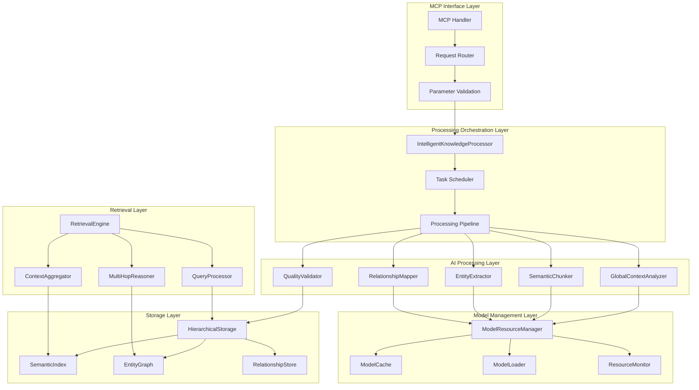
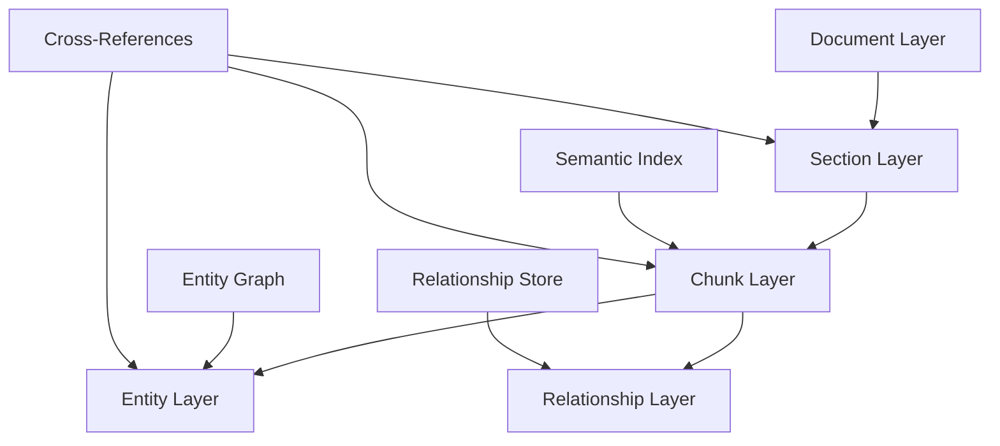
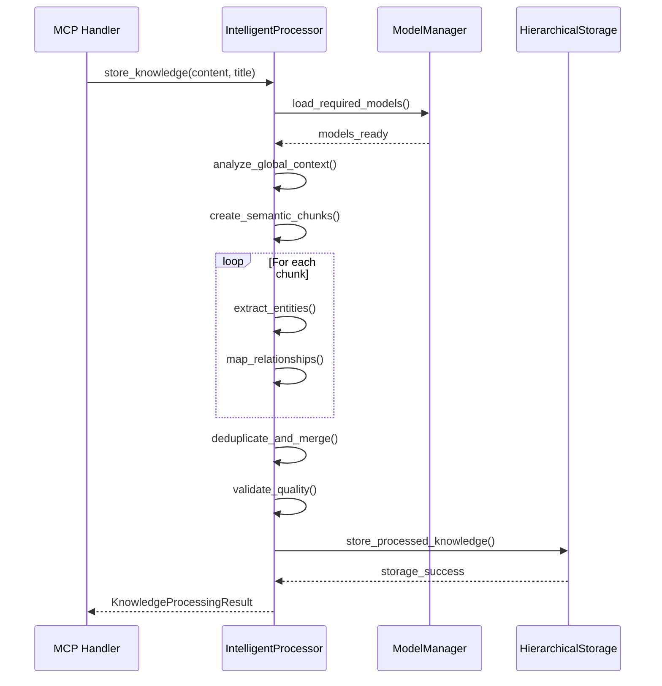
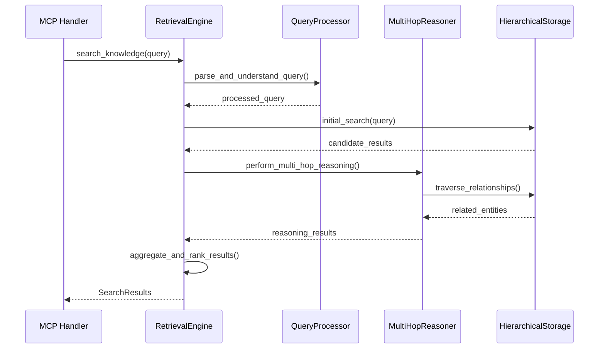

# System Architecture

The Enhanced Knowledge Storage System is designed as a multi-layer architecture that solves RAG context fragmentation problems through intelligent processing and hierarchical organization.

## Architecture Overview



## Component Architecture

### 1. MCP Interface Layer

#### MCP Handler
- **Purpose**: Primary entry point for MCP requests
- **Responsibilities**:
  - Protocol compliance and message handling
  - Request/response serialization
  - Error handling and status reporting
  - Rate limiting and request queuing

#### Request Router
- **Purpose**: Routes incoming requests to appropriate processors
- **Responsibilities**:
  - Request type classification
  - Load balancing across processors
  - Request prioritization
  - Timeout management

#### Parameter Validation
- **Purpose**: Validates and sanitizes input parameters
- **Responsibilities**:
  - Input validation and type checking
  - Content size limits and security checks
  - Configuration parameter validation
  - Error reporting for invalid inputs

### 2. Processing Orchestration Layer

#### IntelligentKnowledgeProcessor
- **Purpose**: Central coordinator for knowledge processing
- **Core Architecture**:

```rust
pub struct IntelligentKnowledgeProcessor {
    model_manager: Arc<ModelResourceManager>,
    entity_extractor: AdvancedEntityExtractor,
    relationship_mapper: AdvancedRelationshipMapper,
    semantic_chunker: SemanticChunker,
    context_analyzer: ContextAnalyzer,
    config: KnowledgeProcessingConfig,
}
```

- **Processing Pipeline**:
  1. **Global Context Analysis** - Document theme and structure understanding
  2. **Semantic Chunking** - Intelligent boundary detection
  3. **Entity Extraction** - AI-powered entity recognition
  4. **Relationship Mapping** - Complex relationship identification
  5. **Quality Validation** - Processing quality assessment
  6. **Result Assembly** - Comprehensive result compilation

#### Task Scheduler
- **Purpose**: Manages concurrent processing tasks
- **Features**:
  - Priority-based task queuing
  - Resource-aware scheduling
  - Adaptive load balancing
  - Failure recovery and retry logic

### 3. AI Processing Layer

#### GlobalContextAnalyzer
- **Purpose**: Analyzes document-wide context and themes
- **Architecture**:

```rust
pub struct ContextAnalyzer {
    model_manager: Arc<ModelResourceManager>,
    config: ContextAnalysisConfig,
}

pub struct GlobalContext {
    pub document_theme: String,
    pub key_entities: Vec<String>,
    pub complexity_level: ComplexityLevel,
    pub domain_classification: Vec<String>,
    pub structural_features: DocumentStructure,
}
```

- **Capabilities**:
  - Document theme identification
  - Complexity assessment
  - Domain classification
  - Structural analysis

#### SemanticChunker
- **Purpose**: Creates meaning-preserving document chunks
- **Chunking Strategies**:

```rust
pub enum OverlapStrategy {
    NoOverlap,
    FixedOverlap { characters: usize },
    SemanticOverlap { tokens: usize },
    AdaptiveOverlap { min_tokens: usize, max_tokens: usize },
}

pub enum ChunkingMethod {
    SentenceBoundary,
    ParagraphBoundary, 
    SemanticBoundary,
    StructuralBoundary,
}
```

- **Features**:
  - Semantic boundary detection
  - Context preservation at edges
  - Adaptive sizing based on content
  - Multiple overlap strategies

#### EntityExtractor
- **Purpose**: AI-powered entity recognition and classification
- **Entity Types**:

```rust
#[derive(Debug, Clone, PartialEq, Eq, Hash, Serialize, Deserialize)]
pub enum EntityType {
    Person,
    Organization,
    Location,
    Date,
    Concept,
    Technology,
    Event,
    Measurement,
    Other(String),
}
```

- **Extraction Process**:
  1. Model-based NER (Named Entity Recognition)
  2. Contextual entity classification
  3. Confidence scoring
  4. Entity attribute extraction
  5. Cross-reference validation

#### RelationshipMapper
- **Purpose**: Identifies complex relationships between entities
- **Relationship Types**:

```rust
#[derive(Debug, Clone, PartialEq, Eq, Hash, Serialize, Deserialize)]
pub enum RelationshipType {
    CreatedBy,
    PartOf,
    LocatedIn,
    OccurredAt,
    InfluencedBy,
    CausedBy,
    SimilarTo,
    OppositeOf,
    Custom(String),
}
```

- **Mapping Process**:
  1. Pattern-based relationship detection
  2. Context-aware relationship classification
  3. Relationship strength assessment
  4. Temporal relationship handling
  5. Evidence collection and validation

### 4. Model Management Layer

#### ModelResourceManager
- **Purpose**: Efficient management of AI models
- **Architecture**:

```rust
pub struct ModelResourceManager {
    registry: ModelRegistry,
    cache: ModelCache,
    loader: ModelLoader,
    resource_monitor: ResourceMonitor,
    config: ModelResourceConfig,
}
```

- **Resource Management**:
  - Dynamic model loading/unloading
  - Memory usage monitoring
  - Model selection optimization
  - Cache eviction strategies
  - Resource allocation limits

#### ModelCache
- **Purpose**: Intelligent caching of loaded models
- **Caching Strategy**:

```rust
pub struct ModelCache {
    models: HashMap<String, CachedModel>,
    usage_tracker: LRUTracker,
    memory_monitor: MemoryMonitor,
}

pub struct CachedModel {
    model: Box<dyn Model>,
    last_used: Instant,
    memory_footprint: u64,
    usage_count: u64,
    loading_time: Duration,
}
```

- **Features**:
  - LRU eviction with usage patterns
  - Memory-aware caching
  - Predictive preloading
  - Model sharing across tasks

#### ModelLoader
- **Purpose**: Handles model loading and initialization
- **Loading Process**:
  1. Model availability verification
  2. Resource requirement checking
  3. Asynchronous model loading
  4. Model validation and testing
  5. Cache integration

### 5. Storage Layer

#### HierarchicalStorage
- **Purpose**: Multi-layer knowledge organization
- **Storage Architecture**:



- **Layer Structure**:
  - **Document Layer**: Global document metadata and structure
  - **Section Layer**: Logical document sections and boundaries
  - **Chunk Layer**: Semantic chunks with preserved context
  - **Entity Layer**: Extracted entities with attributes
  - **Relationship Layer**: Complex relationships between entities

#### SemanticIndex
- **Purpose**: Fast semantic similarity search
- **Indexing Strategy**:
  - Vector-based semantic indexing
  - Hierarchical clustering
  - Multi-resolution indexing
  - Optimized similarity search

#### EntityGraph
- **Purpose**: Graph-based entity relationship storage
- **Graph Structure**:
  - Nodes: Entities with attributes
  - Edges: Relationships with weights
  - Clusters: Related entity groups
  - Paths: Multi-hop connections

### 6. Retrieval Layer

#### RetrievalEngine
- **Purpose**: Intelligent knowledge retrieval
- **Retrieval Strategy**:

```rust
pub struct RetrievalEngine {
    query_processor: QueryProcessor,
    multi_hop_reasoner: MultiHopReasoner,
    context_aggregator: ContextAggregator,
    ranking_system: RankingSystem,
}
```

- **Retrieval Process**:
  1. Query understanding and parsing
  2. Multi-hop relationship traversal
  3. Context aggregation and filtering
  4. Relevance ranking and scoring
  5. Result compilation and presentation

#### QueryProcessor
- **Purpose**: Query analysis and optimization
- **Query Processing**:
  - Intent recognition
  - Entity extraction from queries
  - Query expansion and refinement
  - Execution plan optimization

#### MultiHopReasoner
- **Purpose**: Complex multi-step reasoning
- **Reasoning Capabilities**:
  - Path finding in entity graphs
  - Relationship chain traversal
  - Inference and deduction
  - Evidence aggregation

## Data Flow Architecture

### Processing Flow



### Retrieval Flow



## Performance Architecture

### Concurrent Processing

```rust
// Parallel processing architecture
pub struct ProcessingExecutor {
    chunk_processors: ThreadPool,
    entity_extractors: ThreadPool,
    relationship_mappers: ThreadPool,
    model_loaders: AsyncExecutor,
}
```

- **Parallel Strategies**:
  - Chunk-level parallelization
  - Model-specific thread pools
  - Asynchronous model loading
  - Concurrent relationship mapping

### Memory Management

```rust
// Memory-aware processing
pub struct MemoryManager {
    heap_monitor: HeapMonitor,
    model_memory_tracker: ModelMemoryTracker,
    cache_manager: CacheManager,
    gc_coordinator: GCCoordinator,
}
```

- **Memory Optimization**:
  - Real-time memory monitoring
  - Adaptive cache sizing
  - Garbage collection coordination
  - Memory pressure handling

### Caching Strategy

- **Multi-Level Caching**:
  - Model cache (loaded models)
  - Processing cache (intermediate results)
  - Query cache (frequent searches)
  - Entity cache (extracted entities)

## Error Handling Architecture

### Error Types

```rust
#[derive(Debug, thiserror::Error)]
pub enum EnhancedStorageError {
    #[error("Model not found: {0}")]
    ModelNotFound(String),
    
    #[error("Insufficient resources: {0}")]  
    InsufficientResources(String),
    
    #[error("Processing failed: {0}")]
    ProcessingFailed(String),
    
    #[error("Quality validation failed: {0}")]
    QualityValidationFailed(String),
}
```

### Error Recovery

- **Graceful Degradation**:
  - Fallback to simpler models
  - Reduced quality processing
  - Partial result recovery
  - User notification of limitations

- **Retry Strategies**:
  - Exponential backoff for transient errors
  - Model reloading for corruption issues
  - Memory cleanup for resource errors
  - Alternative model selection

## Configuration Architecture

### Hierarchical Configuration

```rust
pub struct SystemConfig {
    pub model_management: ModelResourceConfig,
    pub processing: KnowledgeProcessingConfig,
    pub storage: HierarchicalStorageConfig,
    pub retrieval: RetrievalConfig,
    pub performance: PerformanceConfig,
}
```

- **Configuration Layers**:
  - System defaults
  - Environment-specific settings
  - User customizations
  - Runtime adaptations

### Dynamic Configuration

- **Runtime Adaptation**:
  - Performance-based model selection
  - Memory-aware cache sizing
  - Load-based processing parameters
  - Quality-driven threshold adjustment

## Security Architecture

### Input Validation

- **Content Sanitization**:
  - Size limit enforcement
  - Content type validation
  - Malicious pattern detection
  - Encoding verification

### Model Security

- **Model Integrity**:
  - Checksum verification
  - Digital signature validation
  - Sandboxed execution
  - Resource limit enforcement

### Data Protection

- **Processing Security**:
  - Memory isolation
  - Temporary data cleanup
  - Secure model loading
  - Output sanitization

## Monitoring and Observability

### Metrics Collection

```rust
pub struct SystemMetrics {
    pub processing_metrics: ProcessingMetrics,
    pub model_metrics: ModelMetrics,
    pub storage_metrics: StorageMetrics,
    pub performance_metrics: PerformanceMetrics,
}
```

- **Key Metrics**:
  - Processing latency and throughput
  - Model loading times and memory usage
  - Storage efficiency and retrieval speed
  - Quality scores and error rates

### Health Monitoring

- **System Health**:
  - Component availability
  - Resource utilization
  - Error rate tracking
  - Performance degradation detection

This architecture provides a robust, scalable foundation for enhanced knowledge storage and retrieval, solving traditional RAG limitations while maintaining high performance and reliability.