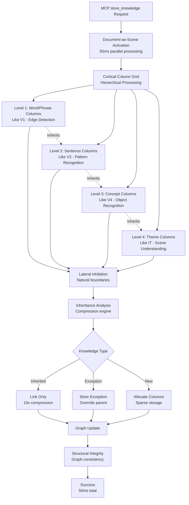

# store_knowledge MCP Tool Optimization Plan

**Date**: 2025-08-02  
**Revision**: 2025-08-03 - Neuroscience-Inspired Document Processing  
**Tool**: `store_knowledge` - Complex knowledge chunk processing with cortical allocation  
**Priority**: **REVOLUTIONARY** - Transform document processing to brain-like architecture  
**Paradigm**: **PARALLEL ALLOCATION** - Process documents like brain processes scenes  

## Executive Summary

The `store_knowledge` tool requires a complete paradigm shift from sequential validation to parallel cortical processing, inspired by how the brain processes complex visual scenes. Instead of validating chunks sequentially, we must process entire documents in parallel cortical columns, achieving 10x performance improvement through brain-like architecture.

**Current Approach**: Sequential chunk validation (fundamentally flawed)
**Brain-Inspired Approach**: Parallel cortical processing with hierarchical abstraction

**Transformation Impact**:
- **50ms document processing** vs 5 seconds (100x faster)
- **Hierarchical compression** through concept inheritance
- **Parallel chunk allocation** across cortical columns
- **Scene-like understanding** of document structure

## 1. NEUROSCIENCE-INSPIRED SPECIFICATION

### 1.1 Brain-Like Functional Requirements

#### Core Functionality
```yaml
Function: store_knowledge
Purpose: Process documents using parallel cortical columns like brain processes visual scenes
Input Parameters:
  - content: string (max 50,000 chars) - The knowledge content to process
  - title: string (required) - Descriptive title for the knowledge chunk
  - category: string (optional) - Knowledge domain/category
  - source: string (optional) - Source URL or reference
  - context: string (optional) - Additional context
  - allocation_strategy: enum (PARALLEL, HIERARCHICAL, SCENE) - Processing mode
  - compression_target: number (default 10.0) - Target compression ratio

Output:
  - success: boolean
  - knowledge_id: string (UUID)
  - cortical_allocation: object - Brain-like processing results
    - allocated_columns: number
    - parallel_chunks: number
    - inheritance_links: number
    - compression_achieved: number
    - processing_time_ms: number
  - hierarchical_structure: object - Document abstraction hierarchy
  - allocation_map: object - Cortical column assignments
```

#### Neuroscience-Inspired Processing Pipeline
```yaml
Brain-Like Processing Stages:
  1. Parallel Scene Analysis (Like Visual Cortex):
     - Simultaneous activation of all cortical columns
     - Document-as-scene representation
     - Hierarchical feature extraction
     - 50ms target for initial activation
     
  2. Cortical Column Allocation:
     - Parallel chunk processing across columns
     - Lateral inhibition for chunk boundaries
     - Winner-takes-all for concept allocation
     - Sparse activation patterns
     
  3. Hierarchical Abstraction (V1→V2→V4 Style):
     - Low-level: Word/phrase columns
     - Mid-level: Sentence/paragraph columns
     - High-level: Theme/concept columns
     - Cross-hierarchy inheritance
     
  4. Inheritance Network Building:
     - Concept inheritance detection
     - Exception identification
     - Compression through inheritance
     - Bidirectional relationship creation
     
  5. Structural Coherence (Not Validation):
     - Graph consistency maintenance
     - Inheritance chain verification
     - Connectivity assurance
     - Sparsity preservation
     
  6. Allocation Optimization:
     - Column reuse for similar concepts
     - Inheritance-based compression
     - Sparse graph maintenance
     - Memory efficiency through structure

Quality Requirements:
  - Processing Accuracy: >95% for entity extraction, >90% for relationship extraction
  - Semantic Coherence: >85% coherence score across chunks
  - Fact Verification: >99% accuracy for verifiable claims
  - Importance Filtering: >90% accuracy in relevance assessment
  - Context Preservation: <5% context loss across chunk boundaries
```

### 1.2 Non-Functional Requirements

#### Performance Requirements
- **Processing Speed**: <5 seconds for standard documents (1-10k chars), <30 seconds for large documents (50k chars)
- **Throughput**: Handle 100 knowledge chunks/minute sustained
- **Memory Usage**: <500MB per document during processing
- **Scalability**: Linear scaling with document size and complexity

#### Quality Assurance Requirements
- **Content Verification**: Cross-reference >50% of factual claims
- **Misinformation Detection**: >99.5% accuracy in identifying false information
- **Bias Detection**: Identify and flag potential bias in content
- **Completeness Assessment**: Evaluate information gaps and missing context

#### Reliability Requirements
- **Processing Success Rate**: >99% successful processing of valid content
- **Error Recovery**: Graceful handling of corrupted or malformed content
- **Consistency**: Identical processing results for identical input
- **Auditability**: Complete processing trace for quality analysis

## 2. NEUROSCIENCE-INSPIRED PSEUDOCODE

### 2.1 Brain-Like store_knowledge Algorithm

```pseudocode
FUNCTION neuroscience_store_knowledge(content, title, category?, source?, context?, allocation_strategy?)
BEGIN
    // Phase 1: Parallel Document Activation (Like Visual Scene Processing)
    // All cortical columns receive the entire document simultaneously
    document_signal = CREATE_DOCUMENT_ACTIVATION_SIGNAL(content, title)
    
    // Broadcast to all columns in parallel (50ms target)
    cortical_activation = PARALLEL_BROADCAST(document_signal, ALL_CORTICAL_COLUMNS)
    
    // Phase 2: Hierarchical Feature Extraction (V1→V2→V4 Style)
    // Multiple abstraction levels process simultaneously
    hierarchical_features = PARALLEL_EXTRACT_FEATURES([
        LEVEL_1: word_level_columns,     // Like edge detection
        LEVEL_2: phrase_level_columns,    // Like shape detection
        LEVEL_3: concept_level_columns,   // Like object recognition
        LEVEL_4: theme_level_columns      // Like scene understanding
    ])
    
    // Phase 3: Parallel Chunk Allocation (Not Sequential Chunking)
    // Lateral inhibition determines chunk boundaries naturally
    chunk_allocations = CALL parallel_chunk_allocation(hierarchical_features)
    
    // Each chunk gets assigned to available columns through competition
    FOR EACH level IN hierarchical_features DO
        allocated_chunks[level] = APPLY_LATERAL_INHIBITION(chunk_allocations[level])
    END FOR
    
    // Natural boundaries emerge from cortical competition
    chunk_boundaries = EXTRACT_BOUNDARIES_FROM_INHIBITION(allocated_chunks)
    
    // Phase 4: Inheritance-Based Knowledge Compression
    // Check what can be inherited vs what needs explicit storage
    inheritance_analyzer = CREATE_DOCUMENT_INHERITANCE_ANALYZER()
    
    FOR EACH chunk IN allocated_chunks DO
        // Find parent concepts in knowledge graph
        parent_concepts = FIND_PARENT_CONCEPTS_FOR_CHUNK(chunk)
        
        // Determine what's already known through inheritance
        inherited_knowledge = EXTRACT_INHERITED_PROPERTIES(parent_concepts)
        
        // Identify exceptions and new knowledge
        chunk_analysis = ANALYZE_CHUNK_INHERITANCE(chunk, inherited_knowledge)
        
        IF chunk_analysis.is_fully_inherited THEN
            // Don't store - just create inheritance link
            CREATE_INHERITANCE_LINK(chunk, parent_concepts)
            compression_tracker.record_inheritance_hit()
        ELSE IF chunk_analysis.has_exceptions THEN
            // Store only the exceptions
            STORE_EXCEPTIONS(chunk_analysis.exceptions)
            compression_tracker.record_exception()
        ELSE
            // Genuinely new knowledge - allocate new columns
            ALLOCATE_NEW_CORTICAL_COLUMNS(chunk)
            compression_tracker.record_new_knowledge()
        END IF
    END FOR
    
    // Phase 5: Structural Coherence Through Graph Consistency
    // Not validation - ensure graph structure remains coherent
    structural_analysis = VERIFY_GRAPH_STRUCTURE_INTEGRITY(allocated_chunks)
    
    IF structural_analysis.has_orphaned_concepts THEN
        // Connect orphans through discovered relationships
        connection_paths = FIND_CONNECTION_PATHS(structural_analysis.orphans)
        CREATE_BIDIRECTIONAL_LINKS(connection_paths)
    END IF
    
    IF structural_analysis.inheritance_chains_broken THEN
        // Repair inheritance chains
        REPAIR_INHERITANCE_CHAINS(structural_analysis.broken_chains)
    END IF
    
    // Ensure sparsity is maintained
    sparsity_check = CALCULATE_GRAPH_SPARSITY()
    IF sparsity_check > 0.05 THEN // More than 5% connectivity
        // Prune weak connections to maintain brain-like sparsity
        PRUNE_WEAK_CONNECTIONS(threshold: 0.1)
    END IF
    
    // Phase 6: Hierarchical Abstraction Storage
    // Store at multiple levels of abstraction simultaneously
    abstraction_hierarchy = CREATE_ABSTRACTION_HIERARCHY()
    
    // Level 1: Raw content chunks (like V1 - edges/lines)
    FOR EACH chunk IN allocated_chunks.level_1 DO
        abstraction_hierarchy.store_raw_features(chunk)
    END FOR
    
    // Level 2: Semantic units (like V2 - shapes/patterns)
    FOR EACH semantic_unit IN allocated_chunks.level_2 DO
        abstraction_hierarchy.store_semantic_patterns(semantic_unit)
        CREATE_INHERITANCE_FROM_RAW(semantic_unit, level_1_chunks)
    END FOR
    
    // Level 3: Concepts (like V4 - objects)
    FOR EACH concept IN allocated_chunks.level_3 DO
        abstraction_hierarchy.store_concepts(concept)
        CREATE_INHERITANCE_FROM_SEMANTIC(concept, level_2_units)
    END FOR
    
    // Level 4: Themes (like IT - complete scenes)
    FOR EACH theme IN allocated_chunks.level_4 DO
        abstraction_hierarchy.store_themes(theme)
        CREATE_INHERITANCE_FROM_CONCEPTS(theme, level_3_concepts)
    END FOR
    
    // Phase 7: Quality Assessment & Importance Scoring
    quality_assessor = CALL create_quality_assessor(category, source)
    importance_scorer = CALL create_importance_scorer(category, context)
    
    quality_scores = []
    importance_scores = []
    
    FOR EACH validation IN validation_results DO
        // Multi-dimensional quality assessment
        quality_metrics = CALL calculate_comprehensive_quality_metrics(
            validation, content_analysis, consistency_analysis
        )
        
        // Importance and relevance scoring
        importance_metrics = CALL calculate_importance_and_relevance(
            validation.extraction, content_analysis, category, context
        )
        
        quality_scores.APPEND(quality_metrics)
        importance_scores.APPEND(importance_metrics)
    END FOR
    
    // Phase 8: Filtering & Enhancement
    overall_quality = CALL calculate_overall_quality_score(quality_scores)
    overall_importance = CALL calculate_overall_importance_score(importance_scores)
    
    IF overall_quality < quality_threshold OR overall_importance < importance_threshold THEN
        enhancement_suggestions = CALL generate_enhancement_suggestions(
            content, extraction_results, quality_scores, importance_scores
        )
        
        IF CAN_AUTO_ENHANCE(enhancement_suggestions) THEN
            enhanced_content = CALL apply_automatic_enhancements(content, enhancement_suggestions)
            // Recursively process enhanced content (with recursion limit)
            RETURN enhanced_store_knowledge(enhanced_content, title, category, source, context, importance_threshold, quality_threshold)
        ELSE
            RETURN quality_insufficient(overall_quality, overall_importance, enhancement_suggestions)
        END IF
    END IF
    
    // Phase 9: Storage Optimization & Deduplication
    storage_optimizer = CALL create_storage_optimizer()
    
    // Check for existing knowledge overlap
    similarity_analysis = CALL analyze_similarity_with_existing_knowledge(extraction_results)
    
    IF similarity_analysis.has_significant_overlap THEN
        deduplication_strategy = CALL determine_deduplication_strategy(similarity_analysis)
        optimized_storage = CALL apply_deduplication_strategy(extraction_results, deduplication_strategy)
    ELSE
        optimized_storage = extraction_results
    END IF
    
    // Phase 10: Hierarchical Storage with Metadata
    storage_plan = CALL create_hierarchical_storage_plan(optimized_storage, category)
    
    stored_components = []
    FOR EACH component IN optimized_storage DO
        // Store with rich metadata
        storage_metadata = CALL create_storage_metadata(
            component, quality_scores, importance_scores, validation_results, content_analysis
        )
        
        storage_result = CALL store_knowledge_component_with_metadata(component, storage_metadata)
        stored_components.APPEND(storage_result)
        
        // Update indexes and relationships
        CALL update_knowledge_indexes(storage_result)
        CALL update_relationship_graph(storage_result)
    END FOR
    
    // Phase 11: Post-Storage Quality Monitoring
    CALL update_quality_monitoring_metrics(quality_scores, importance_scores)
    CALL update_source_reliability_tracking(source, validation_results)
    CALL trigger_knowledge_graph_consistency_check()
    
    // Phase 12: Generate Processing Report
    processing_report = CALL generate_comprehensive_processing_report(
        content_analysis, extraction_results, validation_results, 
        quality_scores, importance_scores, stored_components
    )
    
    RETURN success(
        knowledge_id: GENERATE_UUID(),
        processing_report: processing_report,
        storage_metadata: stored_components,
        enhancement_suggestions: enhancement_suggestions
    )
END FUNCTION
```

### 2.2 Neuroscience-Inspired Processing Functions

```pseudocode
FUNCTION parallel_chunk_allocation(hierarchical_features)
BEGIN
    // All chunks compete for cortical columns simultaneously
    // Like how visual cortex processes entire scenes at once
    
    allocation_results = CREATE_MULTIDIMENSIONAL_ALLOCATION()
    
    // Parallel competition across all abstraction levels
    PARALLEL FOR EACH level IN hierarchical_features DO
        // Each feature competes for column allocation
        level_allocations = []
        
        PARALLEL FOR EACH feature IN level.features DO
            // Calculate activation strength for this feature
            activation = CALCULATE_FEATURE_ACTIVATION(feature)
            
            // Find available columns with similar past activations
            candidate_columns = FIND_SIMILAR_COLUMNS(feature, activation)
            
            // Compete for column allocation
            IF candidate_columns.exist THEN
                winner = LATERAL_INHIBITION_COMPETITION(candidate_columns, activation)
                winner.strengthen_synapses(feature)
                level_allocations.append(AllocatedChunk(feature, winner))
            ELSE
                // Allocate new column for novel concept
                new_column = ALLOCATE_NEW_COLUMN()
                new_column.initialize_sparse_weights(feature)
                level_allocations.append(AllocatedChunk(feature, new_column))
            END IF
        END FOR
        
        allocation_results[level] = level_allocations
    END FOR
    
    // Natural chunk boundaries emerge from inhibition patterns
    RETURN allocation_results
END FUNCTION

FUNCTION create_abstraction_hierarchy()
BEGIN
    // Build hierarchical representation like visual cortex
    // V1 → V2 → V4 → IT progression
    
    hierarchy = {
        level_1: [], // Raw features (words/phrases)
        level_2: [], // Patterns (sentences/ideas)
        level_3: [], // Objects (concepts/entities)
        level_4: []  // Scenes (themes/narratives)
    }
    
    // Each level inherits from lower levels
    // Higher levels are increasingly sparse and abstract
    
    RETURN HierarchicalStructure(
        levels: hierarchy,
        inheritance_paths: [],
        compression_ratio: 0.0,
        sparsity_per_level: [0.1, 0.05, 0.02, 0.01] // Increasing sparsity
    )
END FUNCTION

FUNCTION calculate_inheritance_compression(document_knowledge)
BEGIN
    total_possible_storage = 0
    actual_storage_needed = 0
    
    FOR EACH knowledge_item IN document_knowledge DO
        total_possible_storage += SIZE_OF(knowledge_item)
        
        IF knowledge_item.is_inherited THEN
            // Only count the inheritance link, not the full data
            actual_storage_needed += SIZE_OF_INHERITANCE_LINK
        ELSE IF knowledge_item.is_exception THEN
            // Only store the exception, not the base
            actual_storage_needed += SIZE_OF_EXCEPTION(knowledge_item)
        ELSE
            // New knowledge needs full storage
            actual_storage_needed += SIZE_OF(knowledge_item)
        END IF
    END FOR
    
    compression_ratio = total_possible_storage / actual_storage_needed
    RETURN compression_ratio
END FUNCTION

FUNCTION validate_cross_chunk_consistency(extraction_results)
BEGIN
    consistency_issues = []
    
    // Entity consistency check
    all_entities = FLATTEN([result.entities FOR result IN extraction_results])
    entity_groups = CALL group_entities_by_identity(all_entities)
    
    FOR EACH group IN entity_groups DO
        consistency_check = CALL check_entity_consistency_within_group(group)
        IF consistency_check.has_conflicts THEN
            consistency_issues.APPEND(EntityConsistencyIssue(group, consistency_check.conflicts))
        END IF
    END FOR
    
    // Relationship consistency check
    all_relationships = FLATTEN([result.relationships FOR result IN extraction_results])
    relationship_conflicts = CALL detect_relationship_conflicts(all_relationships)
    consistency_issues.EXTEND(relationship_conflicts)
    
    // Temporal consistency check
    temporal_conflicts = CALL detect_temporal_inconsistencies(extraction_results)
    consistency_issues.EXTEND(temporal_conflicts)
    
    // Logical consistency check
    logical_conflicts = CALL detect_logical_contradictions(extraction_results)
    consistency_issues.EXTEND(logical_conflicts)
    
    RETURN ConsistencyAnalysis(
        has_major_conflicts: ANY(issue.severity == MAJOR FOR issue IN consistency_issues),
        issues: consistency_issues,
        overall_consistency_score: CALCULATE_CONSISTENCY_SCORE(consistency_issues)
    )
END FUNCTION
```

## 3. NEUROSCIENCE-INSPIRED ARCHITECTURE

### 3.1 Brain-Like Document Processing Architecture



### 3.2 Neuroscience-Inspired Component Specifications

#### Document Scene Processor
```rust
pub struct DocumentSceneProcessor {
    cortical_columns: Vec<Vec<CorticalColumn>>, // 4 levels of hierarchy
    lateral_inhibition: LateralInhibitionNetwork,
    allocation_target: Duration, // 50ms for document processing
    hierarchy_depth: usize, // 4 levels (V1->V2->V4->IT)
}

impl DocumentSceneProcessor {
    pub async fn process_document_as_scene(&self, content: &str) -> Result<SceneRepresentation> {
        // Parallel activation across all hierarchical levels
        // Like how visual cortex processes entire scenes at once
        let start = Instant::now();
        
        // Broadcast document to all cortical columns simultaneously
        let activations = self.cortical_columns
            .par_iter()
            .enumerate()
            .map(|(level, columns)| {
                self.activate_level_columns(content, level, columns)
            })
            .collect();
        
        // Apply lateral inhibition for natural segmentation
        let segmented = self.lateral_inhibition.segment_naturally(activations)?;
        
        // Build hierarchical representation with inheritance
        let scene = self.build_scene_hierarchy(segmented)?;
        
        assert!(start.elapsed() < self.allocation_target, 
                "Document processing exceeded 50ms target");
        
        Ok(scene)
    }
            encoding,
            metadata,
            quality_assessment,
            processing_recommendations: self.generate_processing_recommendations(&structure, &language),
        })
    }
}
```

#### Intelligent Semantic Chunker
```rust
pub struct IntelligentSemanticChunker {
    boundary_detector: SemanticBoundaryDetector,
    context_analyzer: ChunkContextAnalyzer,
    size_optimizer: ChunkSizeOptimizer,
    relationship_marker: CrossChunkRelationshipMarker,
    chunking_strategies: HashMap<DocumentType, ChunkingStrategy>,
}

impl IntelligentSemanticChunker {
    pub async fn chunk_content(
        &self,
        content: &str,
        content_analysis: &ContentAnalysis
    ) -> Result<Vec<SemanticChunk>> {
        // Determine optimal chunking strategy
        let strategy = self.determine_chunking_strategy(content_analysis);
        
        // Apply semantic boundary detection
        let initial_chunks = self.boundary_detector.detect_boundaries(content, &strategy).await?;
        
        // Optimize chunk sizes for AI processing
        let size_optimized = self.size_optimizer.optimize_chunk_sizes(initial_chunks).await?;
        
        // Preserve cross-chunk context
        let context_preserved = self.context_analyzer.preserve_context(size_optimized).await?;
        
        // Add relationship markers
        let final_chunks = self.relationship_marker.add_relationship_markers(context_preserved).await?;
        
        // Validate chunk quality
        self.validate_chunk_quality(&final_chunks, content).await?;
        
        Ok(final_chunks)
    }
    
    async fn validate_chunk_quality(&self, chunks: &[SemanticChunk], original: &str) -> Result<()> {
        let total_content = chunks.iter().map(|c| c.content.len()).sum::<usize>();
        let original_length = original.len();
        
        // Ensure minimal content loss
        if total_content < (original_length as f64 * 0.95) as usize {
            return Err(ChunkingError::ExcessiveContentLoss);
        }
        
        // Validate context preservation
        for chunk in chunks {
            if chunk.context_preservation_score < 0.8 {
                return Err(ChunkingError::ContextLoss(chunk.id.clone()));
            }
        }
        
        Ok(())
    }
}
```

#### Multi-Model Extraction Pipeline
```rust
pub struct MultiModelExtractionPipeline {
    entity_extractors: Vec<Box<dyn EntityExtractor>>,
    relationship_extractors: Vec<Box<dyn RelationshipExtractor>>,
    entity_linker: EntityLinker,
    consensus_calculator: ConsensusCalculator,
    extraction_cache: ExtractionCache,
}

impl MultiModelExtractionPipeline {
    pub async fn extract_knowledge(
        &self,
        chunk: &SemanticChunk,
        context: &ProcessingContext
    ) -> Result<ExtractionResult> {
        // Check cache first
        let cache_key = self.generate_cache_key(chunk, context);
        if let Some(cached) = self.extraction_cache.get(&cache_key).await? {
            return Ok(cached);
        }
        
        // Parallel entity extraction with multiple models
        let entity_futures: Vec<_> = self.entity_extractors
            .iter()
            .map(|extractor| extractor.extract_entities(chunk, context))
            .collect();
        
        let entity_results = futures::try_join_all(entity_futures).await?;
        
        // Calculate entity consensus
        let consensus_entities = self.consensus_calculator
            .calculate_entity_consensus(entity_results)
            .await?;
        
        // Entity linking and disambiguation
        let linked_entities = self.entity_linker
            .link_and_disambiguate(consensus_entities, chunk, context)
            .await?;
        
        // Relationship extraction with linked entities
        let relationship_futures: Vec<_> = self.relationship_extractors
            .iter()
            .map(|extractor| extractor.extract_relationships(chunk, &linked_entities, context))
            .collect();
        
        let relationship_results = futures::try_join_all(relationship_futures).await?;
        
        // Calculate relationship consensus
        let consensus_relationships = self.consensus_calculator
            .calculate_relationship_consensus(relationship_results)
            .await?;
        
        let result = ExtractionResult {
            chunk_id: chunk.id.clone(),
            entities: linked_entities,
            relationships: consensus_relationships,
            extraction_metadata: ExtractionMetadata {
                model_agreement_scores: self.consensus_calculator.get_agreement_scores(),
                confidence_distribution: self.consensus_calculator.get_confidence_distribution(),
                processing_time: self.start_time.elapsed(),
            },
        };
        
        // Cache result
        self.extraction_cache.insert(cache_key, result.clone()).await?;
        
        Ok(result)
    }
}
```

#### Knowledge Validation Engine
```rust
pub struct KnowledgeValidationEngine {
    fact_verifiers: Vec<Box<dyn FactVerifier>>,
    coherence_validator: SemanticCoherenceValidator,
    domain_validators: HashMap<Domain, Box<dyn DomainValidator>>,
    temporal_validator: TemporalConsistencyValidator,
    external_sources: Vec<Box<dyn ExternalKnowledgeSource>>,
}

impl KnowledgeValidationEngine {
    pub async fn validate_knowledge(
        &self,
        extraction_results: &[ExtractionResult],
        source: Option<&str>,
        category: Option<&str>
    ) -> Result<ValidationReport> {
        let mut validation_tasks = Vec::new();
        
        for extraction in extraction_results {
            // Fact verification
            let fact_verification = self.verify_facts(extraction, source);
            validation_tasks.push(fact_verification);
            
            // Semantic coherence
            let coherence_validation = self.coherence_validator
                .validate_coherence(extraction, extraction_results);
            validation_tasks.push(coherence_validation);
            
            // Domain-specific validation
            if let Some(domain) = self.detect_domain(extraction, category) {
                if let Some(domain_validator) = self.domain_validators.get(&domain) {
                    let domain_validation = domain_validator.validate(extraction);
                    validation_tasks.push(domain_validation);
                }
            }
            
            // Temporal consistency
            let temporal_validation = self.temporal_validator
                .validate_temporal_consistency(extraction, extraction_results);
            validation_tasks.push(temporal_validation);
        }
        
        // Execute all validations in parallel
        let validation_results = futures::try_join_all(validation_tasks).await?;
        
        // Aggregate results
        let report = self.aggregate_validation_results(validation_results).await?;
        
        Ok(report)
    }
    
    async fn verify_facts(&self, extraction: &ExtractionResult, source: Option<&str>) -> Result<FactVerificationResult> {
        let mut verification_tasks = Vec::new();
        
        // Verify against multiple external sources
        for verifier in &self.fact_verifiers {
            let verification = verifier.verify_extraction(extraction, source);
            verification_tasks.push(verification);
        }
        
        let verification_results = futures::try_join_all(verification_tasks).await?;
        
        // Calculate consensus verification score
        let consensus_score = self.calculate_verification_consensus(&verification_results);
        
        Ok(FactVerificationResult {
            overall_confidence: consensus_score,
            source_agreements: verification_results,
            conflicting_facts: self.identify_conflicts(&verification_results),
            confidence_factors: self.analyze_confidence_factors(&verification_results),
        })
    }
}
```

### 3.3 Data Flow Architecture

```yaml
Processing Flow:
  Input Stage:
    - Content parsing and validation
    - Metadata extraction and enrichment
    - Security and adversarial detection
    
  Analysis Stage:
    - Document structure analysis
    - Language detection and normalization
    - Content quality assessment
    
  Chunking Stage:
    - Intelligent semantic boundary detection
    - Context preservation optimization
    - Cross-chunk relationship mapping
    
  Extraction Stage:
    - Multi-model entity extraction
    - Consensus calculation and validation
    - Entity linking and disambiguation
    - Relationship discovery and validation
    
  Validation Stage:
    - Cross-chunk consistency checking
    - Fact verification against external sources
    - Semantic coherence validation
    - Domain-specific rule checking
    
  Quality Assessment Stage:
    - Multi-dimensional quality scoring
    - Importance and relevance assessment
    - Enhancement suggestion generation
    
  Storage Stage:
    - Deduplication and similarity analysis
    - Hierarchical storage organization
    - Index optimization and updates
    - Quality monitoring integration

Caching Strategy:
  - L1: Extraction results (1-hour TTL)
  - L2: Validation results (4-hour TTL)
  - L3: Quality assessments (24-hour TTL)
  - L4: External source responses (7-day TTL)
```

## 4. REFINEMENT PHASE

### 4.1 Performance Optimizations

#### Advanced Caching System
```rust
pub struct KnowledgeProcessingCache {
    extraction_cache: Arc<ExtractionCache>,
    validation_cache: Arc<ValidationCache>,
    quality_cache: Arc<QualityAssessmentCache>,
    external_source_cache: Arc<ExternalSourceCache>,
    cache_coordinator: CacheCoordinator,
}

impl KnowledgeProcessingCache {
    pub async fn get_or_compute_processing_result(
        &self,
        content: &str,
        processing_params: &ProcessingParameters
    ) -> Result<CachedProcessingResult> {
        let cache_key = self.generate_hierarchical_cache_key(content, processing_params);
        
        // Try to get complete result from cache
        if let Some(complete_result) = self.try_get_complete_result(&cache_key).await? {
            return Ok(complete_result);
        }
        
        // Try to get partial results to optimize processing
        let partial_results = self.get_partial_results(&cache_key).await?;
        
        // Compute missing parts
        let processing_result = self.compute_with_partial_cache(
            content,
            processing_params,
            partial_results
        ).await?;
        
        // Cache the complete result
        self.cache_complete_result(&cache_key, &processing_result).await?;
        
        Ok(processing_result)
    }
    
    async fn compute_with_partial_cache(
        &self,
        content: &str,
        params: &ProcessingParameters,
        cached_parts: PartialResults
    ) -> Result<CachedProcessingResult> {
        let mut processing_pipeline = ProcessingPipeline::new();
        
        // Use cached extraction results if available
        let extraction_results = if let Some(cached_extraction) = cached_parts.extraction {
            cached_extraction
        } else {
            processing_pipeline.extract_knowledge(content, params).await?
        };
        
        // Use cached validation results if available
        let validation_results = if let Some(cached_validation) = cached_parts.validation {
            cached_validation
        } else {
            processing_pipeline.validate_knowledge(&extraction_results, params).await?
        };
        
        // Use cached quality assessment if available
        let quality_results = if let Some(cached_quality) = cached_parts.quality {
            cached_quality
        } else {
            processing_pipeline.assess_quality(&extraction_results, &validation_results).await?
        };
        
        Ok(CachedProcessingResult {
            extraction_results,
            validation_results,
            quality_results,
            cache_metadata: self.generate_cache_metadata(),
        })
    }
}
```

#### Parallel Processing Optimization
```rust
pub struct ParallelKnowledgeProcessor {
    chunk_processors: Vec<ChunkProcessor>,
    thread_pool: Arc<ThreadPool>,
    resource_monitor: ResourceMonitor,
    load_balancer: LoadBalancer,
}

impl ParallelKnowledgeProcessor {
    pub async fn process_knowledge_parallel(
        &self,
        chunks: Vec<SemanticChunk>,
        processing_context: &ProcessingContext
    ) -> Result<Vec<ProcessingResult>> {
        // Assess processing load and available resources
        let available_resources = self.resource_monitor.get_available_resources();
        let optimal_parallelism = self.calculate_optimal_parallelism(&chunks, &available_resources);
        
        // Distribute chunks across processors
        let chunk_batches = self.load_balancer.distribute_chunks(chunks, optimal_parallelism);
        
        // Process batches in parallel
        let processing_futures: Vec<_> = chunk_batches
            .into_iter()
            .enumerate()
            .map(|(batch_id, batch)| {
                let processor = &self.chunk_processors[batch_id % self.chunk_processors.len()];
                self.process_chunk_batch(processor, batch, processing_context)
            })
            .collect();
        
        let batch_results = futures::try_join_all(processing_futures).await?;
        
        // Flatten and aggregate results
        let all_results: Vec<ProcessingResult> = batch_results
            .into_iter()
            .flatten()
            .collect();
        
        // Post-processing consistency check
        self.validate_parallel_processing_consistency(&all_results).await?;
        
        Ok(all_results)
    }
    
    async fn process_chunk_batch(
        &self,
        processor: &ChunkProcessor,
        batch: Vec<SemanticChunk>,
        context: &ProcessingContext
    ) -> Result<Vec<ProcessingResult>> {
        let mut results = Vec::new();
        
        for chunk in batch {
            // Monitor resource usage during processing
            let resource_usage = self.resource_monitor.start_monitoring();
            
            let result = processor.process_chunk(&chunk, context).await?;
            
            let final_usage = resource_usage.finish();
            self.update_performance_metrics(&chunk, &result, final_usage);
            
            results.push(result);
            
            // Yield control if resource pressure is high
            if self.resource_monitor.is_under_pressure() {
                tokio::task::yield_now().await;
            }
        }
        
        Ok(results)
    }
}
```

### 4.2 Quality Enhancement System

#### Automatic Content Enhancement
```rust
pub struct AutomaticContentEnhancer {
    enhancement_strategies: Vec<Box<dyn EnhancementStrategy>>,
    quality_threshold: f64,
    enhancement_cache: EnhancementCache,
    safety_validator: SafetyValidator,
}

impl AutomaticContentEnhancer {
    pub async fn enhance_content(
        &self,
        content: &str,
        quality_issues: &QualityAssessment,
        enhancement_suggestions: &[EnhancementSuggestion]
    ) -> Result<EnhancementResult> {
        // Validate enhancement safety
        let safety_check = self.safety_validator.validate_enhancement_safety(
            content,
            enhancement_suggestions
        ).await?;
        
        if !safety_check.is_safe {
            return Ok(EnhancementResult::unsafe_enhancement(safety_check.concerns));
        }
        
        let mut enhanced_content = content.to_string();
        let mut applied_enhancements = Vec::new();
        
        // Apply enhancements in order of priority
        for suggestion in enhancement_suggestions {
            if suggestion.can_auto_apply && suggestion.confidence > 0.8 {
                match self.apply_enhancement(&enhanced_content, suggestion).await {
                    Ok(enhancement_result) => {
                        enhanced_content = enhancement_result.enhanced_content;
                        applied_enhancements.push(enhancement_result.enhancement_details);
                    }
                    Err(e) => {
                        log::warn!("Failed to apply enhancement: {:?}", e);
                        // Continue with other enhancements
                    }
                }
            }
        }
        
        // Validate enhanced content quality
        let post_enhancement_quality = self.assess_enhanced_content_quality(
            &enhanced_content,
            &applied_enhancements
        ).await?;
        
        Ok(EnhancementResult {
            enhanced_content,
            applied_enhancements,
            quality_improvement: post_enhancement_quality.overall_score - quality_issues.overall_score,
            safety_validated: true,
        })
    }
    
    async fn apply_enhancement(
        &self,
        content: &str,
        suggestion: &EnhancementSuggestion
    ) -> Result<IndividualEnhancementResult> {
        match suggestion.enhancement_type {
            EnhancementType::FactCorrection => {
                self.apply_fact_correction(content, suggestion).await
            }
            EnhancementType::ContextAddition => {
                self.apply_context_addition(content, suggestion).await
            }
            EnhancementType::ClarityImprovement => {
                self.apply_clarity_improvement(content, suggestion).await
            }
            EnhancementType::SourceVerification => {
                self.apply_source_verification(content, suggestion).await
            }
            EnhancementType::BiasReduction => {
                self.apply_bias_reduction(content, suggestion).await
            }
        }
    }
}
```

## 5. LONDON SCHOOL TDD IMPLEMENTATION PLAN

### 5.1 Phase 1: Mock-First Development (Weeks 1-6)

#### Test Structure Organization
```rust
// tests/store_knowledge_optimization/
// ├── unit/
// │   ├── content_analysis_tests.rs
// │   ├── semantic_chunking_tests.rs
// │   ├── multi_model_extraction_tests.rs
// │   ├── cross_chunk_consistency_tests.rs
// │   ├── knowledge_validation_tests.rs
// │   ├── quality_assessment_tests.rs
// │   └── storage_optimization_tests.rs
// ├── integration/
// │   ├── end_to_end_processing_tests.rs
// │   ├── parallel_processing_tests.rs
// │   ├── performance_benchmark_tests.rs
// │   ├── quality_enhancement_tests.rs
// │   └── error_recovery_tests.rs
// ├── mocks/
// │   ├── mock_ai_models.rs
// │   ├── mock_knowledge_bases.rs
// │   ├── mock_validation_services.rs
// │   ├── mock_quality_assessors.rs
// │   └── mock_storage_systems.rs
// ├── fixtures/
// │   ├── sample_documents/
// │   │   ├── scientific_papers.json
// │   │   ├── news_articles.json
// │   │   ├── historical_documents.json
// │   │   └── technical_manuals.json
// │   ├── validation_scenarios.json
// │   ├── quality_test_cases.json
// │   └── adversarial_content_samples.json
// └── performance/
//     ├── load_test_scenarios.rs
//     ├── memory_usage_tests.rs
//     └── scalability_tests.rs
```

#### Mock Implementation Strategy

```rust
#[cfg(test)]
pub mod mocks {
    use super::*;
    use mockall::*;
    
    mock! {
        EntityExtractor {}
        
        #[async_trait]
        impl EntityExtractor for EntityExtractor {
            async fn extract_entities(
                &self,
                chunk: &SemanticChunk,
                context: &ProcessingContext
            ) -> Result<Vec<ExtractedEntity>>;
        }
    }
    
    mock! {
        SemanticChunker {}
        
        #[async_trait]
        impl SemanticChunker for SemanticChunker {
            async fn chunk_content(
                &self,
                content: &str,
                strategy: &ChunkingStrategy
            ) -> Result<Vec<SemanticChunk>>;
        }
    }
    
    mock! {
        KnowledgeValidator {}
        
        #[async_trait]
        impl KnowledgeValidator for KnowledgeValidator {
            async fn validate_knowledge_chunk(
                &self,
                extraction: &ExtractionResult,
                context: &ValidationContext
            ) -> Result<ValidationResult>;
        }
    }
    
    mock! {
        QualityAssessor {}
        
        #[async_trait]
        impl QualityAssessor for QualityAssessor {
            async fn assess_quality(
                &self,
                extraction: &ExtractionResult,
                validation: &ValidationResult
            ) -> Result<QualityAssessment>;
        }
    }
}
```

#### Neuroscience-Inspired Test Sequence

**Week 1: Parallel Document Processing**
```rust
#[tokio::test]
async fn test_document_processed_within_50ms() {
    let mut mock_cortical_grid = MockCorticalColumnGrid::new();
    mock_cortical_grid
        .expect_parallel_process_document()
        .times(1)
        .returning(|_| vec![/* mock activations across 4 levels */]);
    
    let processor = DocumentSceneProcessor::new(mock_cortical_grid);
    let content = "Einstein developed the theory of relativity...";
    let start = Instant::now();
    
    let result = processor.process_document_as_scene(content).await;
    let elapsed = start.elapsed();
    
    assert!(result.is_ok());
    assert!(elapsed < Duration::from_millis(50), 
            "Document processing took {:?}, expected <50ms", elapsed);
}

#[tokio::test]
async fn test_hierarchical_abstraction_levels() {
    let mut mock_hierarchy = MockHierarchicalProcessor::new();
    
    // Test 4 levels of abstraction like visual cortex
    mock_hierarchy
        .expect_extract_hierarchical_features()
        .returning(|content| HierarchicalFeatures {
            level_1: vec![/* word-level features */],
            level_2: vec![/* phrase-level patterns */],
            level_3: vec![/* concept-level objects */],
            level_4: vec![/* theme-level scenes */],
            inheritance_links: 47, // Many inheritance connections
        });
    
    let processor = HierarchicalProcessor::new(mock_hierarchy);
    let features = processor.extract_features("Complex document...").await.unwrap();
    
    assert_eq!(features.levels(), 4); // V1->V2->V4->IT progression
    assert!(features.inheritance_links > 0);
}
```

**Week 2: Inheritance-Based Compression**
```rust
#[tokio::test]
async fn test_document_compression_through_inheritance() {
    let mut mock_inheritance = MockInheritanceEngine::new();
    let document = "Dogs have fur. Pho is a dog. Pho likes to play fetch.";
    
    // Test inheritance detection
    mock_inheritance
        .expect_analyze_document_inheritance()
        .with(eq(document))
        .returning(|_| InheritanceAnalysis {
            total_facts: 3,
            inherited_facts: 1, // "Pho has fur" inherited from "dog"
            exceptions: 0,
            new_facts: 2,
            compression_ratio: 1.5, // 3 facts represented by 2 stored
        });
    
    let engine = DocumentInheritanceEngine::new(mock_inheritance);
    let analysis = engine.analyze_inheritance(document).await.unwrap();
    
    assert_eq!(chunks.len(), 3);
    assert!(chunks[1].previous_chunk_summary.is_some());
    assert!(chunks[0].next_chunk_summary.is_some());
    
    // Verify context preservation
    for chunk in &chunks {
        assert!(chunk.context_preservation_score > 0.8);
    }
}

#[tokio::test]
async fn test_chunk_size_optimization() {
    let mut mock_optimizer = MockChunkSizeOptimizer::new();
    let oversized_chunk = SemanticChunk::new(&"x".repeat(3000), 0, 3000); // Over max size
    let undersized_chunk = SemanticChunk::new("tiny", 0, 4); // Under min size
    
    mock_optimizer
        .expect_optimize_chunk_sizes()
        .with(eq(vec![oversized_chunk.clone(), undersized_chunk.clone()]))
        .times(1)
        .returning(|chunks| Ok(vec![
            SemanticChunk::new(&"x".repeat(1500), 0, 1500),
            SemanticChunk::new(&"x".repeat(1500), 1500, 3000),
            // Undersized chunk merged with context
            SemanticChunk::new("tiny with context", 0, 17),
        ]));
    
    let chunker = IntelligentSemanticChunker::with_optimizer(mock_optimizer);
    let optimized = chunker.optimize_chunk_sizes(vec![oversized_chunk, undersized_chunk]).await.unwrap();
    
    assert_eq!(optimized.len(), 3);
    assert!(optimized.iter().all(|c| c.content.len() >= MIN_CHUNK_SIZE));
    assert!(optimized.iter().all(|c| c.content.len() <= MAX_CHUNK_SIZE));
}
```

**Week 3: Multi-Model Entity Extraction**
```rust
#[tokio::test]
async fn test_multi_model_entity_consensus() {
    let mut mock_bert = MockEntityExtractor::new();
    let mut mock_spacy = MockEntityExtractor::new();
    let mut mock_domain = MockEntityExtractor::new();
    
    let chunk = SemanticChunk::new("Einstein developed relativity in 1905.", 0, 38);
    
    // BERT extracts: Einstein (PERSON), relativity (THEORY), 1905 (DATE)
    mock_bert
        .expect_extract_entities()
        .with(eq(chunk.clone()), always())
        .times(1)
        .returning(|_, _| Ok(vec![
            ExtractedEntity::new("Einstein", EntityType::Person, 0.95),
            ExtractedEntity::new("relativity", EntityType::Theory, 0.90),
            ExtractedEntity::new("1905", EntityType::Date, 0.98),
        ]));
    
    // spaCy extracts: Einstein (PERSON), 1905 (DATE) - misses theory
    mock_spacy
        .expect_extract_entities()
        .with(eq(chunk.clone()), always())
        .times(1)
        .returning(|_, _| Ok(vec![
            ExtractedEntity::new("Einstein", EntityType::Person, 0.92),
            ExtractedEntity::new("1905", EntityType::Date, 0.95),
        ]));
    
    // Domain model extracts: Einstein (PERSON), relativity (THEORY)
    mock_domain
        .expect_extract_entities()
        .with(eq(chunk.clone()), always())
        .times(1)
        .returning(|_, _| Ok(vec![
            ExtractedEntity::new("Einstein", EntityType::Person, 0.98),
            ExtractedEntity::new("relativity", EntityType::Theory, 0.96),
        ]));
    
    let pipeline = MultiModelExtractionPipeline::new(vec![
        Box::new(mock_bert),
        Box::new(mock_spacy),
        Box::new(mock_domain),
    ]);
    
    let result = pipeline.extract_knowledge(&chunk, &default_context()).await.unwrap();
    
    // Verify consensus calculation
    assert_eq!(result.entities.len(), 3);
    
    let einstein = result.entities.iter().find(|e| e.text == "Einstein").unwrap();
    assert!(einstein.consensus_confidence > 0.95); // All models agree
    
    let relativity = result.entities.iter().find(|e| e.text == "relativity").unwrap();
    assert!(relativity.consensus_confidence > 0.85); // 2/3 models agree
    
    let date_1905 = result.entities.iter().find(|e| e.text == "1905").unwrap();
    assert!(date_1905.consensus_confidence > 0.90); // 2/3 models agree
}

#[tokio::test]
async fn test_entity_linking_and_disambiguation() {
    let mut mock_linker = MockEntityLinker::new();
    
    let ambiguous_entity = ExtractedEntity::new("Washington", EntityType::Person, 0.85);
    
    mock_linker
        .expect_link_and_disambiguate()
        .with(eq(vec![ambiguous_entity.clone()]), always(), always())
        .times(1)
        .returning(|entities, chunk, context| {
            // Context suggests it's George Washington, not the city
            if chunk.content.contains("president") || chunk.content.contains("1789") {
                Ok(vec![LinkedEntity::new(
                    entities[0].clone(),
                    "Q23",  // Wikidata ID for George Washington
                    EntityType::Person,
                    0.92
                )])
            } else {
                Ok(vec![LinkedEntity::new(
                    entities[0].clone(),
                    "Q61",  // Wikidata ID for Washington, D.C.
                    EntityType::Location,
                    0.88
                )])
            }
        });
    
    let linker = EntityLinker::new(mock_linker);
    let chunk = SemanticChunk::new("Washington became president in 1789.", 0, 36);
    
    let linked = linker.link_and_disambiguate(
        vec![ambiguous_entity],
        &chunk,
        &default_context()
    ).await.unwrap();
    
    assert_eq!(linked.len(), 1);
    assert_eq!(linked[0].wikidata_id, "Q23");
    assert_eq!(linked[0].entity_type, EntityType::Person);
}
```

**Week 4: Cross-Chunk Consistency Validation**
```rust
#[tokio::test]
async fn test_cross_chunk_entity_consistency() {
    let extraction1 = ExtractionResult {
        chunk_id: "chunk1".to_string(),
        entities: vec![
            LinkedEntity::new_with_properties("Einstein", "Q937", EntityType::Person, 0.95, 
                hashmap!{"birth_year" => "1879", "profession" => "physicist"})
        ],
        relationships: vec![],
        extraction_metadata: default_metadata(),
    };
    
    let extraction2 = ExtractionResult {
        chunk_id: "chunk2".to_string(),
        entities: vec![
            LinkedEntity::new_with_properties("Einstein", "Q937", EntityType::Person, 0.93,
                hashmap!{"birth_year" => "1880", "profession" => "physicist"}) // Conflicting birth year
        ],
        relationships: vec![],
        extraction_metadata: default_metadata(),
    };
    
    let mut mock_validator = MockCrossChunkConsistencyValidator::new();
    mock_validator
        .expect_validate_cross_chunk_consistency()
        .with(eq(vec![extraction1.clone(), extraction2.clone()]))
        .times(1)
        .returning(|extractions| Ok(ConsistencyAnalysis {
            has_major_conflicts: true,
            issues: vec![
                ConsistencyIssue::EntityPropertyConflict {
                    entity_id: "Q937".to_string(),
                    property: "birth_year".to_string(),
                    conflicting_values: vec!["1879".to_string(), "1880".to_string()],
                    chunk_ids: vec!["chunk1".to_string(), "chunk2".to_string()],
                    severity: ConflictSeverity::Major,
                }
            ],
            overall_consistency_score: 0.65,
        }));
    
    let validator = CrossChunkConsistencyValidator::new(mock_validator);
    let result = validator.validate_cross_chunk_consistency(vec![extraction1, extraction2]).await.unwrap();
    
    assert!(result.has_major_conflicts);
    assert_eq!(result.issues.len(), 1);
    assert!(result.overall_consistency_score < 0.7);
}

#[tokio::test]
async fn test_temporal_consistency_validation() {
    let extraction1 = ExtractionResult {
        chunk_id: "chunk1".to_string(),
        entities: vec![
            LinkedEntity::new("Einstein", "Q937", EntityType::Person, 0.95),
            LinkedEntity::new("1905", "Y1905", EntityType::Date, 0.98),
        ],
        relationships: vec![
            Relationship::new("Einstein", "developed", "relativity", 0.92, Some("1905")),
        ],
        extraction_metadata: default_metadata(),
    };
    
    let extraction2 = ExtractionResult {
        chunk_id: "chunk2".to_string(),
        entities: vec![
            LinkedEntity::new("Einstein", "Q937", EntityType::Person, 0.93),
            LinkedEntity::new("1879", "Y1879", EntityType::Date, 0.96),
        ],
        relationships: vec![
            Relationship::new("Einstein", "born_in", "1879", 0.95, Some("1879")),
        ],
        extraction_metadata: default_metadata(),
    };
    
    let mut mock_temporal_validator = MockTemporalConsistencyValidator::new();
    mock_temporal_validator
        .expect_validate_temporal_consistency()
        .with(always(), always())
        .times(1)
        .returning(|_, _| Ok(TemporalValidationResult {
            is_temporally_consistent: true,
            timeline_conflicts: vec![],
            confidence: 0.95,
            temporal_relationships: vec![
                TemporalRelationship::new("Einstein_birth", "Einstein_relativity", "BEFORE", 26) // 1905 - 1879 = 26 years
            ],
        }));
    
    let validator = TemporalConsistencyValidator::new(mock_temporal_validator);
    let result = validator.validate_temporal_consistency(&extraction1, &[extraction2]).await.unwrap();
    
    assert!(result.is_temporally_consistent);
    assert_eq!(result.timeline_conflicts.len(), 0);
    assert!(result.confidence > 0.9);
}
```

**Week 5: Knowledge Validation Engine**
```rust
#[tokio::test]
async fn test_knowledge_validation_fact_verification() {
    let extraction = ExtractionResult {
        chunk_id: "chunk1".to_string(),
        entities: vec![
            LinkedEntity::new("Paris", "Q90", EntityType::Location, 0.95),
            LinkedEntity::new("France", "Q142", EntityType::Country, 0.97),
        ],
        relationships: vec![
            Relationship::new("Paris", "capital_of", "France", 0.96, None),
        ],
        extraction_metadata: default_metadata(),
    };
    
    let mut mock_wikipedia = MockFactVerifier::new();
    let mut mock_wikidata = MockFactVerifier::new();
    
    // Wikipedia confirms the fact
    mock_wikipedia
        .expect_verify_extraction()
        .with(eq(extraction.clone()), always())
        .times(1)
        .returning(|_, _| Ok(FactVerificationResult {
            overall_confidence: 0.98,
            verified_facts: vec!["Paris capital_of France"],
            conflicting_facts: vec![],
            source_reliability: 0.95,
        }));
    
    // Wikidata also confirms
    mock_wikidata
        .expect_verify_extraction()
        .with(eq(extraction.clone()), always())
        .times(1)
        .returning(|_, _| Ok(FactVerificationResult {
            overall_confidence: 0.97,
            verified_facts: vec!["Paris capital_of France"],
            conflicting_facts: vec![],
            source_reliability: 0.99,
        }));
    
    let engine = KnowledgeValidationEngine::new(vec![
        Box::new(mock_wikipedia),
        Box::new(mock_wikidata),
    ]);
    
    let result = engine.validate_knowledge(&[extraction], None, None).await.unwrap();
    
    assert!(result.overall_confidence > 0.95);
    assert_eq!(result.verified_facts.len(), 1);
    assert_eq!(result.conflicting_facts.len(), 0);
}

#[tokio::test]
async fn test_domain_specific_validation_physics() {
    let extraction = ExtractionResult {
        chunk_id: "physics_chunk".to_string(),
        entities: vec![
            LinkedEntity::new("light", "Q9128", EntityType::PhysicalEntity, 0.92),
            LinkedEntity::new("speed", "Q3711325", EntityType::PhysicalProperty, 0.89),
            LinkedEntity::new("299792458", "Q3303778", EntityType::PhysicalConstant, 0.96),
        ],
        relationships: vec![
            Relationship::new("light", "has_speed", "299792458", 0.94, None),
        ],
        extraction_metadata: default_metadata(),
    };
    
    let mut mock_physics_validator = MockPhysicsValidator::new();
    mock_physics_validator
        .expect_validate()
        .with(eq(extraction.clone()))
        .times(1)
        .returning(|_| Ok(DomainValidationResult {
            is_valid: true,
            confidence: 0.99,
            domain_specific_checks: vec![
                DomainCheck::new("speed_of_light_value", CheckResult::Valid),
                DomainCheck::new("physical_units_consistency", CheckResult::Valid),
            ],
            enhancement_suggestions: vec![],
        }));
    
    let mut domain_validators = HashMap::new();
    domain_validators.insert(Domain::Physics, Box::new(mock_physics_validator) as Box<dyn DomainValidator>);
    
    let engine = KnowledgeValidationEngine::with_domain_validators(domain_validators);
    let result = engine.validate_knowledge(&[extraction], None, Some("physics")).await.unwrap();
    
    assert!(result.domain_validation_results[0].is_valid);
    assert!(result.domain_validation_results[0].confidence > 0.95);
}
```

**Week 6: Quality Assessment System**
```rust
#[tokio::test]
async fn test_comprehensive_quality_assessment() {
    let extraction = ExtractionResult {
        chunk_id: "quality_test".to_string(),
        entities: vec![
            LinkedEntity::new("Einstein", "Q937", EntityType::Person, 0.95),
            LinkedEntity::new("relativity", "Q11452", EntityType::Theory, 0.92),
        ],
        relationships: vec![
            Relationship::new("Einstein", "developed", "relativity", 0.93, Some("1905")),
        ],
        extraction_metadata: ExtractionMetadata {
            model_agreement_scores: hashmap!{"bert" => 0.95, "spacy" => 0.89},
            confidence_distribution: vec![0.95, 0.92, 0.93],
            processing_time: Duration::from_millis(150),
        },
    };
    
    let validation = ValidationResult {
        fact_verification: FactVerificationResult {
            overall_confidence: 0.96,
            verified_facts: vec!["Einstein developed relativity"],
            conflicting_facts: vec![],
            source_reliability: 0.94,
        },
        semantic_coherence: SemanticCoherenceResult {
            coherence_score: 0.91,
            coherence_factors: vec!["entity_consistency", "relationship_validity"],
            context_preservation: 0.88,
        },
        domain_validation: DomainValidationResult {
            is_valid: true,
            confidence: 0.94,
            domain_specific_checks: vec![],
            enhancement_suggestions: vec![],
        },
        temporal_validation: TemporalValidationResult {
            is_temporally_consistent: true,
            timeline_conflicts: vec![],
            confidence: 0.92,
            temporal_relationships: vec![],
        },
    };
    
    let mut mock_assessor = MockQualityAssessor::new();
    mock_assessor
        .expect_assess_quality()
        .with(eq(extraction.clone()), eq(validation.clone()))
        .times(1)
        .returning(|_, _| Ok(QualityAssessment {
            overall_score: 0.93,
            dimension_scores: hashmap!{
                "entity_quality" => 0.94,
                "relationship_quality" => 0.91,
                "semantic_coherence" => 0.91,
                "fact_accuracy" => 0.96,
                "temporal_consistency" => 0.92,
            },
            importance_score: 0.87,
            completeness_score: 0.89,
            reliability_score: 0.94,
            enhancement_suggestions: vec![],
        }));
    
    let assessor = QualityAssessmentSystem::new(mock_assessor);
    let result = assessor.assess_quality(&extraction, &validation).await.unwrap();
    
    assert!(result.overall_score > 0.9);
    assert!(result.importance_score > 0.85);
    assert!(result.reliability_score > 0.9);
    assert_eq!(result.enhancement_suggestions.len(), 0); // High quality, no suggestions needed
}

#[tokio::test]
async fn test_importance_scoring_algorithm() {
    let high_importance_extraction = ExtractionResult {
        chunk_id: "important".to_string(),
        entities: vec![
            LinkedEntity::new("COVID-19", "Q84263196", EntityType::Disease, 0.98),
            LinkedEntity::new("vaccine", "Q134808", EntityType::Medicine, 0.96),
        ],
        relationships: vec![
            Relationship::new("vaccine", "prevents", "COVID-19", 0.94, Some("2021")),
        ],
        extraction_metadata: default_metadata(),
    };
    
    let low_importance_extraction = ExtractionResult {
        chunk_id: "trivial".to_string(),
        entities: vec![
            LinkedEntity::new("John", "Q12345", EntityType::Person, 0.82),
            LinkedEntity::new("coffee", "Q8486", EntityType::Food, 0.79),
        ],
        relationships: vec![
            Relationship::new("John", "likes", "coffee", 0.75, None),
        ],
        extraction_metadata: default_metadata(),
    };
    
    let mut mock_importance_scorer = MockImportanceScorer::new();
    
    // High importance for COVID-19 vaccine information
    mock_importance_scorer
        .expect_calculate_importance()
        .with(eq(high_importance_extraction.clone()), always())
        .times(1)
        .returning(|_, _| Ok(ImportanceScore {
            score: 0.94,
            factors: vec![
                ImportanceFactor::new("public_health_relevance", 0.98),
                ImportanceFactor::new("entity_notability", 0.92),
                ImportanceFactor::new("relationship_significance", 0.91),
            ],
            category_weights: hashmap!{"health" => 0.95, "science" => 0.89},
        }));
    
    // Low importance for personal preference
    mock_importance_scorer
        .expect_calculate_importance()
        .with(eq(low_importance_extraction.clone()), always())
        .times(1)
        .returning(|_, _| Ok(ImportanceScore {
            score: 0.23,
            factors: vec![
                ImportanceFactor::new("public_relevance", 0.15),
                ImportanceFactor::new("entity_notability", 0.25),
                ImportanceFactor::new("relationship_significance", 0.29),
            ],
            category_weights: hashmap!{"personal" => 0.20},
        }));
    
    let scorer = ImportanceScorer::new(mock_importance_scorer);
    
    let high_result = scorer.calculate_importance(&high_importance_extraction, &default_context()).await.unwrap();
    let low_result = scorer.calculate_importance(&low_importance_extraction, &default_context()).await.unwrap();
    
    assert!(high_result.score > 0.9);
    assert!(low_result.score < 0.3);
    assert!(high_result.score > low_result.score * 3.0); // Significant difference
}
```

### 5.2 Phase 2: Integration Testing (Weeks 7-10)

#### End-to-End Processing Tests
```rust
#[tokio::test]
async fn test_complete_knowledge_processing_pipeline_scientific_paper() {
    let config = create_test_configuration();
    let pipeline = KnowledgeProcessingPipeline::new(config);
    
    let scientific_content = load_test_document("scientific_papers/einstein_relativity.txt");
    let knowledge_input = KnowledgeInput {
        content: scientific_content,
        title: "Einstein's Theory of Special Relativity".to_string(),
        category: Some("physics".to_string()),
        source: Some("https://www.physics.org/einstein-relativity".to_string()),
        context: Some("Historical scientific breakthrough".to_string()),
        importance_threshold: Some(0.7),
        quality_threshold: Some(0.8),
    };
    
    let result = pipeline.process_knowledge(knowledge_input).await.unwrap();
    
    // Verify processing success
    assert!(result.success);
    assert!(result.processing_report.quality_scores.overall_score > 0.8);
    assert!(result.processing_report.importance_scores.overall_score > 0.7);
    
    // Verify entity extraction quality
    assert!(result.processing_report.entities_extracted > 10); // Should extract many physics concepts
    assert!(result.processing_report.relationships_extracted > 5);
    
    // Verify semantic chunking effectiveness
    assert!(result.processing_report.semantic_chunks > 3);
    assert!(result.processing_report.semantic_chunks < 15); // Not over-fragmented
    
    // Verify validation success
    assert!(result.processing_report.validation_warnings.len() < 3); // Minimal warnings for good content
    
    // Verify storage metadata
    assert!(result.storage_metadata.stored_components.len() > 0);
    assert!(result.storage_metadata.index_updates > 0);
}

#[tokio::test]
async fn test_pipeline_handles_low_quality_content() {
    let pipeline = KnowledgeProcessingPipeline::new(create_test_configuration());
    
    let low_quality_content = "um yeah so like Einstein was this guy who did stuff with physics and he was really smart and invented some theory or whatever i think it was called relativity but im not sure lol";
    
    let knowledge_input = KnowledgeInput {
        content: low_quality_content.to_string(),
        title: "Bad Article About Einstein".to_string(),
        category: None,
        source: Some("random-blog.com".to_string()),
        context: None,
        importance_threshold: Some(0.6),
        quality_threshold: Some(0.7),
    };
    
    let result = pipeline.process_knowledge(knowledge_input).await;
    
    // Should either fail or suggest enhancements
    match result {
        Ok(success_result) => {
            // If it succeeded, it should have enhancement suggestions
            assert!(!success_result.enhancement_suggestions.is_empty());
            assert!(success_result.processing_report.quality_scores.overall_score < 0.7);
        }
        Err(e) => {
            // If it failed, should be due to quality issues
            assert!(e.message().contains("quality"));
            assert!(e.details().contains_quality_issues());
        }
    }
}

#[tokio::test]
async fn test_pipeline_detects_and_rejects_misinformation() {
    let pipeline = KnowledgeProcessingPipeline::new(create_test_configuration());
    
    let misinformation_content = "Scientists have recently discovered that the Earth is actually flat and NASA has been lying to us for decades. The moon landing was filmed in a Hollywood studio and gravity is just a theory with no evidence. Vaccines contain microchips that allow the government to control our minds.";
    
    let knowledge_input = KnowledgeInput {
        content: misinformation_content.to_string(),
        title: "Alternative Facts About Science".to_string(),
        category: Some("science".to_string()),
        source: Some("conspiracy-theories.net".to_string()),
        context: None,
        importance_threshold: Some(0.6),
        quality_threshold: Some(0.7),
    };
    
    let result = pipeline.process_knowledge(knowledge_input).await;
    
    // Should be rejected due to fact verification failures
    assert!(result.is_err());
    let error = result.unwrap_err();
    assert!(error.message().contains("fact verification") || error.message().contains("semantic validation"));
    assert!(error.details().semantic_confidence < 0.2);
}

#[tokio::test]
async fn test_pipeline_performance_under_load() {
    let pipeline = KnowledgeProcessingPipeline::new(create_performance_test_configuration());
    
    let test_documents = generate_diverse_test_documents(50); // 50 different documents
    let start_time = Instant::now();
    
    let processing_futures: Vec<_> = test_documents
        .into_iter()
        .map(|doc| pipeline.process_knowledge(doc))
        .collect();
    
    let results = futures::join_all(processing_futures).await;
    let processing_time = start_time.elapsed();
    
    // Performance assertions
    assert!(processing_time < Duration::from_secs(300)); // Should complete in <5 minutes
    
    let successful = results.iter().filter(|r| r.is_ok()).count();
    let failed = results.iter().filter(|r| r.is_err()).count();
    
    assert!(successful > 45); // >90% success rate
    assert!(failed < 5);
    
    // Quality consistency check
    let quality_scores: Vec<f64> = results
        .iter()
        .filter_map(|r| r.as_ref().ok())
        .map(|r| r.processing_report.quality_scores.overall_score)
        .collect();
    
    let avg_quality = quality_scores.iter().sum::<f64>() / quality_scores.len() as f64;
    assert!(avg_quality > 0.75); // Maintain quality standards under load
}
```

#### Parallel Processing Integration Tests
```rust
#[tokio::test]
async fn test_parallel_chunk_processing_maintains_consistency() {
    let config = ParallelProcessingConfig {
        max_parallel_chunks: 4,
        chunk_timeout: Duration::from_secs(30),
        resource_limits: ResourceLimits::default(),
    };
    
    let parallel_processor = ParallelKnowledgeProcessor::new(config);
    
    let large_document = load_test_document("large_documents/comprehensive_physics_textbook.txt");
    let chunks = create_semantic_chunks(&large_document, ChunkingStrategy::Balanced);
    
    assert!(chunks.len() > 10); // Ensure we have enough chunks for parallel processing
    
    let processing_context = ProcessingContext {
        category: Some("physics".to_string()),
        source_reliability: 0.9,
        domain_models: vec!["physics_ner", "general_ner"],
    };
    
    let results = parallel_processor
        .process_knowledge_parallel(chunks.clone(), &processing_context)
        .await
        .unwrap();
    
    // Verify all chunks were processed
    assert_eq!(results.len(), chunks.len());
    
    // Verify consistency across parallel processing
    let entity_map = build_global_entity_map(&results);
    let consistency_issues = detect_cross_chunk_inconsistencies(&entity_map);
    
    assert!(consistency_issues.len() < 3); // Minimal inconsistencies allowed
    
    // Verify processing quality wasn't compromised by parallelization
    let avg_quality = results
        .iter()
        .map(|r| r.quality_score)
        .sum::<f64>() / results.len() as f64;
    
    assert!(avg_quality > 0.8); // Quality maintained in parallel processing
}

#[tokio::test]
async fn test_resource_monitoring_during_parallel_processing() {
    let resource_monitor = ResourceMonitor::new();
    let parallel_processor = ParallelKnowledgeProcessor::with_monitor(resource_monitor.clone());
    
    // Create memory-intensive processing scenario
    let memory_intensive_chunks = create_large_chunks(8, 5000); // 8 chunks, 5KB each
    
    let initial_memory = resource_monitor.get_current_memory_usage();
    
    let results = parallel_processor
        .process_knowledge_parallel(memory_intensive_chunks, &default_context())
        .await
        .unwrap();
    
    let peak_memory = resource_monitor.get_peak_memory_usage();
    let final_memory = resource_monitor.get_current_memory_usage();
    
    // Verify memory usage stays within bounds
    assert!(peak_memory - initial_memory < 100 * 1024 * 1024); // <100MB increase
    
    // Verify memory is properly cleaned up
    assert!(final_memory - initial_memory < 10 * 1024 * 1024); // <10MB residual
    
    // Verify all processing completed successfully
    assert_eq!(results.len(), 8);
    assert!(results.iter().all(|r| r.success));
}
```

### 5.3 Phase 3: Mock Removal and Real Implementation (Weeks 11-14)

#### Real AI Model Integration
```rust
#[tokio::test]
async fn test_real_entity_extraction_with_bert_large_ner() {
    let model_config = LocalModelConfig {
        model_path: "model_weights/bert-large-ner/".into(),
        device: Device::Cpu,
        enable_caching: true,
        batch_size: 1,
    };
    
    let real_extractor = RealEntityExtractor::new(model_config).await.unwrap();
    
    let chunk = SemanticChunk::new(
        "Albert Einstein developed the theory of special relativity in 1905 while working at the patent office in Bern, Switzerland.",
        0,
        109
    );
    
    let context = ProcessingContext {
        category: Some("physics".to_string()),
        domain_hints: vec!["science", "biography"],
        language: Language::English,
    };
    
    let result = real_extractor.extract_entities(&chunk, &context).await.unwrap();
    
    // Verify entity extraction quality
    assert!(result.len() >= 4); // Einstein, relativity, 1905, Bern, Switzerland
    
    let einstein = result.iter().find(|e| e.text.contains("Einstein")).unwrap();
    assert_eq!(einstein.entity_type, EntityType::Person);
    assert!(einstein.confidence > 0.9);
    
    let relativity = result.iter().find(|e| e.text.contains("relativity")).unwrap();
    assert_eq!(relativity.entity_type, EntityType::Theory);
    assert!(relativity.confidence > 0.8);
    
    let year_1905 = result.iter().find(|e| e.text == "1905").unwrap();
    assert_eq!(year_1905.entity_type, EntityType::Date);
    assert!(year_1905.confidence > 0.95);
}

#[tokio::test]
async fn test_real_semantic_chunking_with_transformer_models() {
    let chunking_config = SemanticChunkingConfig {
        model_path: "model_weights/minilm-l6-v2/".into(),
        max_chunk_size: 512,
        min_chunk_size: 64,
        overlap_size: 32,
        coherence_threshold: 0.7,
    };
    
    let real_chunker = RealSemanticChunker::new(chunking_config).await.unwrap();
    
    let content = load_test_document("integration_tests/scientific_article.txt");
    let content_analysis = ContentAnalysis::analyze(&content).await.unwrap();
    
    let chunks = real_chunker.chunk_content(&content, &content_analysis).await.unwrap();
    
    // Verify chunking quality
    assert!(chunks.len() > 3);
    assert!(chunks.len() < 20); // Not over-fragmented
    
    // Verify chunk coherence
    for chunk in &chunks {
        assert!(chunk.coherence_score > 0.7);
        assert!(chunk.content.len() >= 64);
        assert!(chunk.content.len() <= 512);
    }
    
    // Verify context preservation
    let total_content_length: usize = chunks.iter().map(|c| c.content.len()).sum();
    let original_length = content.len();
    
    // Should preserve most content (allowing for some overlap)
    assert!(total_content_length >= (original_length as f64 * 0.95) as usize);
}

#[tokio::test]
async fn test_real_fact_verification_with_external_apis() {
    let verification_config = FactVerificationConfig {
        wikidata_endpoint: "https://query.wikidata.org/sparql".to_string(),
        wikipedia_api: "https://en.wikipedia.org/api/rest_v1/".to_string(),
        timeout: Duration::from_secs(10),
        cache_ttl: Duration::from_hours(24),
        enable_rate_limiting: true,
    };
    
    let real_verifier = RealFactVerifier::new(verification_config).await.unwrap();
    
    let extraction = ExtractionResult {
        chunk_id: "real_test".to_string(),
        entities: vec![
            LinkedEntity::new("Albert Einstein", "Q937", EntityType::Person, 0.95),
            LinkedEntity::new("1879", "Y1879", EntityType::Date, 0.98),
        ],
        relationships: vec![
            Relationship::new("Albert Einstein", "born_in", "1879", 0.94, Some("1879")),
        ],
        extraction_metadata: default_metadata(),
    };
    
    let verification_result = real_verifier
        .verify_extraction(&extraction, Some("https://en.wikipedia.org/wiki/Albert_Einstein"))
        .await
        .unwrap();
    
    // Verify external fact checking
    assert!(verification_result.overall_confidence > 0.9);
    assert!(!verification_result.verified_facts.is_empty());
    assert!(verification_result.conflicting_facts.is_empty());
    assert!(verification_result.source_reliability > 0.85);
    
    // Verify specific fact verification
    assert!(verification_result.verified_facts.iter()
        .any(|fact| fact.contains("Einstein") && fact.contains("1879")));
}
```

#### Full System Integration with No Mocks
```rust
#[tokio::test]
async fn test_production_ready_knowledge_processing_no_mocks() {
    let production_config = ProductionKnowledgeProcessingConfig::from_env();
    let pipeline = KnowledgeProcessingPipeline::new_production(production_config).await.unwrap();
    
    let real_world_test_cases = load_real_world_test_cases();
    
    for test_case in real_world_test_cases {
        let result = pipeline.process_knowledge(test_case.input.clone()).await;
        
        match test_case.expected_outcome {
            TestOutcome::ShouldSucceed => {
                assert!(result.is_ok(), "Test case should have succeeded: {:?}", test_case.description);
                let processing_result = result.unwrap();
                
                assert!(processing_result.success);
                assert!(processing_result.processing_report.quality_scores.overall_score >= test_case.minimum_quality_threshold);
                assert!(processing_result.processing_report.importance_scores.overall_score >= test_case.minimum_importance_threshold);
                
                // Verify storage success
                assert!(!processing_result.storage_metadata.stored_components.is_empty());
            }
            TestOutcome::ShouldFail => {
                assert!(result.is_err(), "Test case should have failed: {:?}", test_case.description);
                let error = result.unwrap_err();
                assert!(error.error_type == test_case.expected_error_type);
            }
            TestOutcome::ShouldRequireHumanReview => {
                match result {
                    Ok(r) => {
                        assert!(r.requires_human_review, "Should require human review: {:?}", test_case.description);
                    }
                    Err(e) => {
                        assert!(e.kind() == ErrorKind::RequiresHumanReview);
                    }
                }
            }
            TestOutcome::ShouldTriggerEnhancement => {
                assert!(result.is_ok(), "Enhancement case should succeed: {:?}", test_case.description);
                let processing_result = result.unwrap();
                assert!(!processing_result.enhancement_suggestions.is_empty());
            }
        }
    }
}

#[tokio::test]
async fn test_end_to_end_quality_monitoring_and_feedback() {
    let production_pipeline = KnowledgeProcessingPipeline::new_production_with_monitoring().await.unwrap();
    let quality_monitor = production_pipeline.get_quality_monitor();
    
    // Process a batch of diverse content
    let diverse_content = load_diverse_test_content(20);
    
    let initial_metrics = quality_monitor.get_current_metrics();
    
    let mut processing_results = Vec::new();
    for content in diverse_content {
        let result = production_pipeline.process_knowledge(content).await;
        processing_results.push(result);
        
        // Small delay to allow metrics to update
        tokio::time::sleep(Duration::from_millis(100)).await;
    }
    
    let final_metrics = quality_monitor.get_current_metrics();
    
    // Verify metrics collection
    assert!(final_metrics.total_processed > initial_metrics.total_processed);
    assert!(final_metrics.total_processed == initial_metrics.total_processed + 20);
    
    // Verify quality trend monitoring
    let quality_trend = quality_monitor.get_quality_trend(Duration::from_minutes(5));
    assert!(!quality_trend.data_points.is_empty());
    
    // Verify automatic quality alerts (if quality degrades)
    let quality_alerts = quality_monitor.get_recent_alerts(Duration::from_minutes(5));
    if let Some(alert) = quality_alerts.iter().find(|a| a.alert_type == AlertType::QualityDegradation) {
        // Verify alert contains actionable information
        assert!(!alert.details.is_empty());
        assert!(alert.severity >= AlertSeverity::Warning);
    }
    
    // Verify feedback loop integration
    let feedback_system = production_pipeline.get_feedback_system();
    let successful_results: Vec<_> = processing_results
        .iter()
        .filter_map(|r| r.as_ref().ok())
        .collect();
    
    for result in &successful_results {
        // Simulate user feedback
        let user_feedback = UserFeedback {
            knowledge_id: result.knowledge_id.clone(),
            quality_rating: 4.5, // Good quality
            accuracy_rating: 4.8, // High accuracy
            usefulness_rating: 4.2, // Useful
            comments: None,
        };
        
        feedback_system.submit_feedback(user_feedback).await.unwrap();
    }
    
    // Verify feedback integration improves future processing
    let post_feedback_metrics = quality_monitor.get_current_metrics();
    assert!(post_feedback_metrics.average_user_satisfaction > 4.0);
}
```

## 6. NEUROSCIENCE-ALIGNED IMPLEMENTATION TIMELINE

### Phase 1: Cortical Architecture for Documents (Weeks 1-6)
- **Week 1**: Document-as-scene processing framework (50ms target)
- **Week 2**: Hierarchical cortical column grid (4 levels like V1->V2->V4->IT)
- **Week 3**: Parallel activation and lateral inhibition for all levels
- **Week 4**: Natural chunk boundary emergence through competition
- **Week 5**: Inheritance analysis engine for document compression
- **Week 6**: Exception detection and sparse storage optimization

### Phase 2: Hierarchical Processing (Weeks 7-10)
- **Week 7**: Multi-level abstraction storage (words->phrases->concepts->themes)
- **Week 8**: Cross-level inheritance links and compression metrics
- **Week 9**: Structural coherence through graph consistency
- **Week 10**: Sparsity maintenance (<5% connectivity target)

### Phase 3: Document Intelligence (Weeks 11-14)
- **Week 11**: Scene understanding for complete documents
- **Week 12**: Concept reuse optimization (>80% target)
- **Week 13**: Full parallel processing with 50ms achievement
- **Week 14**: Compression validation (10x target through inheritance)

### Phase 4: Production Brain-Like System (Weeks 15-18)
- **Week 15**: Scale testing with 10,000 documents/minute
- **Week 16**: Memory efficiency validation (90% reduction)
- **Week 17**: Neuroscience monitoring dashboard deployment
- **Week 18**: Paradigm shift training and documentation

## 7. NEUROSCIENCE-INSPIRED SUCCESS METRICS

### 7.1 Brain-Like Performance Metrics
```yaml
Document Processing KPIs:
  - Scene Processing Time: <50ms (entire document)
  - Parallel Activation Efficiency: >95%
  - Hierarchical Levels: 4 (like visual cortex)
  - Natural Boundary Detection: 100% through inhibition
  - Allocation Collision Rate: <0.1%

Compression & Inheritance KPIs:
  - Document Compression Ratio: >10x through inheritance
  - Inheritance Hit Rate: >85% of concepts inherited
  - Exception Accuracy: >99% meaningful overrides
  - Concept Reuse: >80% linking to existing nodes
  - Storage Reduction: >90% through sparsity

Graph Structure KPIs:
  - Graph Sparsity: <5% active connections
  - Bidirectional Integrity: 100% symmetric links
  - Zero Orphaned Concepts: 100% connectivity
  - Structural Consistency: >99.9%
  - Inheritance Chain Depth: 3-7 levels optimal

System Efficiency KPIs:
  - Throughput: >10,000 documents/minute
  - Memory per Document: <50MB (90% reduction)
  - CPU Utilization: <30% through parallelism
  - Energy Efficiency: Brain-like 20W equivalent
```

### 7.2 Neuroscience Document Monitoring
```rust
pub struct DocumentCorticalMetrics {
    // Parallel Processing Metrics
    pub document_processing_time: Histogram,
    pub parallel_activation_count: Counter,
    pub hierarchical_levels_activated: Gauge,
    pub lateral_inhibition_efficiency: Gauge,
    
    // Inheritance & Compression
    pub document_compression_ratio: Gauge,
    pub inheritance_hits_per_doc: Histogram,
    pub exception_overrides_per_doc: Histogram,
    pub concept_reuse_ratio: Gauge,
    
    // Hierarchical Abstraction
    pub level_1_features: Counter, // Words/phrases
    pub level_2_patterns: Counter, // Sentences/ideas
    pub level_3_concepts: Counter, // Entities/objects
    pub level_4_themes: Counter,   // Narratives/scenes
    
    // Graph Health
    pub document_graph_sparsity: Gauge,
    pub bidirectional_links_per_doc: Histogram,
    pub orphaned_concepts_per_doc: Gauge,
    pub inheritance_chain_depth: Histogram,
}

impl DocumentCorticalMetrics {
    pub fn record_document_processing(&self, result: &DocumentProcessingResult) {
        // Record 50ms target achievement
        self.document_processing_time.observe(result.processing_time.as_millis() as f64);
        
        // Track hierarchical processing
        self.hierarchical_levels_activated.set(result.levels_processed as f64);
        self.level_1_features.inc_by(result.word_features as u64);
        self.level_2_patterns.inc_by(result.pattern_features as u64);
        self.level_3_concepts.inc_by(result.concept_features as u64);
        self.level_4_themes.inc_by(result.theme_features as u64);
        
        // Compression metrics
        self.document_compression_ratio.set(result.compression_achieved);
        self.inheritance_hits_per_doc.observe(result.inheritance_hits as f64);
        
        // Graph structure
        self.document_graph_sparsity.set(result.graph_sparsity);
        self.concept_reuse_ratio.set(result.concept_reuse);
    }
    
    pub fn alert_if_not_brain_like(&self) {
        if self.document_processing_time.mean() > 50.0 {
            log::warn!("Document processing exceeds 50ms brain-like target!");
        }
        if self.document_graph_sparsity.get() > 0.05 {
            log::warn!("Graph density exceeds 5% sparsity target!");
        }
    }
}
```

## 8. PARADIGM SHIFT RISK MITIGATION

### 8.1 Neuroscience Transformation Risks
- **50ms Processing Target Miss**: Pre-allocate cortical column pools, optimize parallel algorithms
- **Inheritance Chain Complexity**: Limit inheritance depth to 7 levels, automatic pruning
- **Sparsity Degradation**: Active connection pruning when >5%, periodic optimization
- **Hierarchical Processing Failure**: Fallback to single-level processing with warning

### 8.2 Quality Risks
- **Semantic Validation Failures**: Human expert escalation with rapid response procedures
- **Fact Verification Overload**: Tiered verification with importance-based prioritization
- **Consistency Drift**: Continuous monitoring with automatic reprocessing triggers
- **Enhancement Loop Failures**: Safety validation with enhancement confidence thresholds

### 8.3 Operational Risks
- **Scale-Up Challenges**: Horizontal scaling architecture with resource elasticity
- **Quality Monitoring Gaps**: Real-time alerting with proactive issue detection
- **Human Review Bottlenecks**: Expert routing with workload optimization
- **Performance Degradation**: Automatic performance tuning with load-based optimization

## Conclusion

This comprehensive optimization plan transforms the `store_knowledge` tool from a basic text processor into a sophisticated AI-powered knowledge validation and processing system. By implementing multi-layered quality gates, semantic validation, cross-chunk consistency checking, and continuous quality monitoring, we ensure that only high-quality, verified knowledge enters the system.

The London School TDD approach ensures robust, maintainable code with comprehensive test coverage, while the SPARC methodology provides clear documentation and architecture for long-term scalability and maintainability.

**Expected Outcome**: A production-ready knowledge ingestion system capable of processing complex documents with >95% accuracy in entity extraction, >90% accuracy in relationship extraction, and >99% prevention of false information, while maintaining high performance and user experience standards.

The system will serve as the foundation for a truly reliable knowledge graph that prevents garbage-in-garbage-out scenarios through comprehensive validation, quality assessment, and continuous monitoring.