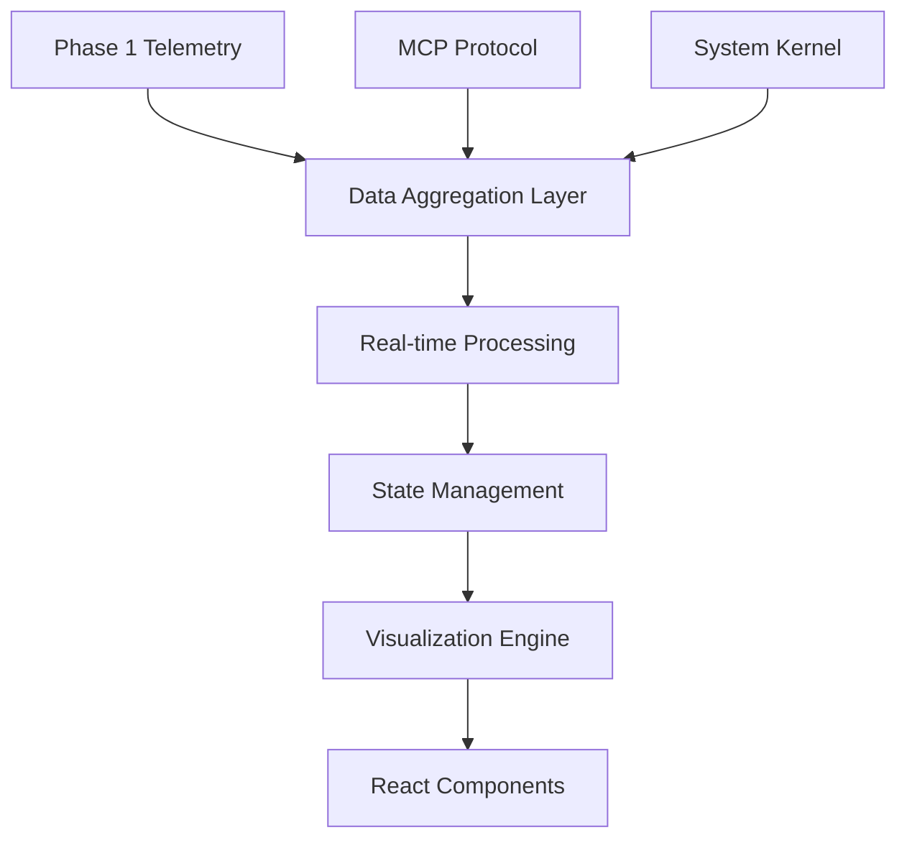

# Phase 5: System Architecture Diagram - Technical Architecture Design

## Executive Summary

This document defines the complete technical architecture for Phase 5 System Architecture Diagram visualization. Phase 5 will create an advanced, interactive system architecture diagram that provides real-time visualization of LLMKG's brain-inspired cognitive architecture, component relationships, and system health monitoring.

## 1. Component Structure Design

### 1.1 Directory Structure

```
visualization/phase5/
├── src/
│   ├── core/
│   │   ├── ArchitectureDiagramEngine.ts     # Main diagram rendering engine
│   │   ├── LayoutEngine.ts                  # Node positioning and layout algorithms
│   │   ├── InteractionEngine.ts             # User interaction handling
│   │   ├── AnimationEngine.ts               # Animation and transition system
│   │   └── StateManager.ts                  # Architecture state management
│   ├── components/
│   │   ├── SystemArchitectureDiagram.tsx    # Main React component
│   │   ├── ArchitectureNode.tsx             # Individual component nodes
│   │   ├── ConnectionEdge.tsx               # Connection visualizations
│   │   ├── LayerGroup.tsx                   # Cognitive layer groupings
│   │   ├── HealthIndicator.tsx              # Component health visualization
│   │   ├── MetricsOverlay.tsx               # Performance metrics overlay
│   │   ├── LegendPanel.tsx                  # Interactive legend
│   │   └── DetailModal.tsx                  # Component detail popover
│   ├── diagrams/
│   │   ├── CognitiveLayerDiagram.ts         # Specialized cognitive layer viz
│   │   ├── MCPProtocolDiagram.ts            # MCP protocol flow diagram
│   │   ├── DataFlowDiagram.ts               # Data flow pathways
│   │   ├── DependencyGraph.ts               # Component dependencies
│   │   └── NetworkTopology.ts               # System network topology
│   ├── monitoring/
│   │   ├── RealTimeMonitor.ts               # Real-time data collection
│   │   ├── HealthMonitor.ts                 # System health monitoring
│   │   ├── PerformanceMonitor.ts            # Performance metrics collection
│   │   ├── AlertSystem.ts                   # Alert and notification system
│   │   └── MetricsCollector.ts              # Centralized metrics gathering
│   ├── integration/
│   │   ├── Phase1Integration.ts             # Phase 1 telemetry integration
│   │   ├── Phase2UIIntegration.ts           # Phase 2 dashboard integration
│   │   ├── Phase3ToolsIntegration.ts        # Phase 3 tools catalog integration
│   │   ├── Phase4VisualizationBridge.ts     # Phase 4 data flow bridge
│   │   └── MCPBridge.ts                     # MCP protocol bridge
│   ├── utils/
│   │   ├── ArchitectureParser.ts            # Architecture data parsing
│   │   ├── LayoutAlgorithms.ts              # Layout calculation utilities
│   │   ├── ColorSchemes.ts                  # Theming and color schemes
│   │   ├── GeometryUtils.ts                 # Geometric calculations
│   │   └── ValidationUtils.ts               # Data validation utilities
│   └── types/
│       ├── ArchitectureTypes.ts             # Core architecture interfaces
│       ├── ComponentTypes.ts                # Component-specific types
│       ├── MetricTypes.ts                   # Metrics and monitoring types
│       └── IntegrationTypes.ts              # Integration-specific types
├── tests/
│   ├── unit/
│   │   ├── core/                            # Core engine unit tests
│   │   ├── components/                      # Component unit tests
│   │   └── utils/                           # Utility unit tests
│   ├── integration/
│   │   ├── phase-integration.test.ts        # Cross-phase integration tests
│   │   ├── real-time-updates.test.ts        # Real-time functionality tests
│   │   └── performance.test.ts              # Performance benchmark tests
│   └── visual/
│       ├── diagram-rendering.test.ts        # Visual regression tests
│       └── interaction.test.ts              # User interaction tests
├── examples/
│   ├── basic-architecture.tsx               # Basic usage example
│   ├── advanced-monitoring.tsx              # Advanced monitoring setup
│   ├── custom-layout.tsx                    # Custom layout configuration
│   └── integration-demo.tsx                 # Full integration demonstration
├── docs/
│   ├── API.md                               # API documentation
│   ├── INTEGRATION_GUIDE.md                 # Integration guidelines
│   ├── CUSTOMIZATION.md                     # Customization options
│   └── PERFORMANCE.md                       # Performance optimization guide
├── package.json
├── tsconfig.json
├── vite.config.ts
└── README.md
```

## 2. Core Components Definition

### 2.1 Architecture Diagram Engine

**Primary Responsibility:** Core rendering and management of the system architecture diagram

```typescript
interface ArchitectureDiagramEngine {
  // Core rendering capabilities
  initialize(container: HTMLElement, config: ArchitectureConfig): Promise<void>;
  render(architectureData: ArchitectureData): void;
  update(changes: ArchitectureChanges): void;
  
  // Layout management
  applyLayout(layoutType: LayoutType): void;
  calculateOptimalLayout(nodes: ArchitectureNode[]): LayoutResult;
  
  // Interaction handling
  enableInteraction(interactionTypes: InteractionType[]): void;
  onNodeSelect(callback: NodeSelectionCallback): void;
  onConnectionHover(callback: ConnectionHoverCallback): void;
  
  // Real-time updates
  startRealTimeUpdates(updateInterval: number): void;
  stopRealTimeUpdates(): void;
  
  // Export capabilities
  exportDiagram(format: ExportFormat): Promise<Blob>;
  exportConfiguration(): ArchitectureConfig;
}
```

### 2.2 Interactive Diagram Components

**Primary Responsibility:** React components for user interface integration

```typescript
interface SystemArchitectureDiagram {
  props: {
    // Data sources
    architectureData: ArchitectureData;
    realTimeEnabled: boolean;
    
    // Display configuration
    layout: LayoutType;
    theme: ThemeConfiguration;
    viewMode: ViewMode;
    
    // Interaction callbacks
    onNodeClick?: (node: ArchitectureNode) => void;
    onConnectionClick?: (connection: ConnectionEdge) => void;
    onLayoutChange?: (layout: LayoutType) => void;
    
    // Integration props
    phase1TelemetryData?: TelemetryData;
    phase2UIState?: UIState;
    phase3ToolsData?: ToolsData;
    phase4DataFlowState?: DataFlowState;
  };
}

// Supporting component interfaces
interface ArchitectureNode {
  id: string;
  type: NodeType;
  label: string;
  layer: CognitiveLayer;
  status: ComponentStatus;
  metrics: ComponentMetrics;
  position: Position;
  connections: Connection[];
}

interface ConnectionEdge {
  id: string;
  source: string;
  target: string;
  type: ConnectionType;
  strength: number;
  active: boolean;
  dataFlow: number;
}
```

### 2.3 Real-Time System Monitoring

**Primary Responsibility:** Live system state collection and health monitoring

```typescript
interface RealTimeMonitor {
  // Data collection
  startMonitoring(config: MonitoringConfig): void;
  stopMonitoring(): void;
  
  // Component monitoring
  monitorComponent(componentId: string): ComponentMonitor;
  monitorConnection(connectionId: string): ConnectionMonitor;
  
  // Health tracking
  trackSystemHealth(): HealthMetrics;
  detectBottlenecks(): Bottleneck[];
  
  // Alert management
  configureAlerts(rules: AlertRule[]): void;
  onAlert(callback: AlertCallback): void;
  
  // Data aggregation
  getMetricsHistory(timeRange: TimeRange): HistoricalMetrics;
  getSystemSnapshot(): SystemSnapshot;
}

interface ComponentMonitor {
  // Performance metrics
  getCPUUsage(): number;
  getMemoryUsage(): number;
  getThroughput(): number;
  getLatency(): number;
  
  // Status tracking
  getStatus(): ComponentStatus;
  getLastActivity(): timestamp;
  getErrorCount(): number;
  
  // Health indicators
  getHealthScore(): number;
  getHealthTrend(): HealthTrend;
}
```

### 2.4 Health and Status Visualization

**Primary Responsibility:** Visual representation of system health and component status

```typescript
interface HealthVisualization {
  // Component health indicators
  renderHealthIndicator(component: ArchitectureNode): HealthIndicatorElement;
  renderHealthMatrix(components: ArchitectureNode[]): HealthMatrixElement;
  
  // Status overlays
  renderStatusOverlay(node: ArchitectureNode): StatusOverlayElement;
  renderMetricsOverlay(metrics: ComponentMetrics): MetricsOverlayElement;
  
  // Trend visualization
  renderHealthTrend(trend: HealthTrend): TrendVisualizationElement;
  renderPerformanceGraph(metrics: PerformanceMetrics[]): GraphElement;
  
  // Alert visualization
  renderAlertIndicator(alert: SystemAlert): AlertIndicatorElement;
  renderSystemStatus(status: SystemStatus): SystemStatusElement;
}

interface HealthIndicatorElement {
  status: 'healthy' | 'warning' | 'critical' | 'offline';
  score: number; // 0-100
  trend: 'improving' | 'stable' | 'degrading';
  lastChecked: timestamp;
}
```

### 2.5 Integration Layer

**Primary Responsibility:** Seamless integration with existing phases and external systems

```typescript
interface IntegrationLayer {
  // Phase integrations
  integratePhase1Telemetry(telemetryBridge: TelemetryBridge): void;
  integratePhase2Dashboard(uiBridge: UIBridge): void;
  integratePhase3Tools(toolsBridge: ToolsBridge): void;
  integratePhase4DataFlow(dataFlowBridge: DataFlowBridge): void;
  
  // Data synchronization
  syncArchitectureState(): Promise<ArchitectureState>;
  syncComponentMetrics(): Promise<ComponentMetrics[]>;
  syncSystemHealth(): Promise<SystemHealth>;
  
  // Event handling
  onPhaseDataUpdate(phase: PhaseIdentifier, callback: DataUpdateCallback): void;
  onSystemStateChange(callback: StateChangeCallback): void;
  
  // External integrations
  integrateMCPProtocol(mcpClient: MCPClient): void;
  integrateWebSocketFeed(wsConnection: WebSocketConnection): void;
}
```

## 3. Technical Requirements

### 3.1 Diagramming Library Recommendations

**Primary Choice: D3.js + React**
- **Rationale:** Maximum flexibility for custom brain-inspired visualizations
- **Strengths:** 
  - Complete control over SVG rendering
  - Advanced animation capabilities
  - Strong mathematical/geometric utilities
  - Excellent performance for complex diagrams
- **Integration:** Custom hooks for React integration
- **Version:** D3 v7.x with TypeScript support

**Secondary Choice: Cytoscape.js**
- **Rationale:** Specialized graph layout algorithms
- **Use Case:** Complex dependency graphs and network topologies
- **Strengths:**
  - Advanced layout algorithms (force-directed, hierarchical, circular)
  - Built-in interaction handling
  - Performance optimizations for large graphs
- **Integration:** React wrapper component

**Tertiary Choice: Three.js (for 3D views)**
- **Rationale:** Advanced 3D architecture visualization
- **Use Case:** Optional 3D system architecture view
- **Strengths:**
  - Hardware-accelerated 3D rendering
  - Advanced visual effects
  - Immersive exploration experience

### 3.2 Real-Time Data Integration Approach

**WebSocket-First Architecture**
```typescript
interface RealTimeDataIntegration {
  // WebSocket connection management
  wsConnection: WebSocketConnection;
  
  // Data stream handling
  onArchitectureUpdate(callback: (data: ArchitectureUpdate) => void): void;
  onMetricsUpdate(callback: (metrics: MetricsUpdate) => void): void;
  onHealthUpdate(callback: (health: HealthUpdate) => void): void;
  
  // Update batching and throttling
  batchUpdates(interval: number): void;
  throttleUpdates(maxRate: number): void;
  
  // Connection resilience
  enableAutoReconnect(config: ReconnectConfig): void;
  handleConnectionLoss(fallbackStrategy: FallbackStrategy): void;
}
```

**Data Flow Pipeline**
1. **Phase 1 Telemetry** → Raw system data collection
2. **WebSocket Stream** → Real-time data transmission
3. **Data Transformation** → Convert to visualization-ready format
4. **State Management** → Update React state with optimistic updates
5. **Rendering Pipeline** → Efficient SVG/Canvas updates
6. **Animation Queue** → Smooth transitions and animations

### 3.3 Interactive Features and Controls

**Primary Interactions**
```typescript
interface InteractiveFeatures {
  // Node interactions
  onNodeHover: (node: ArchitectureNode, event: MouseEvent) => void;
  onNodeClick: (node: ArchitectureNode, event: MouseEvent) => void;
  onNodeDoubleClick: (node: ArchitectureNode, event: MouseEvent) => void;
  onNodeDrag: (node: ArchitectureNode, position: Position) => void;
  
  // Connection interactions
  onConnectionHover: (connection: ConnectionEdge, event: MouseEvent) => void;
  onConnectionClick: (connection: ConnectionEdge, event: MouseEvent) => void;
  
  // Canvas interactions
  onCanvasZoom: (zoomLevel: number, center: Position) => void;
  onCanvasPan: (offset: Position) => void;
  onCanvasReset: () => void;
  
  // Keyboard shortcuts
  keyboardShortcuts: KeyboardShortcut[];
}

interface ControlPanel {
  // Layout controls
  layoutSelector: LayoutSelectorControl;
  layerVisibilityToggles: LayerVisibilityControl[];
  
  // Filtering controls
  componentTypeFilter: ComponentTypeFilter;
  statusFilter: StatusFilter;
  performanceFilter: PerformanceFilter;
  
  // View controls
  zoomControls: ZoomControls;
  viewModeSelector: ViewModeSelector;
  themeSelector: ThemeSelector;
  
  // Export controls
  exportButton: ExportControl;
  snapshotButton: SnapshotControl;
}
```

**Advanced Interactions**
- **Multi-select:** Shift+click for multiple node selection
- **Path tracing:** Click and drag to trace data flow paths
- **Time navigation:** Scrub through historical system states
- **Comparison mode:** Side-by-side architecture comparison
- **Focus mode:** Hide non-related components for clarity

### 3.4 Performance Monitoring Integration

**Metrics Collection Strategy**
```typescript
interface PerformanceMonitoringIntegration {
  // Metrics sources
  collectFromPhase1Telemetry(): TelemetryMetrics;
  collectFromMCPProtocol(): MCPMetrics;
  collectFromSystemKernels(): KernelMetrics;
  
  // Performance indicators
  getResponseTimeMetrics(): ResponseTimeMetrics;
  getThroughputMetrics(): ThroughputMetrics;
  getResourceUtilizationMetrics(): ResourceMetrics;
  getErrorRateMetrics(): ErrorMetrics;
  
  // Real-time processing
  processMetricsStream(stream: MetricsStream): ProcessedMetrics;
  aggregateMetrics(timeWindow: TimeWindow): AggregatedMetrics;
  
  // Alerting integration
  configurePerformanceAlerts(): AlertConfiguration;
  onPerformanceAlert(callback: AlertCallback): void;
}

// Performance visualization elements
interface PerformanceVisualization {
  // Component-level indicators
  cpuUsageIndicator: PerformanceIndicator;
  memoryUsageIndicator: PerformanceIndicator;
  throughputIndicator: PerformanceIndicator;
  latencyIndicator: PerformanceIndicator;
  
  // System-level dashboards
  overallHealthDashboard: HealthDashboard;
  bottleneckIdentification: BottleneckVisualization;
  performanceTrends: TrendAnalysis;
  
  // Interactive elements
  performanceHeatmap: Heatmap;
  resourceUtilizationGraph: UtilizationGraph;
  alertsPanel: AlertsPanel;
}
```

### 3.5 Responsive Design Requirements

**Multi-Device Support**
```typescript
interface ResponsiveDesignSystem {
  // Breakpoint system
  breakpoints: {
    mobile: '768px';
    tablet: '1024px';
    desktop: '1440px';
    large: '1920px';
  };
  
  // Layout adaptations
  mobileLayout: MobileLayoutConfig;
  tabletLayout: TabletLayoutConfig;
  desktopLayout: DesktopLayoutConfig;
  
  // Interaction adaptations
  touchOptimizations: TouchOptimizationConfig;
  keyboardNavigation: KeyboardNavigationConfig;
  accessibilityFeatures: AccessibilityConfig;
}

interface LayoutAdaptations {
  // Mobile adaptations (768px and below)
  mobile: {
    // Simplified node representation
    nodeSize: 'small';
    // Collapse detailed metrics
    metricsDisplay: 'minimal';
    // Touch-friendly controls
    controlSize: 'large';
    // Vertical layout preference
    layoutOrientation: 'vertical';
  };
  
  // Tablet adaptations (768px - 1024px)
  tablet: {
    // Medium node representation
    nodeSize: 'medium';
    // Essential metrics visible
    metricsDisplay: 'essential';
    // Mixed interaction support
    controlSize: 'medium';
    // Flexible layout
    layoutOrientation: 'flexible';
  };
  
  // Desktop adaptations (1024px+)
  desktop: {
    // Full node representation
    nodeSize: 'full';
    // Complete metrics display
    metricsDisplay: 'complete';
    // Precise controls
    controlSize: 'precise';
    // Horizontal layout preference
    layoutOrientation: 'horizontal';
  };
}
```

## 4. Integration Strategy

### 4.1 Phase Integration Architecture

**Phase 1 (MCP Integration & Telemetry) Extension**
```typescript
interface Phase1Integration {
  // Telemetry data consumption
  consumeArchitectureMetrics(): ArchitectureMetrics;
  consumeComponentHealth(): ComponentHealth[];
  consumeConnectionStatus(): ConnectionStatus[];
  
  // Real-time data streams
  subscribeToArchitectureUpdates(): Observable<ArchitectureUpdate>;
  subscribeToHealthChanges(): Observable<HealthChange>;
  
  // MCP protocol insights
  getMCPProtocolState(): MCPProtocolState;
  getActiveConnections(): MCPConnection[];
}
```

**Phase 2 (Dashboard) UI Integration**
```typescript
interface Phase2Integration {
  // UI framework integration
  integrateWithDashboardLayout(): DashboardIntegration;
  registerArchitecturePage(): PageRegistration;
  
  // Shared UI components
  reuseNavigationSystem(): NavigationSystem;
  reuseThemeSystem(): ThemeSystem;
  reuseNotificationSystem(): NotificationSystem;
  
  // State management
  integrateWithGlobalState(): StateIntegration;
  shareUserPreferences(): PreferencesSharing;
}
```

**Phase 3 (Tools Catalog) Integration**
```typescript
interface Phase3Integration {
  // Tool status integration
  getToolHealthStatus(): ToolHealthStatus[];
  getToolUsageMetrics(): ToolUsageMetrics[];
  
  // Visual connections
  showToolArchitectureConnections(): ToolConnectionVisualization;
  highlightToolDependencies(): DependencyHighlighting;
  
  // Interactive features
  launchToolFromArchitecture(): ToolLaunchIntegration;
  showToolDocumentationFromNode(): DocumentationIntegration;
}
```

**Phase 4 (Data Flow) Enhancement**
```typescript
interface Phase4Integration {
  // Visualization engine sharing
  extendDataFlowEngine(): DataFlowEngineExtension;
  shareRenderingPipeline(): RenderingPipelineSharing;
  
  // Animation system integration
  coordinated Animations(): AnimationCoordination;
  sharedParticleSystem(): ParticleSystemSharing;
  
  // Interactive cross-navigation
  navigateToDataFlow(): NavigationIntegration;
  highlightDataFlowPaths(): PathHighlighting;
}
```

### 4.2 Data Sources Integration

**Primary Data Sources**
1. **Phase 1 Telemetry Stream:** Real-time component metrics, health data
2. **MCP Protocol State:** Connection status, protocol-level metrics
3. **System Kernel Data:** Low-level performance metrics
4. **Configuration Files:** Static architecture definitions
5. **Runtime Discovery:** Dynamic component detection

**Data Flow Architecture**


### 4.3 UI Integration with Phase 2 Dashboard

**Navigation Integration**
```typescript
// Add architecture page to existing routing
const architectureRoutes = {
  path: '/architecture',
  component: SystemArchitecturePage,
  children: [
    { path: 'overview', component: ArchitectureOverview },
    { path: 'diagram', component: InteractiveDiagram },
    { path: 'monitoring', component: RealTimeMonitoring },
    { path: 'health', component: SystemHealth }
  ]
};

// Integrate with existing sidebar navigation
const navigationExtension = {
  section: 'System',
  items: [
    {
      title: 'Architecture',
      icon: CubeTransparentIcon,
      href: '/architecture/diagram',
      badge: 'Live'
    }
  ]
};
```

**Shared Component Library Usage**
- Reuse existing **MetricCard** for performance metrics display
- Extend **StatusIndicator** for component health visualization
- Utilize **LoadingSpinner** for async operations
- Leverage **Badge** system for component labels
- Integrate with **NotificationCenter** for system alerts

### 4.4 Enhanced Capabilities from Phase 3 Tools

**Tool Integration Visualization**
```typescript
interface ToolIntegrationVisualization {
  // Tool node representation
  renderToolNode(tool: MCPTool): ArchitectureNode;
  
  // Tool dependency visualization
  showToolDependencies(tool: MCPTool): DependencyVisualization;
  
  // Tool status integration
  displayToolHealth(tool: MCPTool): HealthVisualization;
  
  // Interactive tool access
  launchToolTesterFromDiagram(tool: MCPTool): void;
  showToolDocumentation(tool: MCPTool): void;
  
  // Usage analytics integration
  showToolUsageMetrics(tool: MCPTool): UsageVisualization;
  highlightPopularTools(): HighlightVisualization;
}
```

## 5. Implementation Roadmap and Priorities

### 5.1 Phase 5 Implementation Schedule

**Week 1: Foundation (Days 1-5)**
- [ ] Set up Phase 5 project structure and build configuration
- [ ] Implement core **ArchitectureDiagramEngine** with basic D3.js integration
- [ ] Create fundamental **SystemArchitectureDiagram** React component
- [ ] Establish **StateManager** for architecture data management
- [ ] Implement basic **RealTimeMonitor** for data collection

**Week 2: Core Visualization (Days 6-10)**
- [ ] Develop **LayoutEngine** with multiple layout algorithms
- [ ] Implement **ArchitectureNode** and **ConnectionEdge** components
- [ ] Create **LayerGroup** visualization for cognitive layers
- [ ] Build **InteractionEngine** for user interactions
- [ ] Implement **AnimationEngine** for smooth transitions

**Week 3: Monitoring Integration (Days 11-15)**
- [ ] Integrate **HealthMonitor** with real-time health tracking
- [ ] Implement **PerformanceMonitor** with metrics collection
- [ ] Create **AlertSystem** for system notifications
- [ ] Build **MetricsOverlay** for performance data display
- [ ] Implement **HealthIndicator** components

**Week 4: Cross-Phase Integration (Days 16-20)**
- [ ] Integrate with Phase 1 telemetry data streams
- [ ] Connect with Phase 2 dashboard UI framework
- [ ] Integrate Phase 3 tools catalog data
- [ ] Establish Phase 4 data flow visualization bridge
- [ ] Implement **MCPBridge** for protocol integration

**Week 5: Advanced Features (Days 21-25)**
- [ ] Implement specialized diagram types (cognitive layers, MCP protocol)
- [ ] Add advanced interactive features (multi-select, path tracing)
- [ ] Create export and snapshot functionality
- [ ] Implement responsive design adaptations
- [ ] Add accessibility features and keyboard navigation

**Week 6: Polish and Testing (Days 26-30)**
- [ ] Comprehensive testing suite (unit, integration, visual)
- [ ] Performance optimization and benchmarking
- [ ] Documentation and usage examples
- [ ] Final integration testing with all phases
- [ ] Deployment preparation and production readiness

### 5.2 Implementation Priorities

**Priority 1: Core Architecture Visualization (Week 1-2)**
- Essential for basic Phase 5 functionality
- Foundation for all other features
- Required for integration with existing phases

**Priority 2: Real-Time Monitoring (Week 3)**
- Critical for system health visibility
- Required for production system monitoring
- Foundation for alerting and notification systems

**Priority 3: Cross-Phase Integration (Week 4)**
- Essential for cohesive user experience
- Required for data consistency across phases
- Critical for leveraging existing infrastructure

**Priority 4: Advanced Interactivity (Week 5)**
- Important for user engagement and productivity
- Required for complex system analysis
- Nice-to-have for basic functionality

**Priority 5: Polish and Optimization (Week 6)**
- Important for production readiness
- Required for performance at scale
- Essential for maintainability

### 5.3 Risk Mitigation Strategies

**Technical Risks**
1. **Performance with Large Architecture Diagrams**
   - Mitigation: Implement virtualization and level-of-detail rendering
   - Fallback: Simplified visualization mode for large systems

2. **Real-Time Data Volume**
   - Mitigation: Implement data sampling and aggregation
   - Fallback: Periodic refresh instead of real-time updates

3. **Cross-Phase Integration Complexity**
   - Mitigation: Well-defined integration interfaces and comprehensive testing
   - Fallback: Phase 5 can operate independently with reduced features

**Implementation Risks**
1. **Timeline Pressure**
   - Mitigation: Prioritized feature development with clear MVP definition
   - Fallback: Defer advanced features to post-MVP releases

2. **Resource Constraints**
   - Mitigation: Leverage existing Phase 2 UI components and Phase 4 visualization engine
   - Fallback: Simplified feature set focusing on core architecture visualization

## 6. Success Criteria and Validation Approach

### 6.1 Functional Success Criteria

**Core Functionality**
- [ ] **Architecture Visualization Accuracy**: Diagram accurately represents LLMKG system architecture with 100% component coverage
- [ ] **Real-Time Updates**: System state changes reflected in visualization within 500ms
- [ ] **Interactive Exploration**: Users can drill down into component details with < 3 clicks
- [ ] **Cross-Phase Integration**: Seamless navigation between Phase 5 and other phases
- [ ] **Responsive Design**: Functional on mobile, tablet, and desktop devices

**Advanced Functionality**
- [ ] **Performance Monitoring**: Real-time display of component performance metrics
- [ ] **Health Visualization**: Clear indication of system health and component status
- [ ] **Alert Integration**: System alerts displayed contextually in diagram
- [ ] **Export Capabilities**: Architecture diagrams exportable in multiple formats
- [ ] **Historical Analysis**: Ability to view architecture state changes over time

### 6.2 Performance Success Criteria

**Rendering Performance**
- [ ] **Initial Load**: Architecture diagram loads within 2 seconds
- [ ] **Update Performance**: Real-time updates processed within 100ms
- [ ] **Interaction Responsiveness**: UI interactions respond within 50ms
- [ ] **Memory Efficiency**: Memory usage < 200MB for typical architecture
- [ ] **Scalability**: Handles architectures with 100+ components without degradation

**Data Processing Performance**
- [ ] **Data Ingestion**: Process incoming telemetry data within 50ms
- [ ] **State Synchronization**: Architecture state sync across phases within 200ms
- [ ] **Query Performance**: Component detail queries respond within 100ms
- [ ] **Export Performance**: Diagram export completes within 5 seconds
- [ ] **Concurrent Users**: Supports 10+ concurrent users without performance impact

### 6.3 User Experience Success Criteria

**Usability Metrics**
- [ ] **Learning Curve**: New users can navigate basic features within 5 minutes
- [ ] **Task Completion**: Users can complete common tasks (view health, export diagram) within 30 seconds
- [ ] **Error Rate**: User error rate < 2% for common operations
- [ ] **User Satisfaction**: User satisfaction score > 4.5/5 in usability testing
- [ ] **Accessibility**: WCAG 2.1 AA compliance for accessibility

**Integration Experience**
- [ ] **Cross-Phase Navigation**: Seamless transitions between phases
- [ ] **Data Consistency**: Consistent data representation across all phases
- [ ] **UI Consistency**: Consistent look and feel with existing dashboard
- [ ] **Feature Discovery**: Users can discover advanced features intuitively
- [ ] **Help and Documentation**: Comprehensive help system integrated into UI

### 6.4 Validation Approach

**Development Testing**
```typescript
// Unit Testing Strategy
interface TestingSuite {
  // Core engine tests
  coreEngineTests: {
    renderingAccuracy: RenderingAccuracyTest[];
    performanceTargets: PerformanceBenchmark[];
    interactionHandling: InteractionTest[];
    stateManagement: StateManagementTest[];
  };
  
  // Component tests
  componentTests: {
    reactComponents: ReactComponentTest[];
    visualElements: VisualElementTest[];
    integrationPoints: IntegrationTest[];
  };
  
  // Integration tests
  integrationTests: {
    crossPhaseIntegration: CrossPhaseTest[];
    dataFlow: DataFlowTest[];
    realTimeUpdates: RealTimeTest[];
  };
}
```

**User Acceptance Testing**
1. **Alpha Testing**: Internal team testing with LLMKG development data
2. **Beta Testing**: External testers with real-world LLMKG deployments
3. **Performance Testing**: Load testing with varying system sizes and user counts
4. **Accessibility Testing**: Screen reader and keyboard navigation testing
5. **Cross-Browser Testing**: Chrome, Firefox, Safari, Edge compatibility

**Production Validation**
1. **Monitoring Setup**: Application performance monitoring and error tracking
2. **Usage Analytics**: User behavior tracking and feature usage analysis
3. **Performance Benchmarking**: Continuous performance monitoring in production
4. **User Feedback Collection**: Integrated feedback system for continuous improvement
5. **A/B Testing**: Feature variations testing for optimal user experience

**Success Metrics Dashboard**
```typescript
interface SuccessMetricsDashboard {
  // Performance metrics
  performanceMetrics: {
    loadTime: TimeMetric;
    updateLatency: TimeMetric;
    interactionResponsiveness: TimeMetric;
    memoryUsage: MemoryMetric;
    errorRate: ErrorRateMetric;
  };
  
  // User experience metrics
  userExperienceMetrics: {
    taskCompletionRate: PercentageMetric;
    userSatisfactionScore: ScoreMetric;
    featureAdoptionRate: AdoptionMetric;
    helpSystemUsage: UsageMetric;
  };
  
  // Integration metrics
  integrationMetrics: {
    crossPhaseNavigation: NavigationMetric;
    dataConsistency: ConsistencyMetric;
    apiResponseTime: TimeMetric;
  };
}
```

## 7. Conclusion

This technical architecture design provides a comprehensive blueprint for implementing Phase 5 System Architecture Diagram visualization. The design emphasizes:

1. **Modular Architecture**: Clean separation of concerns with well-defined interfaces
2. **Integration Focus**: Seamless integration with existing phases and systems
3. **Performance Optimization**: Designed for real-time updates and large-scale architectures
4. **User Experience**: Intuitive, responsive, and accessible interface design
5. **Extensibility**: Flexible architecture supporting future enhancements

The implementation roadmap provides a realistic timeline with clear priorities and risk mitigation strategies. Success criteria are measurable and aligned with both technical requirements and user needs.

This design will serve as the foundation for parallel implementation by specialized agents, ensuring consistent and coordinated development across all Phase 5 components.