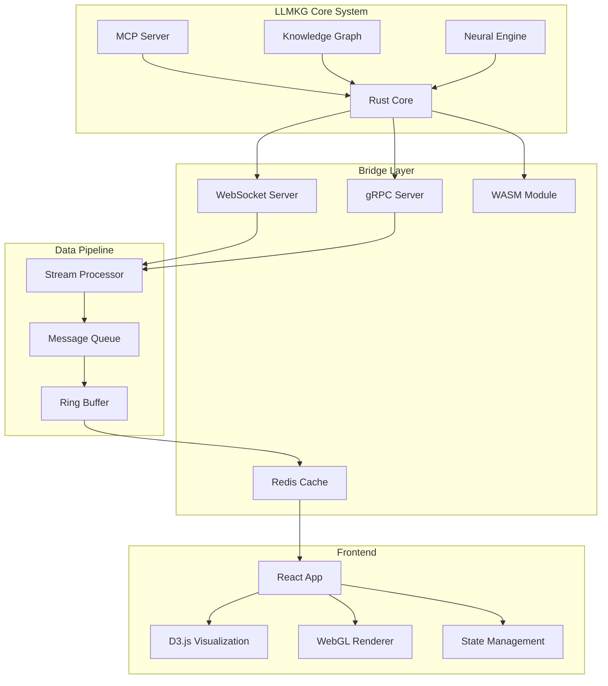
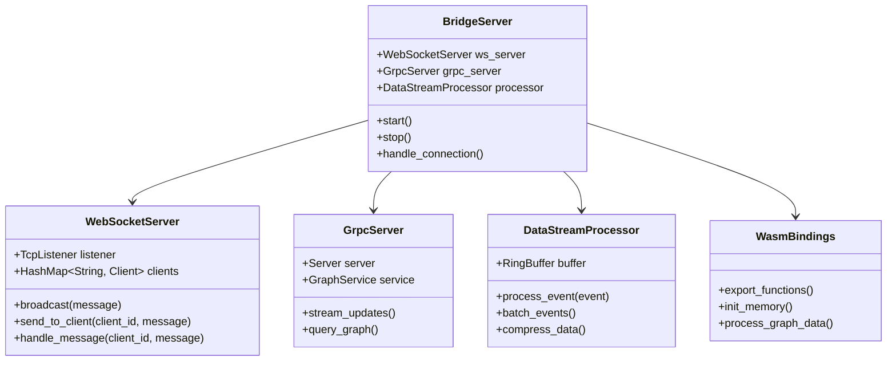
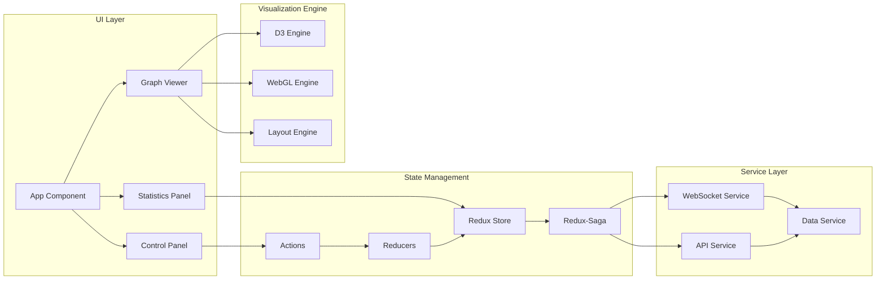
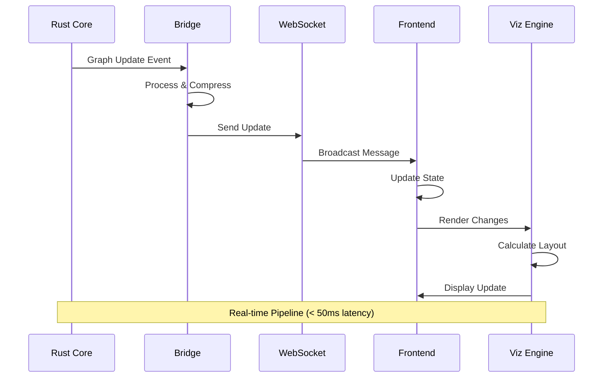

# Phase 0: Foundation & Architecture Documentation

## Table of Contents
1. [Overview](#overview)
2. [Objectives and Goals](#objectives-and-goals)
3. [Technical Requirements](#technical-requirements)
4. [Architecture Design](#architecture-design)
5. [Implementation Steps](#implementation-steps)
6. [Testing Procedures](#testing-procedures)
7. [Deliverables Checklist](#deliverables-checklist)
8. [Success Criteria](#success-criteria)

## Overview

Phase 0 establishes the foundational architecture for the LLMKG visualization dashboard. This phase focuses on creating a robust, scalable infrastructure that bridges the Rust-based backend with a modern JavaScript frontend, enabling real-time visualization of the knowledge graph system.

## Objectives and Goals

### Primary Objectives
1. **Environment Setup**: Establish a comprehensive development environment for the dashboard
2. **Architecture Design**: Create a modular, extensible architecture that interfaces seamlessly with the MCP-based LLMKG system
3. **Bridge Implementation**: Build a high-performance bridge between Rust backend and JavaScript frontend
4. **Real-time Pipeline**: Establish infrastructure for real-time data streaming and visualization

### Secondary Goals
- Ensure cross-platform compatibility (Windows, Linux, macOS)
- Implement security best practices from the ground up
- Design for horizontal scalability
- Create comprehensive developer documentation
- Establish CI/CD pipeline foundations

## Technical Requirements

### Development Environment Setup

#### Prerequisites
```bash
# System Requirements
- Node.js >= 18.0.0
- Rust >= 1.70.0
- Python >= 3.9 (for build tools)
- Git >= 2.30.0

# Package Managers
- npm >= 9.0.0 or yarn >= 1.22.0
- cargo (comes with Rust)
```

#### Required Tools Installation

##### Windows (PowerShell as Administrator)
```powershell
# Install Chocolatey if not present
Set-ExecutionPolicy Bypass -Scope Process -Force
[System.Net.ServicePointManager]::SecurityProtocol = [System.Net.ServicePointManager]::SecurityProtocol -bor 3072
iex ((New-Object System.Net.WebClient).DownloadString('https://community.chocolatey.org/install.ps1'))

# Install development tools
choco install nodejs rust python git visualstudio2022-workload-vctools -y

# Install wasm-pack for WebAssembly compilation
cargo install wasm-pack

# Install additional Rust tools
rustup target add wasm32-unknown-unknown
rustup component add rustfmt clippy
```

##### Linux/macOS
```bash
# Install Node.js via nvm
curl -o- https://raw.githubusercontent.com/nvm-sh/nvm/v0.39.0/install.sh | bash
source ~/.bashrc
nvm install 18
nvm use 18

# Install Rust
curl --proto '=https' --tlsv1.2 -sSf https://sh.rustup.rs | sh
source $HOME/.cargo/env

# Install wasm-pack
cargo install wasm-pack

# Install additional tools
rustup target add wasm32-unknown-unknown
rustup component add rustfmt clippy
```

### Project Structure
```
visualization/
├── Phase_00_Foundation_Architecture.md
├── backend/
│   ├── Cargo.toml
│   ├── src/
│   │   ├── lib.rs
│   │   ├── bridge/
│   │   │   ├── mod.rs
│   │   │   ├── websocket.rs
│   │   │   ├── grpc.rs
│   │   │   └── wasm_bindings.rs
│   │   ├── data/
│   │   │   ├── mod.rs
│   │   │   ├── streaming.rs
│   │   │   └── cache.rs
│   │   └── api/
│   │       ├── mod.rs
│   │       └── endpoints.rs
│   └── tests/
├── frontend/
│   ├── package.json
│   ├── webpack.config.js
│   ├── tsconfig.json
│   ├── src/
│   │   ├── index.ts
│   │   ├── components/
│   │   ├── services/
│   │   ├── stores/
│   │   └── utils/
│   └── public/
├── shared/
│   ├── protocols/
│   │   ├── websocket.proto
│   │   └── types.proto
│   └── schemas/
│       └── graph.schema.json
├── docker/
│   ├── Dockerfile.backend
│   ├── Dockerfile.frontend
│   └── docker-compose.yml
└── scripts/
    ├── setup.sh
    ├── build.sh
    └── deploy.sh
```

## Architecture Design

### High-Level Architecture



### Component Architecture

#### Backend Bridge Component


#### Frontend Architecture


### Data Flow Architecture



## Implementation Steps

### Step 1: Backend Bridge Setup

#### 1.1 Create Cargo Project
```bash
cd visualization/backend
cargo init --lib
```

#### 1.2 Configure Cargo.toml
```toml
[package]
name = "llmkg-viz-backend"
version = "0.1.0"
edition = "2021"

[dependencies]
# Core dependencies
tokio = { version = "1.35", features = ["full"] }
tokio-tungstenite = "0.21"
tonic = "0.10"
prost = "0.12"
serde = { version = "1.0", features = ["derive"] }
serde_json = "1.0"

# WASM support
wasm-bindgen = "0.2"
wasm-bindgen-futures = "0.4"
web-sys = "0.3"

# Performance
dashmap = "5.5"
crossbeam-channel = "0.5"
parking_lot = "0.12"

# Logging
tracing = "0.1"
tracing-subscriber = "0.3"

# Error handling
anyhow = "1.0"
thiserror = "1.0"

[lib]
crate-type = ["cdylib", "rlib"]

[dependencies.llmkg-core]
path = "../../../src"

[build-dependencies]
tonic-build = "0.10"

[[bin]]
name = "viz-server"
path = "src/bin/server.rs"
```

#### 1.3 Implement WebSocket Bridge
```rust
// src/bridge/websocket.rs
use tokio::net::{TcpListener, TcpStream};
use tokio_tungstenite::{accept_async, tungstenite::Message};
use futures_util::{SinkExt, StreamExt};
use dashmap::DashMap;
use std::sync::Arc;
use serde::{Serialize, Deserialize};
use tracing::{info, error, debug};

#[derive(Debug, Clone, Serialize, Deserialize)]
#[serde(tag = "type", content = "data")]
pub enum BridgeMessage {
    GraphUpdate {
        nodes: Vec<NodeUpdate>,
        edges: Vec<EdgeUpdate>,
        timestamp: u64,
    },
    QueryRequest {
        id: String,
        query: String,
    },
    QueryResponse {
        id: String,
        result: serde_json::Value,
    },
    Subscription {
        topics: Vec<String>,
    },
    Error {
        message: String,
        code: u32,
    },
}

#[derive(Debug, Clone, Serialize, Deserialize)]
pub struct NodeUpdate {
    pub id: String,
    pub label: String,
    pub properties: serde_json::Value,
    pub position: Option<(f32, f32, f32)>,
}

#[derive(Debug, Clone, Serialize, Deserialize)]
pub struct EdgeUpdate {
    pub source: String,
    pub target: String,
    pub label: String,
    pub weight: f32,
}

pub struct WebSocketBridge {
    clients: Arc<DashMap<String, tokio::sync::mpsc::Sender<Message>>>,
    graph_updates: Arc<tokio::sync::RwLock<Vec<BridgeMessage>>>,
}

impl WebSocketBridge {
    pub fn new() -> Self {
        Self {
            clients: Arc::new(DashMap::new()),
            graph_updates: Arc::new(tokio::sync::RwLock::new(Vec::new())),
        }
    }

    pub async fn start(&self, addr: &str) -> anyhow::Result<()> {
        let listener = TcpListener::bind(addr).await?;
        info!("WebSocket server listening on {}", addr);

        while let Ok((stream, addr)) = listener.accept().await {
            let clients = Arc::clone(&self.clients);
            let graph_updates = Arc::clone(&self.graph_updates);
            
            tokio::spawn(async move {
                if let Err(e) = handle_connection(stream, addr, clients, graph_updates).await {
                    error!("Error handling connection: {}", e);
                }
            });
        }

        Ok(())
    }

    pub async fn broadcast(&self, message: BridgeMessage) -> anyhow::Result<()> {
        let msg_text = serde_json::to_string(&message)?;
        let ws_message = Message::text(msg_text);

        // Store update for replay
        self.graph_updates.write().await.push(message.clone());

        // Broadcast to all connected clients
        for client in self.clients.iter() {
            if let Err(e) = client.value().send(ws_message.clone()).await {
                error!("Failed to send to client {}: {}", client.key(), e);
                self.clients.remove(client.key());
            }
        }

        Ok(())
    }
}

async fn handle_connection(
    stream: TcpStream,
    addr: std::net::SocketAddr,
    clients: Arc<DashMap<String, tokio::sync::mpsc::Sender<Message>>>,
    graph_updates: Arc<tokio::sync::RwLock<Vec<BridgeMessage>>>,
) -> anyhow::Result<()> {
    let ws_stream = accept_async(stream).await?;
    let (mut ws_sender, mut ws_receiver) = ws_stream.split();
    let (tx, mut rx) = tokio::sync::mpsc::channel::<Message>(100);
    
    let client_id = format!("{}", addr);
    clients.insert(client_id.clone(), tx);
    
    info!("New WebSocket connection from {}", addr);

    // Send replay of recent updates
    let updates = graph_updates.read().await;
    for update in updates.iter().take(100) {
        let msg_text = serde_json::to_string(update)?;
        ws_sender.send(Message::text(msg_text)).await?;
    }

    // Handle incoming messages
    let incoming_task = tokio::spawn(async move {
        while let Some(Ok(msg)) = ws_receiver.next().await {
            match msg {
                Message::Text(text) => {
                    debug!("Received message: {}", text);
                    // Handle query requests, subscriptions, etc.
                }
                Message::Close(_) => break,
                _ => {}
            }
        }
    });

    // Handle outgoing messages
    let outgoing_task = tokio::spawn(async move {
        while let Some(msg) = rx.recv().await {
            if ws_sender.send(msg).await.is_err() {
                break;
            }
        }
    });

    tokio::select! {
        _ = incoming_task => {},
        _ = outgoing_task => {},
    }

    clients.remove(&client_id);
    info!("WebSocket connection closed: {}", addr);

    Ok(())
}
```

#### 1.4 Implement Data Stream Processor
```rust
// src/data/streaming.rs
use crossbeam_channel::{bounded, Sender, Receiver};
use parking_lot::RwLock;
use std::sync::Arc;
use std::collections::VecDeque;
use serde::{Serialize, Deserialize};

#[derive(Debug, Clone)]
pub struct StreamEvent {
    pub timestamp: u64,
    pub event_type: EventType,
    pub data: Vec<u8>,
}

#[derive(Debug, Clone, Serialize, Deserialize)]
pub enum EventType {
    NodeAdded,
    NodeUpdated,
    NodeRemoved,
    EdgeAdded,
    EdgeUpdated,
    EdgeRemoved,
    PropertyChanged,
    MetricUpdate,
}

pub struct DataStreamProcessor {
    buffer: Arc<RwLock<VecDeque<StreamEvent>>>,
    sender: Sender<Vec<StreamEvent>>,
    receiver: Receiver<Vec<StreamEvent>>,
    batch_size: usize,
    compression_enabled: bool,
}

impl DataStreamProcessor {
    pub fn new(buffer_size: usize, batch_size: usize) -> Self {
        let (sender, receiver) = bounded(buffer_size);
        
        Self {
            buffer: Arc::new(RwLock::new(VecDeque::with_capacity(buffer_size))),
            sender,
            receiver,
            batch_size,
            compression_enabled: true,
        }
    }

    pub fn process_event(&self, event: StreamEvent) {
        let mut buffer = self.buffer.write();
        buffer.push_back(event);

        if buffer.len() >= self.batch_size {
            let batch: Vec<_> = buffer.drain(..).collect();
            let _ = self.sender.try_send(batch);
        }
    }

    pub fn get_batch(&self) -> Option<Vec<StreamEvent>> {
        self.receiver.try_recv().ok()
    }

    pub fn compress_batch(&self, batch: Vec<StreamEvent>) -> Vec<u8> {
        if !self.compression_enabled {
            return bincode::serialize(&batch).unwrap_or_default();
        }

        // Use zstd compression for better performance
        use zstd::stream::encode_all;
        let serialized = bincode::serialize(&batch).unwrap_or_default();
        encode_all(&serialized[..], 3).unwrap_or(serialized)
    }

    pub fn decompress_batch(&self, compressed: &[u8]) -> Result<Vec<StreamEvent>, Box<dyn std::error::Error>> {
        if !self.compression_enabled {
            return Ok(bincode::deserialize(compressed)?);
        }

        use zstd::stream::decode_all;
        let decompressed = decode_all(compressed)?;
        Ok(bincode::deserialize(&decompressed)?)
    }
}

// Ring buffer for real-time data
pub struct RingBuffer<T> {
    data: Vec<Option<T>>,
    head: usize,
    tail: usize,
    size: usize,
    capacity: usize,
}

impl<T: Clone> RingBuffer<T> {
    pub fn new(capacity: usize) -> Self {
        Self {
            data: vec![None; capacity],
            head: 0,
            tail: 0,
            size: 0,
            capacity,
        }
    }

    pub fn push(&mut self, item: T) {
        self.data[self.tail] = Some(item);
        self.tail = (self.tail + 1) % self.capacity;
        
        if self.size < self.capacity {
            self.size += 1;
        } else {
            self.head = (self.head + 1) % self.capacity;
        }
    }

    pub fn iter(&self) -> RingBufferIter<T> {
        RingBufferIter {
            buffer: self,
            current: self.head,
            remaining: self.size,
        }
    }

    pub fn latest(&self, count: usize) -> Vec<T> {
        self.iter().take(count.min(self.size)).collect()
    }
}

pub struct RingBufferIter<'a, T> {
    buffer: &'a RingBuffer<T>,
    current: usize,
    remaining: usize,
}

impl<'a, T: Clone> Iterator for RingBufferIter<'a, T> {
    type Item = T;

    fn next(&mut self) -> Option<Self::Item> {
        if self.remaining == 0 {
            return None;
        }

        let item = self.buffer.data[self.current].clone();
        self.current = (self.current + 1) % self.buffer.capacity;
        self.remaining -= 1;
        item
    }
}
```

### Step 2: Frontend Setup

#### 2.1 Initialize Frontend Project
```bash
cd visualization/frontend
npm init -y
```

#### 2.2 Configure package.json
```json
{
  "name": "llmkg-viz-frontend",
  "version": "0.1.0",
  "description": "LLMKG Visualization Dashboard",
  "main": "dist/index.js",
  "scripts": {
    "start": "webpack serve --mode development",
    "build": "webpack --mode production",
    "test": "jest",
    "lint": "eslint src --ext .ts,.tsx",
    "type-check": "tsc --noEmit"
  },
  "dependencies": {
    "react": "^18.2.0",
    "react-dom": "^18.2.0",
    "redux": "^4.2.1",
    "react-redux": "^8.1.3",
    "redux-saga": "^1.2.3",
    "d3": "^7.8.5",
    "three": "^0.159.0",
    "@react-three/fiber": "^8.15.0",
    "@react-three/drei": "^9.92.0",
    "socket.io-client": "^4.6.0",
    "axios": "^1.6.0",
    "styled-components": "^6.1.0"
  },
  "devDependencies": {
    "@types/react": "^18.2.0",
    "@types/react-dom": "^18.2.0",
    "@types/d3": "^7.4.0",
    "@types/three": "^0.159.0",
    "@types/styled-components": "^5.1.0",
    "typescript": "^5.3.0",
    "webpack": "^5.89.0",
    "webpack-cli": "^5.1.0",
    "webpack-dev-server": "^4.15.0",
    "ts-loader": "^9.5.0",
    "html-webpack-plugin": "^5.6.0",
    "css-loader": "^6.8.0",
    "style-loader": "^3.3.0",
    "@typescript-eslint/eslint-plugin": "^6.15.0",
    "@typescript-eslint/parser": "^6.15.0",
    "eslint": "^8.56.0",
    "jest": "^29.7.0",
    "@types/jest": "^29.5.0",
    "ts-jest": "^29.1.0"
  }
}
```

#### 2.3 TypeScript Configuration
```json
// tsconfig.json
{
  "compilerOptions": {
    "target": "ES2020",
    "module": "esnext",
    "lib": ["ES2020", "DOM", "DOM.Iterable"],
    "jsx": "react-jsx",
    "moduleResolution": "node",
    "strict": true,
    "esModuleInterop": true,
    "skipLibCheck": true,
    "forceConsistentCasingInFileNames": true,
    "resolveJsonModule": true,
    "isolatedModules": true,
    "noEmit": true,
    "allowSyntheticDefaultImports": true,
    "baseUrl": "./src",
    "paths": {
      "@/*": ["*"],
      "@components/*": ["components/*"],
      "@services/*": ["services/*"],
      "@stores/*": ["stores/*"],
      "@utils/*": ["utils/*"]
    }
  },
  "include": ["src/**/*"],
  "exclude": ["node_modules", "dist"]
}
```

#### 2.4 Webpack Configuration
```javascript
// webpack.config.js
const path = require('path');
const HtmlWebpackPlugin = require('html-webpack-plugin');

module.exports = (env, argv) => {
  const isProduction = argv.mode === 'production';

  return {
    entry: './src/index.tsx',
    output: {
      path: path.resolve(__dirname, 'dist'),
      filename: isProduction ? '[name].[contenthash].js' : '[name].js',
      clean: true,
    },
    resolve: {
      extensions: ['.tsx', '.ts', '.js'],
      alias: {
        '@': path.resolve(__dirname, 'src'),
        '@components': path.resolve(__dirname, 'src/components'),
        '@services': path.resolve(__dirname, 'src/services'),
        '@stores': path.resolve(__dirname, 'src/stores'),
        '@utils': path.resolve(__dirname, 'src/utils'),
      },
    },
    module: {
      rules: [
        {
          test: /\.tsx?$/,
          use: 'ts-loader',
          exclude: /node_modules/,
        },
        {
          test: /\.css$/,
          use: ['style-loader', 'css-loader'],
        },
        {
          test: /\.(png|svg|jpg|jpeg|gif)$/i,
          type: 'asset/resource',
        },
      ],
    },
    plugins: [
      new HtmlWebpackPlugin({
        template: './public/index.html',
        favicon: './public/favicon.ico',
      }),
    ],
    devServer: {
      port: 3000,
      hot: true,
      open: true,
      historyApiFallback: true,
      proxy: {
        '/api': {
          target: 'http://localhost:8080',
          changeOrigin: true,
        },
        '/ws': {
          target: 'ws://localhost:8080',
          ws: true,
          changeOrigin: true,
        },
      },
    },
    optimization: {
      splitChunks: {
        chunks: 'all',
        cacheGroups: {
          vendor: {
            test: /[\\/]node_modules[\\/]/,
            name: 'vendors',
            priority: 10,
          },
          common: {
            minChunks: 2,
            priority: 5,
            reuseExistingChunk: true,
          },
        },
      },
    },
  };
};
```

#### 2.5 WebSocket Service Implementation
```typescript
// src/services/websocket.service.ts
import { EventEmitter } from 'events';

export interface BridgeMessage {
  type: 'GraphUpdate' | 'QueryRequest' | 'QueryResponse' | 'Subscription' | 'Error';
  data: any;
}

export interface NodeUpdate {
  id: string;
  label: string;
  properties: Record<string, any>;
  position?: [number, number, number];
}

export interface EdgeUpdate {
  source: string;
  target: string;
  label: string;
  weight: number;
}

export interface GraphUpdate {
  nodes: NodeUpdate[];
  edges: EdgeUpdate[];
  timestamp: number;
}

export class WebSocketService extends EventEmitter {
  private ws: WebSocket | null = null;
  private reconnectInterval = 5000;
  private reconnectTimer: NodeJS.Timeout | null = null;
  private messageQueue: BridgeMessage[] = [];
  private isConnected = false;

  constructor(private url: string) {
    super();
    this.connect();
  }

  private connect(): void {
    try {
      this.ws = new WebSocket(this.url);
      
      this.ws.onopen = () => {
        console.log('WebSocket connected');
        this.isConnected = true;
        this.emit('connected');
        
        // Send queued messages
        while (this.messageQueue.length > 0) {
          const message = this.messageQueue.shift();
          if (message) {
            this.send(message);
          }
        }
      };

      this.ws.onmessage = (event) => {
        try {
          const message: BridgeMessage = JSON.parse(event.data);
          this.handleMessage(message);
        } catch (error) {
          console.error('Failed to parse WebSocket message:', error);
        }
      };

      this.ws.onerror = (error) => {
        console.error('WebSocket error:', error);
        this.emit('error', error);
      };

      this.ws.onclose = () => {
        console.log('WebSocket disconnected');
        this.isConnected = false;
        this.emit('disconnected');
        this.scheduleReconnect();
      };
    } catch (error) {
      console.error('Failed to create WebSocket:', error);
      this.scheduleReconnect();
    }
  }

  private scheduleReconnect(): void {
    if (this.reconnectTimer) {
      clearTimeout(this.reconnectTimer);
    }

    this.reconnectTimer = setTimeout(() => {
      console.log('Attempting to reconnect...');
      this.connect();
    }, this.reconnectInterval);
  }

  private handleMessage(message: BridgeMessage): void {
    switch (message.type) {
      case 'GraphUpdate':
        this.emit('graphUpdate', message.data as GraphUpdate);
        break;
      case 'QueryResponse':
        this.emit('queryResponse', message.data);
        break;
      case 'Error':
        this.emit('error', message.data);
        break;
      default:
        console.warn('Unknown message type:', message.type);
    }
  }

  public send(message: BridgeMessage): void {
    if (this.isConnected && this.ws?.readyState === WebSocket.OPEN) {
      this.ws.send(JSON.stringify(message));
    } else {
      this.messageQueue.push(message);
    }
  }

  public query(id: string, query: string): void {
    this.send({
      type: 'QueryRequest',
      data: { id, query }
    });
  }

  public subscribe(topics: string[]): void {
    this.send({
      type: 'Subscription',
      data: { topics }
    });
  }

  public disconnect(): void {
    if (this.reconnectTimer) {
      clearTimeout(this.reconnectTimer);
    }
    if (this.ws) {
      this.ws.close();
      this.ws = null;
    }
  }
}
```

### Step 3: WASM Bridge Implementation

#### 3.1 WASM Bindings
```rust
// src/bridge/wasm_bindings.rs
use wasm_bindgen::prelude::*;
use serde::{Serialize, Deserialize};
use web_sys::console;

#[wasm_bindgen]
extern "C" {
    fn alert(s: &str);
}

#[wasm_bindgen]
pub struct WasmBridge {
    graph_data: Vec<NodeData>,
    edge_data: Vec<EdgeData>,
}

#[derive(Serialize, Deserialize)]
struct NodeData {
    id: String,
    label: String,
    x: f32,
    y: f32,
    z: f32,
    size: f32,
    color: String,
}

#[derive(Serialize, Deserialize)]
struct EdgeData {
    source: String,
    target: String,
    weight: f32,
    color: String,
}

#[wasm_bindgen]
impl WasmBridge {
    #[wasm_bindgen(constructor)]
    pub fn new() -> Self {
        console::log_1(&"WasmBridge initialized".into());
        Self {
            graph_data: Vec::new(),
            edge_data: Vec::new(),
        }
    }

    #[wasm_bindgen]
    pub fn process_graph_update(&mut self, data: &str) -> Result<String, JsValue> {
        match serde_json::from_str::<serde_json::Value>(data) {
            Ok(json) => {
                // Process the graph update
                self.update_internal_state(&json);
                
                // Return processed data
                Ok(self.get_optimized_layout())
            }
            Err(e) => Err(JsValue::from_str(&format!("Failed to parse: {}", e))),
        }
    }

    #[wasm_bindgen]
    pub fn calculate_layout(&self, algorithm: &str) -> String {
        match algorithm {
            "force-directed" => self.force_directed_layout(),
            "hierarchical" => self.hierarchical_layout(),
            "circular" => self.circular_layout(),
            _ => self.force_directed_layout(),
        }
    }

    #[wasm_bindgen]
    pub fn filter_nodes(&self, criteria: &str) -> String {
        // Implement filtering logic
        serde_json::to_string(&self.graph_data).unwrap_or_default()
    }

    fn update_internal_state(&mut self, json: &serde_json::Value) {
        // Update internal graph representation
        if let Some(nodes) = json.get("nodes").and_then(|n| n.as_array()) {
            self.graph_data.clear();
            for node in nodes {
                if let Ok(node_data) = serde_json::from_value::<NodeData>(node.clone()) {
                    self.graph_data.push(node_data);
                }
            }
        }

        if let Some(edges) = json.get("edges").and_then(|e| e.as_array()) {
            self.edge_data.clear();
            for edge in edges {
                if let Ok(edge_data) = serde_json::from_value::<EdgeData>(edge.clone()) {
                    self.edge_data.push(edge_data);
                }
            }
        }
    }

    fn get_optimized_layout(&self) -> String {
        let result = serde_json::json!({
            "nodes": self.graph_data,
            "edges": self.edge_data,
            "metadata": {
                "nodeCount": self.graph_data.len(),
                "edgeCount": self.edge_data.len(),
                "timestamp": js_sys::Date::now()
            }
        });
        
        serde_json::to_string(&result).unwrap_or_default()
    }

    fn force_directed_layout(&self) -> String {
        // Implement force-directed layout algorithm
        // This is a placeholder - implement actual algorithm
        self.get_optimized_layout()
    }

    fn hierarchical_layout(&self) -> String {
        // Implement hierarchical layout algorithm
        self.get_optimized_layout()
    }

    fn circular_layout(&self) -> String {
        // Implement circular layout algorithm
        self.get_optimized_layout()
    }
}

// Performance utilities
#[wasm_bindgen]
pub fn compress_data(data: &str) -> Vec<u8> {
    data.as_bytes().to_vec() // Placeholder - implement actual compression
}

#[wasm_bindgen]
pub fn decompress_data(data: &[u8]) -> String {
    String::from_utf8_lossy(data).to_string() // Placeholder
}
```

### Step 4: Docker Configuration

#### 4.1 Backend Dockerfile
```dockerfile
# docker/Dockerfile.backend
FROM rust:1.75 as builder

WORKDIR /app

# Copy manifests
COPY visualization/backend/Cargo.toml ./Cargo.toml
COPY visualization/backend/src ./src

# Copy the entire project for accessing core libraries
COPY . /llmkg

# Build
RUN cargo build --release

# Runtime stage
FROM debian:bookworm-slim

RUN apt-get update && apt-get install -y \
    ca-certificates \
    && rm -rf /var/lib/apt/lists/*

COPY --from=builder /app/target/release/viz-server /usr/local/bin/

EXPOSE 8080
EXPOSE 50051

CMD ["viz-server"]
```

#### 4.2 Frontend Dockerfile
```dockerfile
# docker/Dockerfile.frontend
FROM node:18-alpine as builder

WORKDIR /app

# Copy package files
COPY visualization/frontend/package*.json ./

# Install dependencies
RUN npm ci

# Copy source
COPY visualization/frontend ./

# Build
RUN npm run build

# Runtime stage
FROM nginx:alpine

# Copy built files
COPY --from=builder /app/dist /usr/share/nginx/html

# Copy nginx config
COPY visualization/frontend/nginx.conf /etc/nginx/conf.d/default.conf

EXPOSE 80

CMD ["nginx", "-g", "daemon off;"]
```

#### 4.3 Docker Compose
```yaml
# docker/docker-compose.yml
version: '3.8'

services:
  backend:
    build:
      context: ../../..
      dockerfile: visualization/docker/Dockerfile.backend
    ports:
      - "8080:8080"
      - "50051:50051"
    environment:
      - RUST_LOG=info
      - LLMKG_DATA_PATH=/data
    volumes:
      - llmkg-data:/data
    networks:
      - llmkg-net

  frontend:
    build:
      context: ../../..
      dockerfile: visualization/docker/Dockerfile.frontend
    ports:
      - "3000:80"
    depends_on:
      - backend
    networks:
      - llmkg-net

  redis:
    image: redis:7-alpine
    ports:
      - "6379:6379"
    volumes:
      - redis-data:/data
    networks:
      - llmkg-net

volumes:
  llmkg-data:
  redis-data:

networks:
  llmkg-net:
    driver: bridge
```

## Testing Procedures

### Unit Tests

#### Backend Tests
```rust
// tests/bridge_tests.rs
#[cfg(test)]
mod tests {
    use super::*;
    use tokio::test;

    #[test]
    async fn test_websocket_connection() {
        let bridge = WebSocketBridge::new();
        let server = tokio::spawn(async move {
            bridge.start("127.0.0.1:8081").await
        });

        // Give server time to start
        tokio::time::sleep(tokio::time::Duration::from_millis(100)).await;

        // Test connection
        let client = tokio_tungstenite::connect_async("ws://127.0.0.1:8081")
            .await
            .expect("Failed to connect");

        assert!(client.0.get_ref().is_open());
    }

    #[test]
    async fn test_message_broadcast() {
        let bridge = WebSocketBridge::new();
        
        let message = BridgeMessage::GraphUpdate {
            nodes: vec![],
            edges: vec![],
            timestamp: 0,
        };

        let result = bridge.broadcast(message).await;
        assert!(result.is_ok());
    }

    #[test]
    fn test_data_compression() {
        let processor = DataStreamProcessor::new(1000, 10);
        let events = vec![
            StreamEvent {
                timestamp: 1,
                event_type: EventType::NodeAdded,
                data: vec![1, 2, 3],
            }
        ];

        let compressed = processor.compress_batch(events.clone());
        let decompressed = processor.decompress_batch(&compressed).unwrap();

        assert_eq!(events.len(), decompressed.len());
    }
}
```

#### Frontend Tests
```typescript
// src/services/__tests__/websocket.service.test.ts
import { WebSocketService } from '../websocket.service';
import WS from 'jest-websocket-mock';

describe('WebSocketService', () => {
  let server: WS;
  let service: WebSocketService;

  beforeEach(async () => {
    server = new WS('ws://localhost:8080');
    service = new WebSocketService('ws://localhost:8080');
    await server.connected;
  });

  afterEach(() => {
    service.disconnect();
    WS.clean();
  });

  test('should connect to WebSocket server', async () => {
    expect(service).toBeTruthy();
    await expect(server).toReceiveMessage(expect.anything());
  });

  test('should handle graph updates', async () => {
    const graphUpdate = {
      type: 'GraphUpdate',
      data: {
        nodes: [{ id: '1', label: 'Node 1', properties: {} }],
        edges: [],
        timestamp: Date.now()
      }
    };

    const updatePromise = new Promise(resolve => {
      service.on('graphUpdate', resolve);
    });

    server.send(JSON.stringify(graphUpdate));
    const receivedUpdate = await updatePromise;

    expect(receivedUpdate).toEqual(graphUpdate.data);
  });

  test('should queue messages when disconnected', () => {
    service.disconnect();
    
    const message = {
      type: 'QueryRequest' as const,
      data: { id: '123', query: 'test' }
    };

    expect(() => service.send(message)).not.toThrow();
  });
});
```

### Integration Tests

#### End-to-End Test Script
```bash
#!/bin/bash
# scripts/integration_test.sh

set -e

echo "Starting integration tests..."

# Start backend
cd visualization/backend
cargo run --bin viz-server &
BACKEND_PID=$!

# Wait for backend to start
sleep 5

# Start frontend
cd ../frontend
npm start &
FRONTEND_PID=$!

# Wait for frontend to start
sleep 5

# Run integration tests
npm run test:e2e

# Cleanup
kill $BACKEND_PID $FRONTEND_PID

echo "Integration tests completed"
```

### Performance Tests

#### Load Testing Script
```javascript
// tests/performance/load_test.js
const WebSocket = require('ws');
const { performance } = require('perf_hooks');

const NUM_CLIENTS = 100;
const MESSAGES_PER_CLIENT = 1000;
const SERVER_URL = 'ws://localhost:8080';

async function runLoadTest() {
  const clients = [];
  const metrics = {
    connectionTimes: [],
    messageTimes: [],
    errors: 0
  };

  // Create clients
  for (let i = 0; i < NUM_CLIENTS; i++) {
    const startTime = performance.now();
    const client = new WebSocket(SERVER_URL);
    
    await new Promise((resolve, reject) => {
      client.on('open', () => {
        metrics.connectionTimes.push(performance.now() - startTime);
        resolve();
      });
      client.on('error', reject);
    });

    clients.push(client);
  }

  // Send messages
  const messagePromises = [];
  
  for (let i = 0; i < NUM_CLIENTS; i++) {
    for (let j = 0; j < MESSAGES_PER_CLIENT; j++) {
      const startTime = performance.now();
      const promise = new Promise((resolve) => {
        clients[i].send(JSON.stringify({
          type: 'QueryRequest',
          data: { id: `${i}-${j}`, query: 'test' }
        }));
        
        clients[i].once('message', () => {
          metrics.messageTimes.push(performance.now() - startTime);
          resolve();
        });
      });
      
      messagePromises.push(promise);
    }
  }

  await Promise.all(messagePromises);

  // Calculate statistics
  const avgConnectionTime = metrics.connectionTimes.reduce((a, b) => a + b, 0) / metrics.connectionTimes.length;
  const avgMessageTime = metrics.messageTimes.reduce((a, b) => a + b, 0) / metrics.messageTimes.length;
  const p95MessageTime = metrics.messageTimes.sort((a, b) => a - b)[Math.floor(metrics.messageTimes.length * 0.95)];

  console.log(`
    Load Test Results:
    - Clients: ${NUM_CLIENTS}
    - Messages per client: ${MESSAGES_PER_CLIENT}
    - Avg connection time: ${avgConnectionTime.toFixed(2)}ms
    - Avg message RTT: ${avgMessageTime.toFixed(2)}ms
    - P95 message RTT: ${p95MessageTime.toFixed(2)}ms
    - Errors: ${metrics.errors}
  `);

  // Cleanup
  clients.forEach(client => client.close());
}

runLoadTest().catch(console.error);
```

## Deliverables Checklist

### Backend Components
- [ ] WebSocket server implementation
- [ ] gRPC server implementation
- [ ] WASM bridge module
- [ ] Data stream processor
- [ ] Ring buffer implementation
- [ ] Compression utilities
- [ ] Error handling system
- [ ] Logging infrastructure
- [ ] Configuration management
- [ ] API documentation

### Frontend Components
- [ ] React application scaffold
- [ ] WebSocket service
- [ ] State management (Redux)
- [ ] D3.js visualization components
- [ ] WebGL 3D renderer
- [ ] Control panel UI
- [ ] Statistics dashboard
- [ ] Error boundary components
- [ ] Loading states
- [ ] Responsive design

### Infrastructure
- [ ] Docker configurations
- [ ] Docker Compose setup
- [ ] Nginx configuration
- [ ] Environment variables
- [ ] Build scripts
- [ ] Deployment scripts
- [ ] CI/CD pipeline (GitHub Actions)
- [ ] Monitoring setup
- [ ] Log aggregation
- [ ] Health checks

### Documentation
- [ ] API documentation
- [ ] Architecture diagrams
- [ ] Setup instructions
- [ ] Development guide
- [ ] Deployment guide
- [ ] Troubleshooting guide
- [ ] Performance tuning guide
- [ ] Security guidelines
- [ ] Contributing guidelines
- [ ] Code style guide

### Testing
- [ ] Unit test suite (>80% coverage)
- [ ] Integration test suite
- [ ] E2E test suite
- [ ] Performance test suite
- [ ] Load testing scripts
- [ ] Security test suite
- [ ] Accessibility tests
- [ ] Browser compatibility tests
- [ ] Mobile responsiveness tests
- [ ] Test automation setup

## Success Criteria

### Performance Metrics
- **Latency**: Real-time updates < 50ms end-to-end
- **Throughput**: Handle 10,000 updates/second
- **Concurrency**: Support 1,000 concurrent connections
- **Memory**: < 500MB per 10,000 nodes
- **CPU**: < 50% utilization under normal load

### Reliability Metrics
- **Uptime**: 99.9% availability
- **Recovery**: < 5 seconds reconnection time
- **Data Loss**: Zero message loss with acknowledgments
- **Error Rate**: < 0.1% request failure rate

### Quality Metrics
- **Code Coverage**: > 80% test coverage
- **Documentation**: 100% API documentation
- **Build Time**: < 5 minutes for full build
- **Deploy Time**: < 10 minutes for deployment
- **Security**: Pass OWASP security scan

### User Experience Metrics
- **Load Time**: < 3 seconds initial load
- **Interaction**: < 100ms UI response time
- **Render**: 60 FPS for animations
- **Mobile**: Fully responsive design
- **Accessibility**: WCAG 2.1 AA compliance

### Developer Experience
- **Setup Time**: < 30 minutes from clone to running
- **Hot Reload**: < 2 seconds for code changes
- **Debug Tools**: Comprehensive debugging support
- **Examples**: Working examples for all features
- **Support**: Active community and documentation

## Next Steps

After completing Phase 0:
1. Review all deliverables against checklist
2. Conduct performance testing and optimization
3. Security audit and penetration testing
4. User acceptance testing
5. Documentation review and updates
6. Prepare for Phase 1 implementation
7. Create migration plan from prototype
8. Set up monitoring and alerting
9. Train team on new architecture
10. Plan gradual rollout strategy