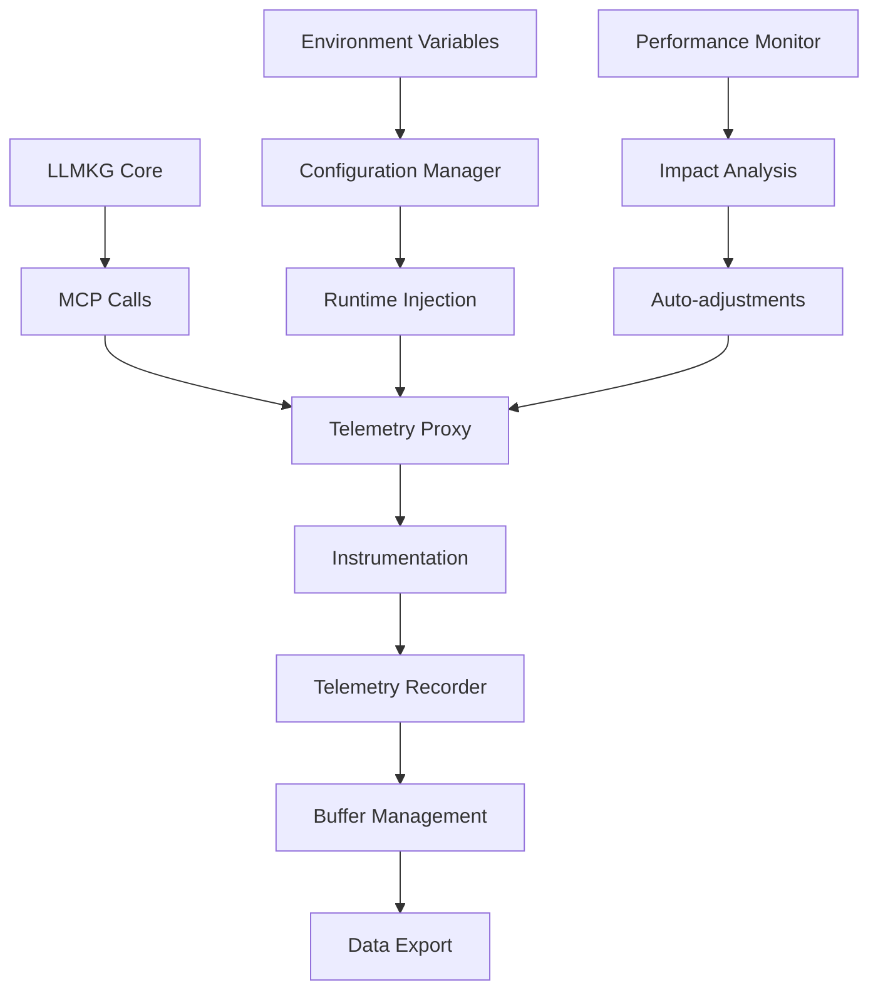

# LLMKG Telemetry Injection System

A sophisticated, non-intrusive telemetry system for LLMKG visualization that provides comprehensive monitoring without requiring any modifications to LLMKG's core Rust codebase.

## Overview

The LLMKG Telemetry Injection System is designed to provide ultra-low overhead monitoring of LLMKG operations through environment variables and proxy patterns. It offers:

- **Non-intrusive**: No modifications to LLMKG's core code required
- **Ultra-low overhead**: <1% performance impact guarantee
- **Comprehensive monitoring**: SDR, cognitive, neural, memory, attention, and graph operations
- **Automatic configuration**: Environment variable-driven setup
- **Production-ready**: Robust error handling and graceful degradation

## Architecture

### Core Components

```
┌─────────────────────────────────────────────────────────────┐
│                    Telemetry Manager                        │
│                 (Orchestration Layer)                      │
├─────────────────────────────────────────────────────────────┤
│  Config  │  Recorder  │   Proxy   │  Injector │ Instrument  │
│ Manager  │  (Buffer)  │ (MCP/Tool)│ (Runtime) │ (LLMKG Ops) │
├──────────┼────────────┼───────────┼───────────┼─────────────┤
│ Env Vars │   Events   │    MCP    │  Module   │   SDR Ops   │
│ Runtime  │  Metrics   │   Calls   │ Loading   │ Cognitive   │
│ Updates  │   Traces   │ WebSocket │  Process  │   Neural    │
│          │    Logs    │   HTTP    │   Hooks   │   Memory    │
│          │            │           │           │  Attention  │
│          │            │           │           │   Graph     │
└──────────┴────────────┴───────────┴───────────┴─────────────┘
```

### Data Flow



## Quick Start

### Basic Setup

```typescript
import { initializeTelemetry, wrapMCPClient } from '@llmkg/visualization/telemetry';

// Initialize with default settings
await initializeTelemetry();

// Wrap MCP client
const client = new MCPClient(config);
const instrumentedClient = wrapMCPClient(client);
```

### Environment Configuration

```bash
# Core telemetry settings
export LLMKG_TELEMETRY_ENABLED=true
export LLMKG_TELEMETRY_LEVEL=standard
export LLMKG_TELEMETRY_MAX_OVERHEAD=1.0

# Enable specific instrumentation
export LLMKG_TELEMETRY_INSTR_SDR=true
export LLMKG_TELEMETRY_INSTR_COGNITIVE=true
export LLMKG_TELEMETRY_INSTR_NEURAL=true
export LLMKG_TELEMETRY_INSTR_MEMORY=true
export LLMKG_TELEMETRY_INSTR_ATTENTION=false  # Disable for lower overhead
export LLMKG_TELEMETRY_INSTR_GRAPH=true

# Performance monitoring
export LLMKG_TELEMETRY_PERF_MONITORING=true
export LLMKG_TELEMETRY_SAMPLING_RATE=0.1
```

### Advanced Usage

```typescript
import { 
  initializeTelemetry, 
  instrument, 
  instrumentAsync,
  telemetryManager 
} from '@llmkg/visualization/telemetry';

// Initialize with custom configuration
await initializeTelemetry({
  level: 'verbose',
  maxOverhead: 0.5,
  instrumentation: {
    sdr: true,
    cognitive: true,
    neural: false,  // Disable neural for performance
  }
});

// Instrument operations
const result = instrument('sdr', 'encode_operation', () => {
  return performSDREncoding(data);
}, { dataSize: data.length });

// Instrument async operations
const graphResult = await instrumentAsync('graph', 'complex_query', async () => {
  return await knowledgeGraph.query(complexQuery);
});

// Monitor system health
telemetryManager.on('alert_created', (alert) => {
  console.error(`Alert: ${alert.message}`, alert.details);
});

const health = telemetryManager.getHealthStatus();
if (!health.healthy) {
  console.warn('Issues:', health.issues);
  console.log('Recommendations:', health.recommendations);
}
```

## Configuration Reference

### Environment Variables

| Variable | Type | Default | Description |
|----------|------|---------|-------------|
| `LLMKG_TELEMETRY_ENABLED` | boolean | `true` | Enable/disable telemetry |
| `LLMKG_TELEMETRY_LEVEL` | string | `standard` | Collection level (minimal/standard/verbose) |
| `LLMKG_TELEMETRY_MAX_OVERHEAD` | number | `1.0` | Maximum overhead percentage (0-10) |
| `LLMKG_TELEMETRY_BUFFER_SIZE` | number | `1000` | Buffer size for events |
| `LLMKG_TELEMETRY_FLUSH_INTERVAL` | number | `5000` | Flush interval in milliseconds |
| `LLMKG_TELEMETRY_INSTR_SDR` | boolean | `true` | Enable SDR instrumentation |
| `LLMKG_TELEMETRY_INSTR_COGNITIVE` | boolean | `true` | Enable cognitive instrumentation |
| `LLMKG_TELEMETRY_INSTR_NEURAL` | boolean | `true` | Enable neural instrumentation |
| `LLMKG_TELEMETRY_INSTR_MEMORY` | boolean | `true` | Enable memory instrumentation |
| `LLMKG_TELEMETRY_INSTR_ATTENTION` | boolean | `true` | Enable attention instrumentation |
| `LLMKG_TELEMETRY_INSTR_GRAPH` | boolean | `true` | Enable graph instrumentation |
| `LLMKG_TELEMETRY_PERF_MONITORING` | boolean | `true` | Enable performance monitoring |
| `LLMKG_TELEMETRY_SAMPLING_RATE` | number | `0.1` | Performance sampling rate (0-1) |
| `LLMKG_TELEMETRY_METRICS` | boolean | `true` | Enable metric collection |
| `LLMKG_TELEMETRY_TRACES` | boolean | `false` | Enable trace collection |
| `LLMKG_TELEMETRY_LOGS` | boolean | `true` | Enable log collection |

### Telemetry Levels

#### Minimal
- Basic operation counts and durations
- Error tracking only
- 1% performance sampling
- Disabled: neural, attention instrumentation
- Disabled: traces, detailed logs

#### Standard (Default)
- Full operation metrics
- Error and warning tracking
- 10% performance sampling
- All instrumentation categories enabled
- Basic traces, standard logs

#### Verbose
- Comprehensive metrics and traces
- Debug-level logging
- 100% performance sampling
- Full instrumentation enabled
- Detailed traces and logs

## LLMKG-Specific Instrumentation

### SDR Operations

```typescript
import { instrument } from '@llmkg/visualization/telemetry';

// Instrument SDR encoding
const encodedSDR = instrument('sdr', 'encode_operation', () => {
  return sdrEncoder.encode(inputData);
}, {
  inputSize: inputData.length,
  sparsity: 0.02,
  dimensions: 2048
});

// Instrument SDR union/intersection
const unionResult = instrument('sdr', 'union_operation', () => {
  return SDR.union(sdr1, sdr2);
}, {
  sdr1Size: sdr1.getActiveBits().length,
  sdr2Size: sdr2.getActiveBits().length
});
```

### Cognitive Pattern Operations

```typescript
// Instrument pattern recognition
const patterns = instrument('cognitive', 'pattern_recognition', () => {
  return patternRecognizer.recognize(inputData);
}, {
  inputComplexity: calculateComplexity(inputData),
  patternLibrarySize: patternRecognizer.getLibrarySize()
});

// Instrument inhibitory processing
const inhibitedOutput = instrument('cognitive', 'inhibition_processing', () => {
  return inhibitoryProcessor.process(cognitivePatter);
}, {
  inhibitionStrength: 0.8,
  processingMode: 'hierarchical'
});
```

### Memory System Operations

```typescript
// Instrument memory storage
const stored = instrument('memory', 'store_operation', () => {
  return memorySystem.store(key, value);
}, {
  operationType: 'write',
  dataSize: JSON.stringify(value).length,
  compressionUsed: true
});

// Instrument zero-copy operations
const result = instrument('memory', 'zero_copy_operation', () => {
  return zeroCopyEngine.process(data);
}, {
  dataSize: data.byteLength,
  bufferReused: true
});
```

### Graph Query Operations

```typescript
// Instrument graph traversal
const traversalResult = await instrumentAsync('graph', 'traversal_operation', async () => {
  return await knowledgeGraph.traverse(startNode, endNode, maxDepth);
}, {
  queryType: 'pathfinding',
  maxDepth: maxDepth,
  nodeCount: await knowledgeGraph.getNodeCount(),
  estimatedComplexity: 'high'
});
```

## Performance Monitoring

### Automatic Impact Detection

The system continuously monitors its own performance impact:

```typescript
import { telemetryManager } from '@llmkg/visualization/telemetry';

// Get real-time performance impact
const impact = telemetryManager.getSnapshot().performance;
console.log(`Current overhead: ${impact.overallOverhead.toFixed(2)}%`);

// Listen for performance alerts
telemetryManager.on('performance_issue', (issue) => {
  console.warn(`Performance threshold exceeded:`, issue);
});
```

### Performance Profiles

Get detailed performance analysis for specific operations:

```typescript
import { telemetryManager } from '@llmkg/visualization/telemetry';

const profile = telemetryManager.getPerformanceProfile('sdr_encode');
if (profile) {
  console.log(`P95 latency: ${profile.percentiles.p95}ms`);
  console.log(`Throughput: ${profile.throughput.operationsPerSecond} ops/sec`);
  console.log(`Memory usage: ${profile.resources.memoryUsage} bytes`);
}
```

## Integration Patterns

### MCP Client Integration

```typescript
import { wrapMCPClient } from '@llmkg/visualization/telemetry';

// Automatic instrumentation of MCP calls
const instrumentedClient = wrapMCPClient(mcpClient);

// All calls are automatically instrumented
const tools = await instrumentedClient.listTools();
const result = await instrumentedClient.callTool('sdr_encode', params);
```

### Tool Function Integration

```typescript
import { wrapTool } from '@llmkg/visualization/telemetry';

// Wrap individual tool functions
const instrumentedSDREncoder = wrapTool('sdr_encoder', originalSDREncoder, 'sdr');
const instrumentedPatternMatcher = wrapTool('pattern_matcher', originalPatternMatcher, 'cognitive');

// Use as normal - telemetry is transparent
const encoded = instrumentedSDREncoder.encode(data);
const patterns = instrumentedPatternMatcher.match(input);
```

### Custom Operation Integration

```typescript
import { llmkgInstrumentation } from '@llmkg/visualization/telemetry';

// Register custom instrumentation point
llmkgInstrumentation.registerInstrumentationPoint({
  id: 'custom_sdr_operation',
  name: 'Custom SDR Processing',
  category: 'sdr',
  type: 'process',
  samplingRate: 1.0,
  thresholds: { warning: 10, error: 50 },
  metadata: { version: '1.0', experimental: true }
});

// Use the instrumentation
const result = llmkgInstrumentation.instrumentSDROperation('custom_sdr_operation', () => {
  return performCustomSDRProcessing(input);
}, { customParam: 'value' });
```

## Error Handling and Resilience

### Graceful Degradation

The telemetry system is designed to never interfere with LLMKG operations:

```typescript
// If telemetry fails, operations continue normally
const result = instrument('sdr', 'operation', () => {
  return criticalSDROperation(); // This always executes
}); // Telemetry failure is logged but doesn't affect the operation
```

### Error Recovery

```typescript
import { telemetryManager } from '@llmkg/visualization/telemetry';

// Monitor telemetry system errors
telemetryManager.on('error', (error) => {
  console.error('Telemetry system error:', error);
  
  // System automatically attempts recovery
  // Operations continue without telemetry if recovery fails
});

// Check system health and get recommendations
const health = telemetryManager.getHealthStatus();
if (!health.healthy) {
  // Follow recommendations to restore health
  health.recommendations.forEach(rec => console.log(`Recommendation: ${rec}`));
}
```

## Best Practices

### Performance Optimization

1. **Use appropriate telemetry levels**:
   - Production: `minimal` or `standard`
   - Development: `standard` or `verbose`
   - Debugging: `verbose`

2. **Tune sampling rates**:
   ```typescript
   // High-frequency operations - reduce sampling
   LLMKG_TELEMETRY_SAMPLING_RATE=0.01  // 1%
   
   // Critical operations - increase sampling  
   LLMKG_TELEMETRY_SAMPLING_RATE=1.0   // 100%
   ```

3. **Selective instrumentation**:
   ```bash
   # Disable expensive instrumentation in production
   export LLMKG_TELEMETRY_INSTR_NEURAL=false
   export LLMKG_TELEMETRY_INSTR_ATTENTION=false
   export LLMKG_TELEMETRY_TRACES=false
   ```

### Security Considerations

1. **Sensitive data filtering**:
   ```typescript
   const result = instrument('sdr', 'encode_sensitive', () => {
     return encoder.encode(sensitiveData);
   }, {
     // Don't log sensitive parameters
     dataType: 'sensitive',
     size: sensitiveData.length
     // sensitiveData itself is not logged
   });
   ```

2. **Production deployment**:
   ```bash
   # Minimal telemetry for production
   export LLMKG_TELEMETRY_LEVEL=minimal
   export LLMKG_TELEMETRY_LOGS=false
   export LLMKG_TELEMETRY_TRACES=false
   export LLMKG_TELEMETRY_MAX_OVERHEAD=0.5
   ```

### Monitoring and Alerting

1. **Set up health monitoring**:
   ```typescript
   import { telemetryManager } from '@llmkg/visualization/telemetry';
   
   setInterval(() => {
     const health = telemetryManager.getHealthStatus();
     if (!health.healthy) {
       sendAlert('Telemetry system health degraded', health);
     }
   }, 60000); // Check every minute
   ```

2. **Configure alert thresholds**:
   ```typescript
   telemetryManager.updateConfig({
     alerts: {
       enabled: true,
       thresholds: {
         overheadPercentage: 0.5,  // Alert at 0.5% overhead
         errorRate: 0.01,          // Alert at 1% error rate
         responseTime: 100,        // Alert at 100ms response time
       }
     }
   });
   ```

## Troubleshooting

### Common Issues

1. **High overhead**: Check sampling rates and disable expensive instrumentation
2. **Buffer overflow**: Increase buffer size or flush frequency
3. **Missing data**: Verify instrumentation is enabled for relevant categories
4. **Performance degradation**: Reduce telemetry level or disable non-essential monitoring

### Debug Mode

```bash
# Enable verbose logging for troubleshooting
export LLMKG_TELEMETRY_LEVEL=verbose
export LLMKG_TELEMETRY_LOGS=true
export NODE_ENV=development
```

### Health Checks

```typescript
import { getTelemetryStatus } from '@llmkg/visualization/telemetry';

const status = getTelemetryStatus();
console.log(`Telemetry Status:
  Enabled: ${status.enabled}
  Overhead: ${status.overhead}%
  Operations: ${status.operationCount}
  Error Rate: ${(status.errorRate * 100).toFixed(2)}%
  Healthy: ${status.healthy}
`);
```

## API Reference

See the individual module documentation for detailed API references:

- [Configuration Manager](./config.ts) - Environment-driven configuration
- [Telemetry Recorder](./recorder.ts) - Event recording and buffering
- [MCP Proxy](./proxy.ts) - MCP call interception
- [Runtime Injector](./injector.ts) - Non-intrusive injection system
- [LLMKG Instrumentation](./instrumentation.ts) - Operation-specific monitoring
- [Telemetry Manager](./manager.ts) - Central orchestration

## License

This telemetry system is part of the LLMKG project and follows the same licensing terms.